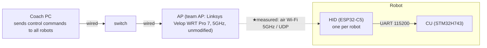
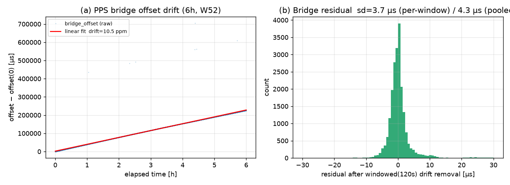
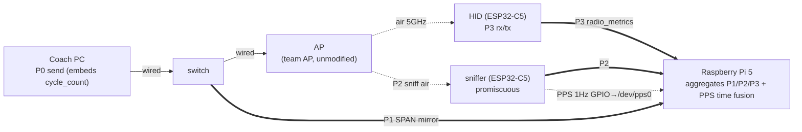
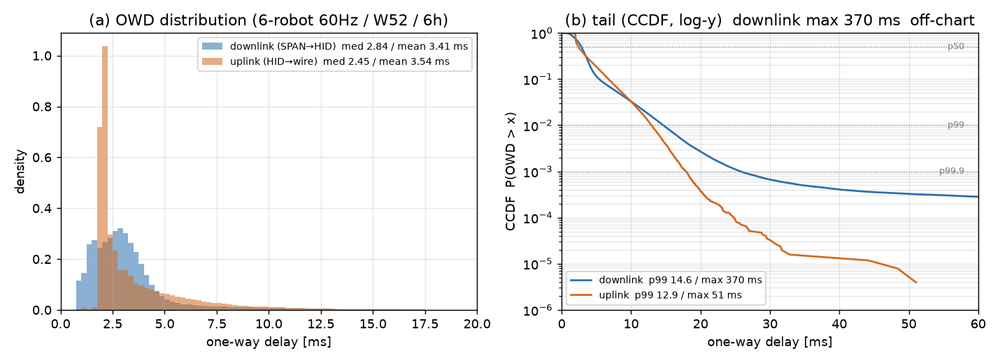

# RoboCup SSL 2026 Radio Communications Challenge — Wi-Fi (Team GreenTea)

> English version (submission). Japanese master: [README_JP.md](README_JP.md).
> Self-contained: the relevant parts of the three source repositories are vendored under
> [`components/`](components/) (provenance in [components/PROVENANCE.md](components/PROVENANCE.md)):
> [GreenTea_NetworkLatencyViewer](components/GreenTea_NetworkLatencyViewer) (measurement system, master `bac5076`),
> [robot_comm_spec](components/robot_comm_spec) (protocol spec, v2.1.0-dev `adbd58b`),
> [SanRei_HID](components/SanRei_HID) (production HID firmware, dev `1132740`).

## 0. Summary of Reported Items

**(A) Items that depend on the radio environment** (vary at the venue → venue measurements added during the event)

| Item | Pre-measurement (W52, 6 h, 6 robots @ 60 Hz) | Venue measurement (added during event) | Notes |
|---|---|---|---|
| **One-way Latency, downlink** (SPAN→HID, all data) | Mean **3.41** / Var **11.54 ms²** (SD 3.40) / median 2.84 / p99 14.64 / Max 370.4 ms (OWD join n=**7,777,299**, per-frame) | `—` (during event) | **0 samples >1 s** |
| **One-way Latency, downlink** (&lt;p99, outliers removed) | Mean **3.22** / Var **4.20 ms²** / median 2.82 | `—` (during event) | outlier removal, defined in §6.1 |
| **One-way Latency, uplink** (HID→wire, all data) | Mean **3.54** / Var **5.97 ms²** (SD 2.44) / median 2.45 / p99 12.93 / Max 51.0 ms (n=253,709, per rx_dlb UDP frame, ~2 Hz/robot) | `—` (during event) | Measured target: radio_metrics (`52000`, `rx_dlb`), HID→wire |
| **One-way Latency, uplink** (&lt;p99, outliers removed) | Mean **3.42** / Var **4.59 ms²** / median 2.43 | `—` (during event) | outlier removal, defined in §6.1 |
| **Average Packet Loss, downlink** | **0.0071 %** (**worst** single robot, per-robot denominator ≈ **1.30M** expected sends; 6-robot average 0.0058%. Wi-Fi frame = one downlink command, computed from `cycle_count` gaps. The **7,777,460** is the 6-robot aggregate received rx_dl; aggregate denominator = 7,777,460 + gaps) | `—` (during event) | In this run each robot wrapped its 24-bit `cycle_count` once (§6.1) → gaps counted after unwrap |
| **Average Packet Loss, uplink** | **0 % (0 losses observed)** (Wi-Fi frame = one `rx_dlb` UDP, `bseq` gaps 0, n=253,709) | `—` (during event) | uplink frame rate ≈ 2 Hz/robot (`rx_dlb`) |
| **Data Rate** (base-station view) | Mean **≈ 30.7 kbit/s** /robot / Variance ≈ 0 | `—` (during event) | downlink 60 Hz × 64 B. ≈ 184.3 kbit/s for 6 robots |

**(B) Items independent of the environment** (invariant at the venue)

| Item | Value | Notes |
|---|---|---|
| **Start Up Time** | median **3.29 s** (mean 3.31 / max 3.70 / sd 0.13, n=18 = 6 robots × 3) | — |
| **Power Consumption** | Mean ≈ **1 W** (HID = ESP32-C5, measured estimate) / Variance `—` (no measurement means, not reported) | catalog upper bound, 5 GHz TX peak ≈ 1.26 W @3.3 V (100% duty) |
| **Cost** | **HID = Seeed XIAO ESP32-C5 ¥1,259/robot (= $7.78)** | @¥161.78/USD (2026-06-26). AP (¥44,000 ≈ $272) is infrastructure. Details in §8 |
| **Network Switch** (rule demonstration) | recv→GOT_IP mean **1366 ms** (→WPA2 1.15 s / →Open 1.57 s, n=12, §6.2) | on-device SWMARK |
| **Detect Interference** | **Yes** | Detected via sniffer (PROMISC): RSSI / retry bit / neighboring AP beacons (this run captured 939k sniffer frames). AP queue freeze was observed only when using a DFS channel (ch112); the submitted **W52 is non-DFS**, so it does not apply |
| **Firmware Source** | §9 ([SanRei_HID](components/SanRei_HID)) | editable |
| **eCAD / Hardware** | §8 (COTS module configuration) | no custom board |

> Measurement accuracy (dominant error of the cross-domain segment): PPS bridge residual **sd ≈ 3.7 µs** (120 s windowed, 6 h W52, after removing ≈ 10.5 ppm drift).
> The reported values are obtained by re-running the bundled [`analysis/plot_owd.py`](analysis/plot_owd.py) against [`data/`](data/) (downlink OWD join **n=7,777,299**, loss denominator rx_dl **7,777,460**, uplink join **n=253,709**). [`docs/phase3_findings.md` §2.24](components/GreenTea_NetworkLatencyViewer/docs/phase3_findings.md) of GreenTea_NetworkLatencyViewer uses a different join condition (different wire-side deduplication, OWD sample 7.39M) but the median/p99 conclusions agree.

---

## 1. Introduction

In Team GreenTea, the coach (control PC) and each robot exchange commands and telemetry over
Wi-Fi/UDP. Because latency and loss over this radio segment directly affect control performance,
this submission quantitatively reports the communication quality as the prescribed items
(latency [the prescribed name is Round-Trip Latency, but for the reason below this submission reports one-way], packet loss, data rate, interference detection, startup time, power consumption, cost).
This chapter states how we measure the central item, **latency**, and also lays out the structure of the document.

Wi-Fi communication behaves differently in the uplink (robot→coach) and downlink (coach→robot)
in terms of transmission scheme, queuing, and retransmission. In our configuration too, the
downlink is unicast commands and the uplink is broadcast telemetry — i.e. asymmetric — and we
expect that **uplink and downlink latency are intrinsically different values**. An approximation
that takes half of the round-trip time (RTT) as the one-way delay cannot reveal this asymmetry,
so this submission adopts **one-way delay (OWD) measurement, measuring uplink and downlink
independently** (§2).

One-way delay is obtained as the **difference between the clocks of two different devices** — the
sending point and the receiving point. OWD measurement therefore presupposes **accurate time
synchronization** good enough to state that difference at a meaningful precision. If the
synchronization is off, the measured delay directly inherits that offset. Hence this submission
first **evaluates the time-synchronization method and its precision**, clarifying up front how
trustworthy the resulting delay values are (§3).

Having established the time reference, we proceed to the sampling design: **where and how to
observe in order to capture the entire communication path** (§4). Without modifying the coach PC,
the robots' production firmware, or the AP, we define a method and placement that captures a
single frame with timestamps at multiple observation points from transmission to reception.
Furthermore, so that **the packets captured at each observation point can later be matched as the
same frame**, we embed a unique transmit counter in the payload as a matching key (§5). Finally, we
actually **acquire data with this measurement system and analyze it with statistics** to compute
each reported item (§6).

The remainder of the document is organized as follows: conclusions of the reported items (§0),
network configuration and communication method (§2), time synchronization and accuracy evaluation
(§3), sampling method and measurement points (§4), data design for multi-point matching (§5),
data acquisition and analysis (§6), public deliverables (§7), hardware (§8), firmware (§9),
reproduction guide (§10).

---

## 2. Network Configuration and Communication Method

> Shows how uplink and downlink are configurationally asymmetric, fixing the premise of one-way
> delay measurement (§1).
> Protocol authority: [robot_comm_spec](components/robot_comm_spec)
> ([downlink_command.md](components/robot_comm_spec/downlink_command.md) /
> [uplink_telemetry.md](components/robot_comm_spec/uplink_telemetry.md) /
> [radio_metrics.md](components/robot_comm_spec/radio_metrics.md))

### 2.1 Topology (normal operation)

SanRei's robot communication connects the **coach (control PC)** and each robot's **HID (radio
interface, ESP32-C5)** over **Wi-Fi 5 GHz / UDP**. Inside the robot the HID is connected to the CU
(STM32) over UART, bridging Wi-Fi ↔ the robot's internal bus. **The measured target of this
challenge is the Coach↔HID Wi-Fi UDP segment.**



- Designed so that **the AP is never modified**, allowing measurement even on a shared Wi-Fi. The
  current values are obtained with the team AP (Linksys Velop WRT Pro 7, model LN6001-JP), but the
  method is AP-independent and applies as-is to a venue-provided AP.

### 2.2 Port-based communication

Communication is a port-based scheme that **identifies the logical channel and the robot by the
UDP port number**. Each channel distinguishes an individual robot by `base port + robot_id`, and
the direction (downlink/uplink) and purpose are separated by port range.

| Direction | Logical channel | Port | Transmission | Origin | Measured |
|---|---|---|---|---|---|
| downlink | normal command | `40000 + robot_id` | unicast (mDNS `robot<id>.local`) | coach | ✅ |
| downlink | EMS / OTA (shared) | `40999` | broadcast | coach | — |
| downlink | HID control (hid_bridge) | `41000 + robot_id` | unicast | coach | — |
| uplink | normal telemetry | `50000 + robot_id` | broadcast | CU origin (HID relay) | — |
| uplink | CAN telemetry | `51000 + robot_id` | broadcast | HID (CAN diagnostics) | — |
| uplink | **Radio Metrics** | `52000 + robot_id` | broadcast | HID (Wi-Fi metadata) | ✅ |

- The robot ID is uniquely determined by the **source/destination port** (`base + id`), so the
  port alone tells "which robot, which direction, which kind of frame."
- The differing transmission scheme between downlink (unicast) and uplink (broadcast) is the
  configurational basis of the **up/down latency asymmetry** stated in §1.
- The payload of a downlink normal command (64 B) carries the **transmit-cycle counter
  `cycle_count`**, which becomes the multi-point matching key (matching design in §5).
- **Network switch**: the `set_ssid` command (v2.1.0) on the HID control channel (hid_bridge,
  downlink `41000 + robot_id`) switches the AP the HID connects to. This corresponds to the rule's
  "demonstration of rapid switching between different radio networks" (demonstration in §6.2).

---

## 3. Time Synchronization and Accuracy Evaluation

> Because one-way delay is the **difference between clocks of different devices**, we first
> establish the time reference and evaluate its precision up front.
> The starting point is confirming that multiple Wi-Fi devices connected wirelessly can **hold a
> common clock**.

### 3.1 TSF synchronization between Wi-Fi devices

In IEEE 802.11, the beacon the AP periodically transmits (interval ~100 ms here) contains a **TSF
(Timing Synchronization Function) timestamp**, and every STA connected to the same AP aligns its
own TSF counter to it. That is, **devices under the same AP can share a µs-resolution common clock
(AP TSF) without any wiring**.

This measurement applies that property to two Wi-Fi devices: the robot's **HID (ESP32-C5)** and a
**sniffer (ESP32-C5)**. Because both synchronize to the same AP's beacon, the TSF each reads via
`esp_wifi_get_tsf_time()` lies on the same time axis. This lets us **directly subtract** the time
of a frame one observes over the air (air) and a frame the other receives/transmits at the
terminal (HID) **on the same AP TSF**.

- **Verification**: We made both the HID and the sniffer emit a GPIO pulse at the TSF 1-second
  boundary (the moment `tsf_us` crosses a multiple of 10⁶), and measured the time difference Δt of
  the two pulses with an ADALM2000. With the submitted GPTimer-based PPS the inter-device Δt is
  **median +4.4 µs / sd 5.0 µs** (idle, unimodal; §2.22) — small and stable, corroborating that
  "the two Wi-Fi devices are synchronized to the AP at the same precision."

### 3.2 Giving TSF-domain time to the measurement RasPi

§3.1 showed the HID and sniffer can hold a common clock, AP TSF. On the other hand, we need to
**observe wired-segment packets too**, and to **aggregate the measurement logs each device
produces in one place**. This measurement concentrates that role on a **Raspberry Pi 5 (RasPi)**.
The RasPi is the core of the measurement system: it receives the wired frames between the AP and
the coach via SPAN mirror and timestamps them (§4 P1), and also collects logs from the HID and
sniffer.

However, the RasPi runs on its own **UNIX time** (`CLOCK_REALTIME`) and **cannot directly match
the AP-TSF-domain observations** kept by the HID and sniffer. To put the time of a wired frame the
RasPi captures and the time of a frame recorded on TSF over the air/terminal on the same axis,
we must **also give the measurement RasPi a TSF-domain time** — i.e. a mechanism to bridge AP TSF
to UNIX time. That is the focus of this section.

From the above, this measurement has two clock domains: the **AP TSF domain** (sniffer, HID) and
the **RasPi's UNIX time** (P1 wire timestamping). Since OWD is meaningful only on a synchronized
time axis, we quantify the synchronization method and residual within and across each domain.

The concrete means of joining the two domains is the **PPS (Pulse Per Second) signal the sniffer
gives the RasPi**. Since the sniffer is synchronized to AP TSF (§3.1), it can **output a 1 Hz
pulse on GPIO at the AP TSF 1-second boundary** (the moment `tsf_us` crosses a multiple of 10⁶).
This pulse is wired to the RasPi's GPIO (`/dev/pps0`), and the RasPi **timestamps the pulse
arrival with its own UNIX time**. This yields, once per second, a correspondence pair between "a
given AP TSF boundary value" and "the UNIX time at that instant," from which the offset joining the
two domains is obtained: `bridge_offset = unix_assert − tsf_boundary/1e6`. In other words,
**through the sniffer's PPS, the measurement RasPi is given AP-TSF-domain time**.

| Synchronization | Method | Precision (residual) |
|---|---|---|
| within TSF domain (air↔HID) | both TSF-synchronized to the same AP's beacon (§3.1); taken as TSF-to-TSF difference | **µs order** (does not include bridging error) |
| TSF ↔ UNIX bridge | sniffer outputs **GPIO 1-PPS** at the AP TSF 1-second boundary → RasPi `/dev/pps0` timestamps in UNIX. `bridge_offset` has its drift removed linearly **per 120 s window** | residual **sd ≈ 3.7 µs** (6 h W52, dominant error of the cross-domain segment) |

### 3.3 Accuracy summary

> **What "120 s windowing" means**: rather than approximating the TSF↔UNIX `bridge_offset` with a
> single straight line over the whole 6 h, the method **splits time into 120-second windows and
> fits a separate straight line in each window**. Because clock drift (≈10.5 ppm) varies slowly,
> joining local straight lines (piecewise-linear approximation) gives a smaller residual than a
> single global fit, settling at sd ≈ 3.7 µs (a single global fit gives about 1400 µs).
> Implemented in [`analysis/plot_owd.py`](analysis/plot_owd.py).

- **Dominant error of the cross-domain segment** = PPS bridge residual **sd ≈ 3.7 µs**
  (sniffer↔RasPi, **120 s windowed**, 6 h W52, after linear removal of **≈ 10.5 ppm** drift). The
  accuracy of downlink OWD (which crosses the UNIX-domain P1 and the TSF-domain P3) is set by this
  value.
- **Within the TSF domain (air↔HID)** it is a TSF-to-TSF difference, free of bridging error, on the
  order of µs.
- Note that **sd 3.7 µs is only the bridge component**. The full OWD also includes the HID-side
  TSF-anchor jitter (submitted GPTimer PPS: idle sd ~5 µs, unimodal; §2.22), but at
  < 1 % of a ms-scale OWD it does not change the conclusions.
- PPS generation jitter (GPTimer hardware PPS) is idle 1σ ~5 µs. The 120 s linear fit averages out
  the per-pulse jitter, so the bridge residual settles at sd ~3.7 µs.
- **NTP is unnecessary for this measurement**: OWD is computed from the PPS bridge (relative
  offset), so the RasPi's NTP absolute-time error (chrony, RMS ~0.3 ms in this run) does not affect
  OWD. The coach clock is not used either.
- **Uplink measurement traffic (broadcast) does not affect time synchronization**: uplink broadcast
  consumes airtime and **can worsen downlink delay** (self-interference, §5.2 / §6), but time
  synchronization holds on a separate path. PPS is over **GPIO wiring (Wi-Fi-independent)** and TSF
  is **beacon synchronization**, so airtime contention does not change the accuracy of the time
  axis. Even under high load where downlink OWD degrades, the **PPS bridge is maintained** and the
  bridge residual stays at **sd 3.7 µs**.



*Figure: Measured PPS bridge for the submitted run (6 h, W52). **(a)** `bridge_offset` drifts
linearly at about **10.5 ppm** (removed by 120 s windowing). **(b)** After removal, the residual is
centered at 0 within **sd ≈ 3.7 µs (window-averaged) / 4.3 µs (whole pool)**, which is the dominant
error of the cross-domain segment (downlink OWD, etc.). Raw data:
[data/batch_6r_060hz_6h_w52ch36](data/batch_6r_060hz_6h_w52ch36) (`pps_gpio`/`pps_uart`).*


---

## 4. Sampling Method and Measurement Points (overlaid on the operational configuration)

> On the time reference established in §3, we design the **observation points and acquisition
> methods** to capture the communication path.

Without changing the normal operating configuration at all, we overlay a **measurement system
centered on the Raspberry Pi 5**. The coach PC and the robots' production firmware **carry no
measurement code (black boxes)**, and the AP is not modified. A single frame is observed with
timestamps at up to **four measurement points**.

Real-data frames flow along the top row (downlink: coach→HID, uplink: the reverse), and at each
measurement point they are **tapped** and aggregated to the RasPi 5 on the bottom row. Thin line =
wired, dotted = air, thick = measurement tap.



| Symbol | Measurement point | Acquired by | Acquired time (clock domain) |
|---|---|---|---|
| **P0** | coach send | coach PC (payload-embedded) | embeds join key `cycle_count` |
| **P1** | wire (wired arrival) | RasPi5 eth0 (SPAN mirror receive) | NIC hardware timestamp (`SO_TIMESTAMPING`, UNIX time domain; column `t_wire_phc`) |
| **P2** | air (over-the-air send/receive) | sniffer (ESP32-C5, promiscuous) | AP TSF (per frame) |
| **P3** | HID (terminal rx/tx) | HID itself (declared via radio_metrics) | AP TSF (rx_dlb / hb) |

- For the **downlink**, a frame passes in the order P0→P1→P2→P3. For the **uplink**, P3 (HID send)
  →P2 (air)→P1 (wired arrival).
- P2/P3 are AP TSF and P1 (wire) is the RasPi's UNIX time. The two domains are fused onto a single
  time axis by the PPS bridge of §3 (P0 is the origin of the join key `cycle_count`).
- **Limit of capturing the downlink air (P2) with many robots**: as the number of robots grows, the
  AP **aggregates downlink unicast per-STA into A-MPDU**, so the promiscuous sniffer (P2) cannot
  demodulate frames addressed to other STAs and **drops them structurally, depending on
  transmission order** (measured: 2 robots ~89% → 6 robots ~16%). We therefore **measure downlink
  OWD with the air-independent P1 (wire) + P3 (HID)**. The uplink can be captured uniformly across
  all STAs and P2 is usable in principle, but **the submitted run does not obtain the air-leg
  decomposition** (the sniffer's MAC matching does not hold, source §2.24). Uplink OWD is computed
  **endpoint-to-endpoint from the HID send anchor `tx` (P3) → wire (P1)** (§5.2 / §6.1).

### 4.1 Acquisition method at each measurement point

- **P1 wire**: the RasPi's eth0 is connected to the switch's SPAN mirror destination and receives
  via `AF_PACKET` + `SO_TIMESTAMPING`, timestamping frame arrival with the **NIC hardware RX
  timestamp** (UNIX time domain, analysis column `t_wire_phc`). Being the RasPi's local clock, there
  is no systematic error within the RasPi segment.
- **P2 air (sniffer)**: the ESP32-C5 is put in promiscuous mode and records `esp_timer` in each
  frame-receive callback → a separate task assigns `tsf_us` by **midpoint-fit linear conversion** of
  `(esp_timer, AP TSF)` every 100 ms (using the midpoint `t_mid=(t_before+t_after)/2` because
  `t_before` alone worsens the residual p99). The callback time matches the HW RX timestamp within
  ±1 µs.
- **P3 HID**: the HID records `esp_timer` at the instant of rx/tx, converts it to AP TSF by windowed
  linear regression, and declares `t_rx_tsf_us` / `t_tx_tsf_us` via radio_metrics (`52000+id`). Same
  AP TSF domain as P2.
- **Clock fusion**: P2/P3 (AP TSF) and P0/P1 (UNIX) are fused onto a single axis by the PPS bridge
  of §3 (residual sd ≈ 3.7 µs).


---

## 5. Data Design for Multi-point Matching

> A design that lets observations acquired at different measurement points be matched later as the
> **same frame**.

Because each measurement point timestamps independently, the payload needs a **unique matching key**
to link observations. This submission uses the unique counter the sender increments on each transmission as the key, and
each observation point matches by **reading just the key cheaply from a fixed offset**, without
parsing the whole packet.

| Target frame | Matching key | Notes |
|---|---|---|
| downlink normal command (`40000+id`) | `cycle_count` (transmit-cycle counter) | coach origin. Packet loss is also computed from gaps |
| radio_metrics (`52000+id`, uplink/hb, etc.) | `hid_seq` | the fixed-length leading `meta` (offset 9) is parsed by sniffer / wire |

### 5.1 Downlink command layout (fixed 64 bytes)

A downlink normal command is a fixed 64 bytes and embeds the matching key `cycle_count`.

| offset | field | type | purpose |
|---|---|---|---|
| 00–01 | header | `0xFF 0xC3` | frame detection |
| 02 | robot_id | uint8 | robot identification |
| 51–53 | `cycle_count` | uint24 LE | **transmit-cycle counter** (per-cycle loss/arrival key, wraps over 0–16,777,215) |
| 63 | checksum | `XOR ^ 0xFF` | — |

- The wired (wire) / air observation points do not parse JSON; they identify a downlink frame by
  **reading only `cycle_count` (51–53) from this fixed offset**.
- Downlink OWD is **SPAN→HID (wire PHC + TSF bridge)**, joined on `cycle_count`.

### 5.2 The `meta` of radio_metrics (off-board matching header)

On the uplink side (broadcast), the HID places a fixed-length HEX `meta` at the head of each JSON of
the radio_metrics it sends (`52000+id`). `meta` is the **first key of the JSON**, and because
serialization always begins with `{"meta":"` (9 bytes), the **HEX value always appears at offset 9
from the payload head** (by the rule of not placing variable-length elements before it).

| HEX byte | content |
|---|---|
| 0–1 | magic `0x52 0x4D` (ASCII `"RM"`, radio_metrics frame detection) |
| 2 | meta format version (`0x01`) |
| 3 | type (`04`=rx_dlb / `03`=hb) |
| 4 | robot_id |
| 5–8 | `hid_seq` (uint32 big-endian, monotonically increasing counter shared across all types) |

- An off-board observer can match the same frame across air / wire / host-socket without JSON
  parsing just by "**reading 18 HEX from payload offset 9 → confirming the magic is `RM` →
  obtaining `(robot_id, hid_seq)`**."
- The **segment decomposition** (air leg) of uplink OWD could in principle be obtained by matching
  air (P2) and wire (P1) on `hid_seq`, but **it is not obtained in this run because the sniffer's
  MAC matching does not hold** (source [phase3_findings §2.24](components/GreenTea_NetworkLatencyViewer/docs/phase3_findings.md)).
  **The reported value is** the **endpoint-to-endpoint OWD** from the send anchor `tx` (P3), which
  the HID reads in software just before broadcast, → wire (P1), and includes the `HID→air` channel
  access + internal TX queue.
- `meta` contains **only values fixed before transmission (counters, IDs)**. The on-air transmit time
  is observed by the sniffer (not embedded in the payload).
- **Uplink broadcast affects downlink delay (self-interference)**: uplink measurement broadcast
  consumes airtime and **can worsen the delay and capacity of the downlink, which is the measured
  target**. **On the other hand it does not affect time synchronization** (PPS over GPIO wiring, TSF
  over beacon synchronization, §3.3).
- **`rx_dlb` (batch, type `04`)**: to suppress self-interference, downlink receive records are bundled
  into one UDP broadcast, aggregating the uplink measurement frames to **~2 Hz/robot**. The `recs`
  array holds per-record `cycle_count` / `t_rx_tsf−base` (delta-compressed) / `rssi` (obtaining
  downlink OWD, loss, RSSI). Gaps in `bseq` (batch sequence) **separate report (UDP) loss from
  downlink loss**.

> Authority: [downlink_command.md](components/robot_comm_spec/downlink_command.md) / [radio_metrics.md](components/robot_comm_spec/radio_metrics.md)

---

## 6. Data Acquisition and Analysis (computing the reported items)

> From the data acquired by the measurement system, compute each reported item with statistics.

**Measurement conditions (recommended submission run)**: coach (`pc_emulator` sends downlink
40000+id as **60 Hz** unicast, **6 robots**) → Linksys Velop WRT Pro 7 (5 GHz **W52 ch36
(non-DFS)**, open auth) → each HID (ESP32-C5, `rx_dlb` batch measurement firmware). **6 hours
continuous**. Source: [`docs/phase3_findings.md` §2.24](components/GreenTea_NetworkLatencyViewer/docs/phase3_findings.md) of GreenTea_NetworkLatencyViewer.

**Population and outlier removal**: the headline reports both **all data** and **<p99** with the
upper outliers removed. Outlier removal is computed in three stages, taking ascending values
**below each of the p95 / p99 / p99.9 thresholds** as the population (`<p99` is the representative).
(A range guard of −50 to 20000 ms to reject non-physical divergent values is also applied, but in
this run **0 samples** matched, so no data was removed.)

### 6.1 How each reported item is computed

Each item is shown by "which measurement-point pair, which formula" (values in §0, clock fusion via
the PPS bridge of §3).

| Item | Computation (measurement points, formula) |
|---|---|
| **One-way Latency, downlink** | `t_hid_rx_tsf/1e6 + bridge_off(t_wire_phc) − t_wire_phc` (SPAN→HID, air-independent). Joins the wire and HID downlink-receive records on (robot_id, `cycle_count`), excluding wire captures of the same cycle spanning >0.1 s (same `cycle_count`-value collisions). OWD join n=**7,777,299** (of rx_dl 7,777,460, the part matching wire) |
| **One-way Latency, uplink** | `t_wire_phc − (tx/1e6 + bridge_off(t_wire_phc))` (HID→wire). `tx` is the **send TSF anchor the HID reads in software just before broadcasting** `rx_dlb` (P3, endpoint-to-endpoint OWD including channel access + internal TX queue; air-leg decomposition not obtained in this run, §2.24). Joined with uplink wire (52000) on (robot_id, `hid_seq`). Per rx_dlb UDP frame (~2 Hz/robot), n=253,709 |
| **Average Packet Loss, downlink** | `cycle_count` gaps (dedup) of downlink commands. Per Wi-Fi frame. `cycle_count` is the coach AI's **transmit counter continuous from startup** (not reset to 0 per run); in this run it was near the 24-bit ceiling at the start and **each robot wrapped to 0 once during the run** (data: each robot min 0 / max 16,777,215, distinct ≈ 1.30M ≈ 60 Hz×6 h, while span(max−min)=16.78M). A naïve max−min would mistake the real 1.30M for 16.77M, so gaps are counted **after 24-bit unwrap** |
| **Average Packet Loss, uplink** | `bseq` gaps of `rx_dlb` (1 UDP = 1 Wi-Fi frame) = uplink Wi-Fi frame loss |
| **Data Rate** | payload × send rate (base-station view) |
| **Detect Interference** | sniffer (PROMISC) RSSI / retry bit / neighboring AP beacons (AP queue freeze only on DFS channels) |
| **Start Up Time** | cold boot via esptool hard_reset → capture "WiFi Got IP" in the boot banner with a host timestamp |
| **Power / Cost** | the radio module (HID = ESP32-C5) alone is the reported target (Cost = module unit price, Power = HID alone) |



*Figure: Up/down one-way delay (submitted run). **(a)** Both distributions peak at 2–3 ms (downlink
mean 3.41 / uplink 3.54 ms). **(b)** Comparing the tails by CCDF (log-y), **the downlink has the
heavier tail** (downlink p99 14.6 ms, max 370 ms off-chart; uplink p99 12.93 ms, max 51 ms). Values in §0, raw
data: [data/batch_6r_060hz_6h_w52ch36](data/batch_6r_060hz_6h_w52ch36).*

### 6.2 Network switch demonstration (rule requirement)

In addition to the 7 reported items, the rule requires a **"demonstration of rapid switching between
different radio networks."** Our configuration addresses this with the **`set_ssid` command** of
robot_comm_spec v2.1.0.

- **Means**: sending `{ "type": "set_ssid", "ssid": "<target>", "password": "<optional>" }` to the
  HID control channel (hid_bridge, downlink port `41000 + robot_id`, JSON) makes the HID switch the
  AP it connects to.
- Because it is a directed connection with an explicit SSID, **it can connect to a hidden AP as
  well**.
- After switching, responses (telemetry / `hid_status`) move to the new network side, so **the
  commanding PC follows too**.

**Measurement method**: an on-device marker (`SWMARK`) is added to the HID firmware, recording in HID
millis the `set_ssid` receive time (recv) and the connection-complete `GOT_IP` (= downlink
receivable) time. Their difference, **recv→conn, is taken as the switch time**. Open(TEAM_SSID_OPEN)
↔ WPA2(TEAM_SSID) was toggled 6 times.

**Results** (on-device SWMARK, r1/r2 × 6 toggles, n=12):

| Switch direction | Switch time (recv→GOT_IP) |
|---|---|
| → WPA2 (normal) | ≈ **1.15 s** (1142–1162 ms, stable) |
| → Open | ≈ **1.57 s** (1560–1620 ms, stable) |
| overall | mean **1366 ms** / min 1142 / max 1620 / sd ~210 (dominated by the directional difference) |

- **Switching to Open is slower** (WPA2 1.15 s < Open 1.57 s, consistent across both robots and all
  trials). The handshake-based intuition (WPA2 should be slower due to its 4-way handshake) is
  reversed here. A likely cause (not yet verified on-device): WPA2 (TEAM_SSID) is the firmware's
  *default* SSID, so →WPA2 reconnects to a known network via a fast scan/association path (possibly
  with PMKSA caching), whereas →Open targets a non-default SSID that requires a fresh scan and full
  association each time. The stable ~420 ms gap points to a scan/association-path difference rather
  than the handshake (which would make WPA2 the slower one).
- **Two measurement methods and the worst case**: the table above is the authoritative **on-device
  SWMARK method** (recv→GOT_IP, network/batch-independent). We also measured with a `cycle_count`-gap
  method; while most were ~0 (<1 cycle), it **occasionally recorded an 8.40 s / 9.48 s outage**
  (→normal mean 0.47 s/max 8.40 s, →open mean 0.68 s/max 9.48 s, outlier-dominated). This is an
  artifact stemming from the **firmware behavior of reverting to the default SSID when not
  connected** plus the toggle script's confusion of directional attribution, and is not the true
  switch delay (includes batch-flush confounding and partial reconnection). The bundled
  [data/ssid_switch_2026-06-26/README.md](data/ssid_switch_2026-06-26/README.md) lists both methods. As the
  definitive value we adopt the network/batch-independent SWMARK **1.15 / 1.57 s**.
- **Behavior of the time domain**: on re-association the TSF jumps to the new AP's value, but the HID
  and sniffer re-synchronize to the new AP's beacon, the calibration ring is cleared at
  re-association, and they re-calibrate on the new AP's TSF (§3.1). The measurement time axis
  recovers automatically after the switch.

> Source / raw data: [data/ssid_switch_2026-06-26](data/ssid_switch_2026-06-26) (on-device marker
> values + method). Reference: [hid_bridge.md `set_ssid`](components/robot_comm_spec/hid_bridge.md)


---

## 7. Public Deliverables (editable / source)

| Deliverable | Location |
|---|---|
| production HID firmware | [SanRei_HID/src/ESP32C5Controller](components/SanRei_HID/src/ESP32C5Controller) (§9) |
| measurement-system firmware | [GreenTea_NetworkLatencyViewer/tools/esp_firmware](components/GreenTea_NetworkLatencyViewer/tools/esp_firmware) (§9) |
| protocol spec | [robot_comm_spec](components/robot_comm_spec) |
| analysis scripts | [GreenTea_NetworkLatencyViewer/tools/owd_analyzer](components/GreenTea_NetworkLatencyViewer/tools/owd_analyzer) |
| raw data | [data/](data/) |
| live test plan | [GreenTea_NetworkLatencyViewer/testplan.md](components/GreenTea_NetworkLatencyViewer/testplan.md) |

<!-- Vendored under components/ (self-contained). Provenance in components/PROVENANCE.md. -->

---

## 8. Hardware Configuration (COTS modules)

This team uses a **combination of COTS modules**, with no eCAD of a custom board (per the rules,
commercial modules **may publish the interface only**).

| Role | Module (COTS) | Key spec | Connection |
|---|---|---|---|
| HID (radio interface, radio module) | Seeed XIAO ESP32-C5 | Wi-Fi 6 / 5 GHz | UART 115200 with CU |
| sniffer | ESP32-C5 devkit | promiscuous + GPIO PPS | RasPi USB UART |
| measurement host | Raspberry Pi 5 | eth0 SPAN + `/dev/pps0` | — |
| AP | Linksys Velop WRT Pro 7 (LN6001-JP) | Wi-Fi 7 unit; this measurement is a 5 GHz **11ax/HE** link | wired |
| switch (SPAN) | TP-Link TL-SG105E (easy smart) | port mirror | — |

**Interface**: the external IF of the radio module (HID) is **Wi-Fi (UDP, §2.2)** and **UART with the
CU** (2 wires TX/RX, 115200 8N1, no flow control).


**BOM / Cost**: the Cost of the reported target (the radio solution) is the **HID module ¥1,259/robot
(= $7.78)** (one per robot). The AP (¥44,000 ≈ $272) is infrastructure that a venue-provided AP can
substitute, so it is counted separately. The whole measurement system (≈ ¥45k) is a reference value
outside the reported scope. Power/Cost details in §0.

---

## 9. Firmware (source, build)

The firmware has two lines: the **production HID** (center of evaluation) and the **measurement
system** (auxiliary to the method).

### A. Production HID ([SanRei_HID](components/SanRei_HID), ESP32-C5)
Bridges Wi-Fi UDP ↔ the robot's interior (UART/CAN) and emits radio_metrics (`rx_dlb`/`hb`).

| Element | Source |
|---|---|
| `ESP32C5Controller` (main) | [src/ESP32C5Controller](components/SanRei_HID/src/ESP32C5Controller) |
| `metrics_radio.cpp/.h` (measurement emit) | same as above |

- **Docker build (recommended, IDE-independent)**: `src/ESP32C5Controller/` bundles a `Dockerfile`
  (Ubuntu 22.04 + arduino-cli + `esp32:esp32` core) + `docker-compose.yml` + `build.sh`. Run
  `cd components/SanRei_HID/src/ESP32C5Controller && docker compose run build` to produce
  `ESP32C5Controller.ino.bin`.
- Local direct: `arduino-cli compile -b esp32:esp32:XIAO_ESP32C5 ./ESP32C5Controller.ino` (board =
  Seeed XIAO ESP32-C5). Linux instructions in [docs/Build_Linux.md](components/SanRei_HID/docs/Build_Linux.md).

### B. Measurement system ([GreenTea_NetworkLatencyViewer](components/GreenTea_NetworkLatencyViewer))

| Firmware | Role | Source |
|---|---|---|
| `sniffer` | promiscuous, TSF embedding, GPIO PPS | [tools/esp_firmware/sniffer](components/GreenTea_NetworkLatencyViewer/tools/esp_firmware/sniffer) |
| `metrics_radio` | radio_metrics library | [.../metrics_radio](components/GreenTea_NetworkLatencyViewer/tools/esp_firmware/metrics_radio) |
| `metrics_radio_reflector` | HID emulation for testing | [.../metrics_radio_reflector](components/GreenTea_NetworkLatencyViewer/tools/esp_firmware/metrics_radio_reflector) |

```bash
arduino-cli upload -p /dev/ttyUSB0 --fqbn esp32:esp32:esp32c5 tools/esp_firmware/sniffer
```

---

## 10. Reproduction Guide (for other teams, technology transfer)

> **Aim**: let other teams reproduce this measurement method on their own AP / robots in the shortest
> path.
> **Core**: modify neither the coach, the production firmware, nor the AP — just **"overlay" the
> RasPi measurement system**. Being AP-independent, a venue-provided AP is fine.

### 10.1 Minimal configuration
- Raspberry Pi 5 (RPi OS)
- an **L2 switch capable of port mirroring (SPAN)** (e.g. TP-Link TL-SG105E)
- ESP32-C5 ×1 (sniffer: promiscuous + GPIO 1-PPS)
- the Wi-Fi device under measurement (your own HID equivalent) and an AP (your own or venue-provided)

### 10.2 Setup
1. **switch**: mirror the AP-connection port → to RasPi `eth0`.
2. **RasPi eth0**: acquire wired frames with `promisc on`, `AF_PACKET` + `SO_TIMESTAMPING` (P1, NIC
   hardware timestamp, UNIX time domain `t_wire_phc`).
3. **sniffer**: synchronize to the target AP, capture air in promiscuous mode, assign AP TSF to each
   frame (P2). Output **1-PPS on GPIO** at the TSF 1-second boundary.
4. **PPS wiring**: sniffer GPIO → RasPi `/dev/pps0` (`dtoverlay=pps-gpio`). This establishes the AP
   TSF ↔ RasPi UNIX bridge (§3).
5. **device under measurement**: embed the matching key (unique counter) at a **fixed offset** in the
   payload (adapt to your own protocol).

### 10.3 Running the measurement
- Record wire + sniffer + PPS with the RasPi daemon (`gtnlv-rpid` equivalent).
- Send the target traffic.
- Build the PPS bridge with `owd_analyzer` → compute one-way OWD and loss (command examples in
  [testplan.md](components/GreenTea_NetworkLatencyViewer/testplan.md)).

### 10.4 Adaptation points for your own environment
- How the **matching key** is embedded (offset, bit width, wrap) to fit your protocol.
- The sniffer's **destination filter** (OUI/MAC) to your device.
- Port numbers, unicast/broadcast distinction.
- For **many-robot downlink**, air capture is missing due to A-MPDU aggregation, so measure downlink
  OWD with the air-independent **wire + terminal declaration** (§4).

References: [GreenTea_NetworkLatencyViewer](components/GreenTea_NetworkLatencyViewer) / [SanRei_HID](components/SanRei_HID) / [robot_comm_spec](components/robot_comm_spec)
