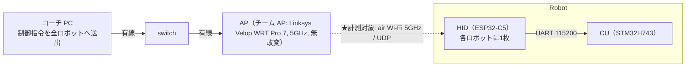
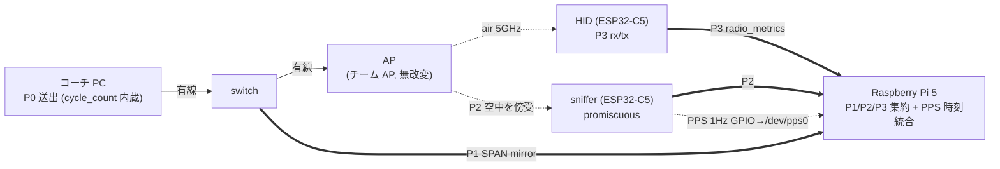

# RoboCup SSL 2026 Radio Communications Challenge — Wi-Fi（Team GreenTea）

> 日本語版（主版）。英語版（提出用）は本書を英訳した [`README.md`](README.md)。

## 0. 報告項目サマリ

**(A) 無線環境に依存する項目**（会場で変動 → 会場測定を会期中追記）

| 項目 | 事前計測（W52 6h・6台60Hz） | 会場測定（会期中追記） | 補足 |
|---|---|---|---|
| **One-way Latency 下り**（SPAN→HID、全データ） | Mean **3.41** ／ Var **11.54 ms²**（SD 3.40）／ median 2.84 ／ p99 14.64 ／ Max 370.4 ms（OWD join n=**7,777,299**、per-frame） | `—`（会期中） | **>1s 0 件** |
| **One-way Latency 下り**（&lt;p99 外れ値除去） | Mean **3.22** ／ Var **4.20 ms²** ／ median 2.82 | `—`（会期中） | 外れ値除去、定義 §6.1 |
| **One-way Latency 上り**（HID→wire、全データ） | Mean **3.54** ／ Var **5.97 ms²**（SD 2.44）／ median 2.45 ／ p99 12.93 ／ Max 51.0 ms（n=253,709、per rx_dlb UDP frame・~2 Hz/台） | `—`（会期中） | 計測対象: radio_metrics（`52000`、`rx_dlb`）の HID→wire |
| **One-way Latency 上り**（&lt;p99 外れ値除去） | Mean **3.42** ／ Var **4.59 ms²** ／ median 2.43 | `—`（会期中） | 外れ値除去、定義 §6.1 |
| **Average Packet Loss 下り** | **0.0071 %**（**最悪1台**、per-robot 分母 ≈ **1.30M** 期待送信。6台平均 0.0058%。Wi-Fi フレーム＝下りコマンド 1 件、`cycle_count` 欠番で算出。**7,777,460** は全6台合計の受信 rx_dl で、合計分母＝7,777,460 ＋ 欠番） | `—`（会期中） | 本 run は各台 24bit `cycle_count` を 1 周（§6.1）→ unwrap 後に欠番集計 |
| **Average Packet Loss 上り** | **0 %（観測損失 0 件）**（Wi-Fi フレーム＝`rx_dlb` 1 UDP、`bseq` 欠番 0、n=253,709） | `—`（会期中） | 上りフレームレート ≈ 2 Hz/台（`rx_dlb`） |
| **Data Rate**（base-station 視点） | Mean **≈ 30.7 kbit/s** /robot ／ Variance ≈ 0 | `—`（会期中） | 下り 60 Hz × 64 B。6台で ≈ 184.3 kbit/s |

**(B) 環境に依存しない項目**（会場でも不変）

| 項目 | 値 | 補足 |
|---|---|---|
| **Start Up Time** | median **3.29 s**（mean 3.31 / max 3.70 / sd 0.13、n=18＝6台×3） | — |
| **Power Consumption** | Mean ≈ **1 W**（HID=ESP32-C5、実測概算）／ Variance `—`（測定手段なし・非報告） | カタログ上限 5 GHz TX ピーク ≈ 1.26 W@3.3V（100% duty） |
| **Cost** | **HID=Seeed XIAO ESP32-C5 ¥1,259/台（= $7.78）** | @¥161.78/USD（2026-06-26）。AP（¥44,000 ≈ $272）はインフラ。詳細 §8 |
| **Network Switch**（規則実証） | recv→GOT_IP mean **1366 ms**（→WPA2 1.15s / →Open 1.57s、n=12、§6.2） | on-device SWMARK |
| **Detect Interference** | **Yes** | sniffer（PROMISC）で RSSI / retry-bit / 近隣 AP beacon を検出（本 run の sniffer 捕捉 939k frames）。AP キュー freeze は DFS チャネル(ch112)使用時に観測した現象で、本提出の **W52 は非DFS**のため該当なし |
| **Firmware Source** | §9（[SanRei_HID](components/SanRei_HID)） | editable |
| **eCAD / Hardware** | §8（市販モジュール構成） | 独自基板なし |

> 計測精度（系を跨ぐ区間の支配誤差）: PPS ブリッジ残差 **sd ≈ 3.7 µs**（窓 120s 分割、6h W52、drift ≈ 10.5 ppm 除去後）。
> 報告値は本 repo 同梱の [`analysis/plot_owd.py`](analysis/plot_owd.py) を [`data/`](data/) に対し再実行した結果（下り OWD join **n=7,777,299**、損失分母 rx_dl **7,777,460**、上り join **n=253,709**）。GreenTea_NetworkLatencyViewer の [`docs/phase3_findings.md` §2.24](components/GreenTea_NetworkLatencyViewer/docs/phase3_findings.md) は別 join 条件（wire 側の重複処理が異なり OWD 標本 7.39M）だが median/p99 等の結論は一致する。

---

## 1. はじめに

GreenTea では、各国電波法令に適合できるようにするため、コーチ（制御 PC）と各ロボットが Wi-Fi・UDP を介して指令とテレメトリを
やり取りする。この無線区間の遅延・損失は制御性能を直接左右するため、本提出ではその通信品質を
規定の項目（遅延〔規定名は Round-Trip Latency だが、後述の理由で本提出は片方向で報告〕・パケット損失・データレート・干渉検出・起動時間・消費電力・コスト）として
定量的に報告する。本章では、そのうち中心となる**遅延**をどのような方針で計測するのかを述べ、
あわせて本書全体の構成を示す。

無線通信は、上り（ロボット→コーチ）と下り（コーチ→ロボット）で送信方式・キューイング・
再送の振る舞いが異なる。本チームの構成でも下りは unicast コマンド、上りは broadcast テレメトリ
というように非対称であり、**上りと下りの遅延は本質的に異なる値になると想定される**。
往復遅延（RTT）の半分を一方向遅延とみなす近似ではこの非対称性が見えないため、本提出では
**上り・下りをそれぞれ独立に測る片方向遅延（One-Way Delay; OWD）測定**を採る（§2）。

片方向遅延は、送信点と受信点という**異なる機器の時刻の差**として求まる。したがって OWD 測定は、
その差を意味のある精度で語れるだけの**正確な時刻同期**が前提となる。同期がずれていれば、
測定された遅延はそのずれをそのまま含んでしまう。そこで本提出では、まず**時刻同期の方式と
その精度を評価**し、得られる遅延値がどの程度の確からしさで語れるのかを最初に明らかにする（§3）。

時刻基準を確立したうえで、**どの点で・どのように観測すれば一連の通信経路を捉えられるか**という
サンプリングの設計に進む（§4）。コーチ・ロボット本番ファーム・AP のいずれにも手を加えずに、
1 つのフレームを送信から受信まで複数の観測点でタイムスタンプ付きに捕捉する手法と配置を定める。
さらに、**各観測点で取得したパケットを後から同一フレームとして突合できるよう**、
送出のたびに採番する一意カウンタを突合キーとしてペイロードに内包させるデータ設計を行う（§5）。
最後に、この計測系で実際にデータを**取得し、統計量とともに分析**して各報告項目を算出する（§6）。

以降、本書は次の順で構成する。報告項目の結論（§0）、ネットワーク構成と通信方法（§2）、
時刻同期と精度評価（§3）、サンプリング手法と測定点（§4）、多点突合のためのデータ設計（§5）、
データの取得と分析（§6）、公開成果物（§7）、ハードウェア（§8）、ファームウェア（§9）、再現ガイド（§10）。

---

## 2. ネットワーク構成と通信方法

> 上り・下りが構成上どのように非対称かを示し、片方向遅延測定（§1）の前提を固める。
> プロトコル正本: [robot_comm_spec](components/robot_comm_spec)
> （[downlink_command.md](components/robot_comm_spec/downlink_command.md) /
> [uplink_telemetry.md](components/robot_comm_spec/uplink_telemetry.md) /
> [radio_metrics.md](components/robot_comm_spec/radio_metrics.md)）

### 2.1 トポロジ（通常運用時）

SanRei のロボット通信は、**コーチ（制御 PC）** と各ロボットの **HID（無線 IF、ESP32-C5）** が
**Wi-Fi 5 GHz・UDP** で結ばれる。HID はロボット内部で CU（STM32）と UART 接続され、
Wi-Fi ↔ ロボット内部バスを橋渡しする。**本チャレンジの計測対象は Coach↔HID の Wi-Fi UDP 区間**。



- **共有 Wi-Fi 上でも計測できるよう、AP には一切手を加えない**設計。現在の値はチーム AP（Linksys Velop WRT Pro 7, 型番 LN6001-JP）で取得しているが、手法は AP 非依存で会場提供 AP にもそのまま適用できる。

### 2.2 ポートベースの通信

通信は **UDP のポート番号で論理チャネルとロボットを識別する**ポートベース方式。各チャネルは
`ベースポート + robot_id` でロボット個体を区別し、方向（下り/上り）と用途がポート帯で分かれる。

| 方向 | 論理チャネル | ポート | 送信方式 | 起源 | 計測対象 |
|---|---|---|---|---|---|
| 下り | 通常コマンド | `40000 + robot_id` | unicast（mDNS `robot<id>.local`） | コーチ | ✅ |
| 下り | EMS / OTA（共有） | `40999` | broadcast | コーチ | — |
| 下り | HID 制御（hid_bridge） | `41000 + robot_id` | unicast | コーチ | — |
| 上り | 通常テレメトリ | `50000 + robot_id` | broadcast | CU 起源（HID 中継） | — |
| 上り | CAN テレメトリ | `51000 + robot_id` | broadcast | HID（CAN 診断） | — |
| 上り | **Radio Metrics** | `52000 + robot_id` | broadcast | HID（Wi-Fi メタ） | ✅ |

- ロボット ID は **送信元/宛先ポート**（`ベース + id`）で一意に決まるため、ポートを見れば「どのロボットの・どの方向の・何のフレームか」が判別できる。
- 下り（unicast）と上り（broadcast）で送信方式が異なる点が、§1 で述べた**上下の遅延非対称**の構成上の根拠である。
- 下り通常コマンド（64 B）の payload には**送出周期カウンタ `cycle_count`** が入り、これが多点突合キーになる（突合設計は §5）。
- **ネットワーク切替**: HID 制御チャネル（hid_bridge、下り `41000 + robot_id`）の `set_ssid` 指示（v2.1.0）で、HID の接続先 AP をコマンドで切替できる。これが規則の「異なる無線ネットワーク間の迅速な切替の実証」に対応する（実証は §6.2）。

---

## 3. 時刻同期と精度評価

> 片方向遅延は**異なる機器の時刻差**なので、まず時刻基準を確立し、その精度を最初に評価する。
> 出発点は、無線でつながった複数の Wi-Fi デバイスが**共通の時計を持てる**ことの確認である。

### 3.1 Wi-Fi デバイス間の TSF 同期

IEEE 802.11 では、AP が周期的に送出する beacon（本構成では間隔 ~100 ms）に **TSF
（Timing Synchronization Function）タイムスタンプ**が含まれ、同じ AP に接続した全 STA は
このタイムスタンプで自身の TSF カウンタを合わせる。すなわち**同一 AP 配下のデバイスは、
配線なしに µs 分解能の共通時計（AP TSF）を共有できる**。

本計測ではこの性質を、ロボットの **HID（ESP32-C5）** と **sniffer（ESP32-C5）** の 2 つの
Wi-Fi デバイスに適用する。両者は同じ AP の beacon に同期しているため、それぞれが
`esp_wifi_get_tsf_time()` で読む TSF は同一の時間軸上にある。これにより、片方が空中で観測した
フレーム（air）と、もう片方が端末で受信／送信したフレーム（HID）の時刻を、**同じ AP TSF の上で
直接差し引ける**。

- **検証**: HID と sniffer の双方に、TSF の 1 秒境界（`tsf_us` が 10⁶ の倍数を跨ぐ瞬間）で
  GPIO パルスを出させ、両パルスの時間差 Δt を ADALM2000 で測定した。
  提出 firmware の GPTimer ベース PPS では Δt は **median +4.4 µs / sd 5.0 µs**（idle・単峰、§2.22）
  に収まり、小さく安定している。これが「2 つの Wi-Fi デバイスが同精度で AP に同期している」ことの裏付けである。

### 3.2 計測系 RasPi への TSF 系時刻の付与

§3.1 で HID と sniffer は AP TSF という共通時計を持てることを示した。一方、無線区間だけでなく
**有線区間のパケットも観測**し、各デバイスが出す**測定ログを 1 か所に集約**する必要がある。
本計測ではこの役割を **Raspberry Pi 5（以下 RasPi）** に集約する。RasPi は AP〜コーチ間の
有線フレームを SPAN ミラーで受けて時刻付きに取得し（§4 P1）、HID・sniffer からのログも収集する
計測系の中核である。

ただし RasPi は自身の **UNIX 時刻**（`CLOCK_REALTIME`）で動作しており、HID・sniffer が刻む
**AP TSF 系の観測と直接は突合できない**。RasPi が捉えた有線フレームの時刻と、空中／端末で
TSF 上に記録されたフレームの時刻を同じ軸に載せるには、**計測系の RasPi にも TSF 系の時刻を
与える**——すなわち AP TSF を UNIX 時刻へ橋渡しする仕組みが要る。これが本節の中心となる。

以上から、本計測には二つの時計系がある。**AP TSF 系**（sniffer・HID）と、**RasPi の UNIX 時刻**
（P1 wire の打刻）である。OWD は同期した時刻軸の上でのみ意味を持つため、各系内・系間の
同期方式と残差を定量化する。

二系統を結ぶ具体的な手段が、**sniffer から RasPi へ与える PPS（Pulse Per Second）信号**である。
sniffer は §3.1 で AP TSF に同期しているので、**AP TSF の 1 秒境界（`tsf_us` が 10⁶ の倍数を
跨ぐ瞬間）で GPIO に 1 Hz のパルスを出力**できる。このパルスを RasPi の GPIO（`/dev/pps0`）へ
配線し、RasPi が**パルス到来時刻を自身の UNIX 時刻で打刻**する。これにより「ある AP TSF 境界値」
と「その瞬間の UNIX 時刻」の対応ペアが 1 秒ごとに得られ、両系を結ぶオフセット
`bridge_offset = unix_assert − tsf境界/1e6` が求まる。すなわち **sniffer の PPS を介して、
計測系 RasPi に AP TSF 系の時刻が与えられる**。

| 同期 | 方式 | 精度（残差） |
|---|---|---|
| TSF 系内（air↔HID） | 双方とも同一 AP の beacon に TSF 同期（§3.1）。TSF 同士の差で取る | **µs オーダー**（橋渡し誤差を含まない） |
| TSF ↔ UNIX 橋渡し | sniffer が AP TSF の 1 秒境界で **GPIO 1-PPS** を出力 → RasPi `/dev/pps0` が UNIX 打刻。`bridge_offset` を **窓 120s 分割**で drift 線形除去 | 残差 **sd ≈ 3.7 µs**（6h W52、系を跨ぐ区間の支配誤差） |

### 3.3 精度のまとめ

> **「窓 120s 分割」とは**: TSF↔UNIX の `bridge_offset` を 6h 全体で 1 本の直線に近似せず、**120 秒ごとの区間（窓）に区切り、各窓で個別に直線 fit** する手法。クロックの drift（≈10.5 ppm）は緩やかに揺らぐため、局所直線でつなぐ（折れ線近似）方が一括 fit より残差が小さく、sd ≈ 3.7 µs に収まる（一括 fit では約 1400 µs）。実装は [`analysis/plot_owd.py`](analysis/plot_owd.py)。

- **系を跨ぐ区間の支配誤差** = PPS ブリッジ残差 **sd ≈ 3.7 µs**（sniffer↔RasPi、**窓 120s 分割**、6h W52、
  drift **≈ 10.5 ppm** 線形除去後）。下り OWD（UNIX 系 P1 と TSF 系 P3 を跨ぐ）の確度はこの値で決まる。
- **TSF 系内（air↔HID）** は TSF 同士の差でブリッジ誤差を含まず µs オーダー。
- なお **sd 3.7 µs は bridge 成分のみ**。OWD 全体には HID 側の TSF 換算アンカーのジッタ（提出 firmware の GPTimer PPS で idle sd ~5 µs・単峰、§2.22）も加わるが、ms スケールの OWD に対し 1 % 未満で結論は不変。
- PPS 生成ジッタ（GPTimer ハードウェア PPS）は idle 1σ ~5 µs。窓 120s の線形 fit で per-pulse jitter が平均化され、bridge 残差は sd ~3.7 µs に収まる。
- **NTP は本計測に不要**: OWD は PPS bridge（相対オフセット）で算出するため、RasPi の NTP 絶対時刻誤差（chrony、本 run の RMS ~0.3 ms）は OWD に影響しない。コーチ時計も使わない。
- **上り計測トラフィック（broadcast）は時刻同期に影響しない**: 上り broadcast はエアタイムを消費し**下り遅延を悪化させ得る**（自己干渉、§5.2・§6）が、時刻同期は別系統で成立する。PPS は **GPIO 配線（Wi-Fi 非依存）**、TSF は **beacon 同期**であり、エアタイム競合は時刻軸の確度を変えない。高負荷で下り OWD が悪化する条件でも **PPS bridge は維持**され、bridge 残差は **sd 3.7 µs** に留まる。


*図: 提出 run（6h・W52）の PPS bridge 実測。**(a)** `bridge_offset` は約 **10.5 ppm** で線形にドリフトする（窓 120s 分割で除去）。**(b)** 除去後の残差は 0 を中心に **sd ≈ 3.7 µs（窓平均）/ 4.3 µs（全プール）** に収まり、これが系を跨ぐ区間（下り OWD 等）の支配誤差。生データ: [data/batch_6r_060hz_6h_w52ch36](data/batch_6r_060hz_6h_w52ch36)（`pps_gpio`/`pps_uart`）。*


---

## 4. サンプリング手法と測定点（運用構成に重ねる）

> §3 で確立した時刻基準の上で、通信経路を捉えるための**観測点と取得手法**を設計する。

通常運用の構成を一切変えずに、**Raspberry Pi 5 を中核とする計測系**を重ねる。コーチ PC とロボット本番ファームは**計測コードを持たない（黒箱）**、AP も改変しない。1 つのフレームを最大 **4 つの測定ポイント**で時刻付き観測する。

上段を実データのフレームが流れ（下り: コーチ→HID、上り: 逆向き）、各測定ポイントで**横取り（タップ）**して下段の RasPi 5 に集約する。細線=有線、点線=空中、太線=計測タップ。



| 記号 | 測定ポイント | 取得主体 | 取得する時刻（時計系） |
|---|---|---|---|
| **P0** | コーチ送出 | コーチ PC（payload 内蔵） | join key `cycle_count` を内包 |
| **P1** | wire（有線到達） | RasPi5 eth0（SPAN mirror 受信） | NIC ハードウェアタイムスタンプ（`SO_TIMESTAMPING`、UNIX 時刻系。列 `t_wire_phc`） |
| **P2** | air（空中送出/受信） | sniffer（ESP32-C5、promiscuous） | AP TSF（フレーム毎） |
| **P3** | HID（端末 rx/tx） | HID 自身（radio_metrics で申告） | AP TSF（rx_dlb / hb） |

- **下り**は P0→P1→P2→P3 の順にフレームが通過する。**上り**は P3（HID 送出）→P2（空中）→P1（有線到達）。
- P2/P3 は AP TSF、P1（wire）は RasPi の UNIX 時刻。両系は §3 の PPS ブリッジで 1 本の時間軸に統合する（P0 は join key `cycle_count` の起点）。
- **多台数時の下り air（P2）捕捉の限界**: ロボットが増えると AP が下り unicast を **per-STA A-MPDU 集約**するため、promiscuous の sniffer（P2）が他 STA 宛フレームを復調できず**送信順依存で構造的に欠落**する（実測: 2台 ~89% → 6台 ~16%）。そこで**下り OWD は air に依存しない P1（wire）＋ P3（HID）で測る**。なお上りは全 STA を均一に捕捉でき P2 も原理上使えるが、**本提出 run は air leg 分解を取得していない**（sniffer の MAC 突合が不成立、出典 §2.24）。上り OWD は **HID の送信アンカー `tx`（P3）→ wire（P1）の端点間**で算出する（§5.2 / §6.1）。

### 4.1 各測定点の取得手法

- **P1 wire**: RasPi の eth0 を switch の SPAN ミラー先に接続し、`AF_PACKET` + `SO_TIMESTAMPING` で受信、
  **NIC ハードウェア RX タイムスタンプ**（UNIX 時刻系、解析列 `t_wire_phc`）でフレーム到達を打刻する。RasPi 内ローカル時計なので
  RasPi 内区間に系統誤差は無い。
- **P2 air（sniffer）**: ESP32-C5 を promiscuous にし、各フレーム受信コールバックで `esp_timer` を記録 →
  別タスクが 100 ms 周期で `(esp_timer, AP TSF)` を**中点フィット線形換算**して `tsf_us` を付与する
  （`t_before` 単独だと残差 p99 が悪化するため中点 `t_mid=(t_before+t_after)/2` を使う）。
  コールバック時刻は HW RX タイムスタンプと ±1 µs で一致。
- **P3 HID**: HID が rx/tx の瞬間に `esp_timer` を記録し窓付き線形回帰で AP TSF に換算、
  radio_metrics（`52000+id`）で `t_rx_tsf_us` / `t_tx_tsf_us` を申告する。P2 と同じ AP TSF 系。
- **時計統合**: P2/P3（AP TSF）と P0/P1（UNIX）は §3 の PPS ブリッジ（残差 sd ≈ 3.7 µs）で 1 軸に統合する。


---

## 5. 多点突合のためのデータ設計

> 異なる測定点で取得した観測を、後から**同一フレーム**として突合できるようにする設計。

各測定点は独立に時刻を打つため、観測同士を紐付ける**一意の突合キー**がペイロードに必要になる。
本提出では、送信側が送出のたびに採番する一意カウンタをキーとし、各観測点はパケット全体を解さず
**固定 offset から軽量にキーだけを読み取って**突合する。

| 対象フレーム | 突合キー | 備考 |
|---|---|---|
| 下り通常コマンド（`40000+id`） | `cycle_count`（送出周期カウンタ） | コーチ起点。欠番からパケット損失も算出 |
| radio_metrics（`52000+id`、上り/hb 等） | `hid_seq` | 先頭固定長 `meta`（offset 9）を sniffer / wire が parse |

### 5.1 下りコマンドのレイアウト（64 byte 固定）

下り通常コマンドは 64 byte 固定長で、突合キー `cycle_count` を内包する。

| offset | フィールド | 型 | 用途 |
|---|---|---|---|
| 00–01 | ヘッダ | `0xFF 0xC3` | フレーム判定 |
| 02 | robot_id | uint8 | ロボット識別 |
| 51–53 | `cycle_count` | uint24 LE | **送出周期カウンタ**（cycle 単位の損失/到達キー、0–16,777,215 で wrap） |
| 63 | checksum | `XOR ^ 0xFF` | — |

- 有線（wire）/ 空中（air）の観測点は JSON を解さず、**この固定 offset から `cycle_count`（51–53）だけを読み取って**下りフレームを同定する。
- 下り OWD は **SPAN→HID（wire PHC + TSF bridge）** で、join は `cycle_count`。

### 5.2 radio_metrics の `meta`（off-board 突合ヘッダ）

上り側（broadcast）は、HID が送る radio_metrics（`52000+id`）の各 JSON 先頭に固定長 HEX の `meta` を置く。
`meta` は **JSON の最初のキー**で、シリアライズが必ず `{"meta":"`（9 byte）で始まるため、
**HEX 値は payload 先頭から常に offset 9** に現れる（可変長要素を前に置かない規則）。

| HEX byte | 内容 |
|---|---|
| 0–1 | magic `0x52 0x4D`（ASCII `"RM"`、radio_metrics フレーム判定） |
| 2 | meta フォーマット版（`0x01`） |
| 3 | type（`04`=rx_dlb / `03`=hb） |
| 4 | robot_id |
| 5–8 | `hid_seq`（uint32 big-endian、全種別共有の単調増加カウンタ） |

- off-board 観測者は「**payload offset 9 から 18 HEX を読む → magic が `RM` か確認 → `(robot_id, hid_seq)` 取得**」だけで、JSON パース無しに air / wire / host-socket の同一フレームを突合できる。
- 上り OWD の **区間分解**（air leg）は原理的には air（P2）と wire（P1）を `hid_seq` で突合して求められるが、**本 run では sniffer の MAC 突合が不成立のため未取得**（出典 [phase3_findings §2.24](components/GreenTea_NetworkLatencyViewer/docs/phase3_findings.md)）。**報告値は** HID が broadcast 直前に software で読む送信アンカー `tx`（P3）→ wire（P1）の**端点間 OWD**で、`HID→air` の channel access＋内部 TX queue を含む。
- `meta` には**送信前に確定する値（カウンタ・ID）のみ**を入れる。on-air 送出時刻は sniffer が観測する（payload には埋めない）。
- **上り broadcast は下り遅延に影響する（自己干渉）**: 上り計測 broadcast はエアタイムを消費し、**計測対象である下りの遅延・容量を悪化させ得る**。**一方で時刻同期には影響しない**（PPS は GPIO 配線・TSF は beacon 同期、§3.3）。
- **`rx_dlb`（batch、type `04`）**: 自己干渉を抑えるため下り受信レコードを 1 UDP にまとめて broadcast し、上り計測フレームを **~2 Hz/台**に集約する。`recs` 配列に per-record で `cycle_count` / `t_rx_tsf−base`（delta 圧縮）/ `rssi` を保持（下り OWD・損失・RSSI を取得）。`bseq`（batch 連番）の抜けで **report(UDP)損失を下り損失から分離**する。

> 正本: [downlink_command.md](components/robot_comm_spec/downlink_command.md) ／ [radio_metrics.md](components/robot_comm_spec/radio_metrics.md)

---

## 6. データの取得と分析（報告項目の算出）

> 計測系で取得したデータから、統計量とともに各報告項目を算出する。

**計測条件（提出推奨 run）**: コーチ（`pc_emulator` で下り 40000+id を **60 Hz** unicast、ロボット **6 台**）→ Linksys Velop WRT Pro 7
（5 GHz **W52 ch36（非DFS）**、open auth）→ 各 HID（ESP32-C5、`rx_dlb` batch 計測 firmware）。**6 時間連続**。
出典: GreenTea_NetworkLatencyViewer の [`docs/phase3_findings.md` §2.24](components/GreenTea_NetworkLatencyViewer/docs/phase3_findings.md)。

**母集団と外れ値除去**: ヘッドラインは **全データ**と、上位の外れ値を除いた **<p99** を併記する。
外れ値除去は昇順で **p95 / p99 / p99.9 の各閾値未満**を母集団とした 3 段階で算出する（`<p99` はその代表）。
（非物理的な発散値を弾く範囲ガード −50〜20000 ms も併用するが、本 run では該当 **0 件**でデータ除去なし。）

### 6.1 報告各項目の算出方法

各項目を「どの測定点ペア・どの式で算出したか」で示す（値は §0、時計統合は §3 の PPS ブリッジ）。

| 項目 | 算出方法（測定点・式） |
|---|---|
| **One-way Latency 下り** | `t_hid_rx_tsf/1e6 + bridge_off(t_wire_phc) − t_wire_phc`（SPAN→HID、air 非依存）。wire と HID 下り受信記録を (robot_id, `cycle_count`) で join、同一 cycle の wire 捕捉 >0.1s 跨ぎ（同一 cycle 値の衝突）を除外。OWD join n=**7,777,299**（rx_dl 7,777,460 のうち wire 一致分） |
| **One-way Latency 上り** | `t_wire_phc − (tx/1e6 + bridge_off(t_wire_phc))`（HID→wire）。`tx` は HID が `rx_dlb` を broadcast する**直前に software で読む送信 TSF アンカー**（P3、channel access＋内部 TX queue を含む端点間 OWD。air leg 分解は本 run 未取得 §2.24）。wire 上り(52000) と (robot_id, `hid_seq`) で join。per rx_dlb UDP frame（~2 Hz/台）、n=253,709 |
| **Average Packet Loss 下り** | 下りコマンドの `cycle_count` 欠番（重複除去）。Wi-Fi フレーム単位。`cycle_count` はコーチ AI の**起動時から連続する送信カウンタ**（run ごとに 0 リセットされない）で、本 run では開始時に 24bit 上限付近にあり**各台 run 中に 1 回 0 へ wrap**した（実データ: 各台 min 0 / max 16,777,215、distinct ≈ 1.30M ≈ 60 Hz×6h、なお span(max−min)=16.78M）。naïve な max−min は実数 130 万件を 1677 万件と誤るため、**24bit unwrap 後**に欠番を集計する |
| **Average Packet Loss 上り** | `rx_dlb`（1 UDP=1 Wi-Fi フレーム）の `bseq` 欠番＝上り Wi-Fi フレーム損失 |
| **Data Rate** | payload × 送信レート（base-station 視点） |
| **Detect Interference** | sniffer（PROMISC）の RSSI / retry-bit / 近隣 AP beacon（AP キュー freeze は DFS チャネル使用時のみ） |
| **Start Up Time** | esptool hard_reset で cold boot → boot banner の "WiFi Got IP" を host タイムスタンプで捕捉 |
| **Power / Cost** | radio モジュール（HID=ESP32-C5）単体を報告対象（Cost=モジュール単価、Power=HID 単体） |


*図: 上下の片方向遅延（提出 run）。**(a)** 分布は上下とも 2–3 ms にピーク（下り mean 3.41 / 上り 3.54 ms）。**(b)** CCDF（log-y）で裾を比較すると、**下りの方が裾が重い**（下り p99 14.6 ms・max 370 ms は範囲外、上り p99 12.93 ms・max 51 ms）。値は §0、生データ: [data/batch_6r_060hz_6h_w52ch36](data/batch_6r_060hz_6h_w52ch36)。*

### 6.2 ネットワーク切替の実証（規則要件）

規則は報告7項目に加え、**「異なる無線ネットワーク間の迅速な切替の実証」**を求める。
本構成では robot_comm_spec v2.1.0 の **`set_ssid` 指示**で対応する。

- **手段**: HID 制御チャネル（hid_bridge、下り port `41000 + robot_id`、JSON）に
  `{ "type": "set_ssid", "ssid": "<切替先>", "password": "<任意>" }` を送ると、HID が接続先 AP を切替える。
- SSID を明示した directed connection のため **hidden AP にも接続可能**。
- 切替後は応答（テレメトリ / `hid_status`）が新ネットワーク側に移るため、**指示元 PC も追従**する。

**測定法**: HID firmware に on-device マーカー（`SWMARK`）を追加し、`set_ssid` 受信時刻（recv）と
接続完了 `GOT_IP`（= 下り受信可能）時刻を HID の millis で記録。その差 **recv→conn を切替時間**とする。
Open(TEAM_SSID_OPEN) ↔ WPA2(TEAM_SSID) を 6 回トグル。

**結果**（on-device SWMARK、r1/r2 × 6 トグル、n=12）:

| 切替方向 | 切替時間（recv→GOT_IP） |
|---|---|
| → WPA2（normal） | ≈ **1.15 s**（1142–1162 ms、安定） |
| → Open | ≈ **1.57 s**（1560–1620 ms、安定） |
| 全体 | mean **1366 ms** / min 1142 / max 1620 / sd ~210（方向差が支配） |

- **Open への切替の方が遅い**（WPA2 1.15s < Open 1.57s、両台・全回で一貫）。「WPA2 は 4-way handshake があるので遅いはず」という直感とは逆になっている。**推測**（実機未検証）: WPA2(TEAM_SSID) は firmware の**既定 SSID** であり、→WPA2 は既知ネットワークへの再接続で scan/association が高速な経路（PMKSA キャッシュの可能性）を通るのに対し、→Open は非既定 SSID で毎回 fresh scan ＋ full association を要する。安定した ~420 ms 差は handshake（それなら WPA2 が遅くなる）ではなく scan/association 経路の差を示唆する。
- **2 つの測定法と worst-case**: 上表は権威値の **on-device SWMARK 法**（recv→GOT_IP、network/batch 非依存）。
  別途 `cycle_count` 欠落法でも測ったが、大半 ~0（<1 周期）の一方で**稀に 8.40 s / 9.48 s の outage**を記録した
  （→normal mean 0.47s/max 8.40s、→open mean 0.68s/max 9.48s、外れ値支配）。これは**未接続時に HID が既定 SSID へ
  revert する firmware 挙動**＋トグル script の方向帰属の乱れに由来する artifact で、真の切替遅延ではない
  （batch flush の交絡・部分再接続を含む）。同梱 [data/ssid_switch_2026-06-26/README.md](data/ssid_switch_2026-06-26/README.md) に両法を併記。
  確定値としては network/batch に依存しない SWMARK の **1.15 / 1.57 s** を採用する。
- **時刻系の挙動**: 再associate で TSF は新 AP 値へ飛ぶが、HID・sniffer は新 AP beacon に再同期し、
  較正リングは再associate 時にクリアされ、新 AP の TSF で再較正される（§3.1）。計測の時刻軸は切替後に自動復帰する。

> 出典・生データ: [data/ssid_switch_2026-06-26](data/ssid_switch_2026-06-26)（on-device マーカー値＋手法）。参考: [hid_bridge.md `set_ssid`](components/robot_comm_spec/hid_bridge.md)


---

## 7. 公開成果物（editable / ソース）

| 成果物 | 場所 |
|---|---|
| 本番 HID ファーム | [SanRei_HID/src/ESP32C5Controller](components/SanRei_HID/src/ESP32C5Controller)（§9） |
| 計測系ファーム | [GreenTea_NetworkLatencyViewer/tools/esp_firmware](components/GreenTea_NetworkLatencyViewer/tools/esp_firmware)（§9） |
| プロトコル仕様 | [robot_comm_spec](components/robot_comm_spec) |
| 解析スクリプト | [GreenTea_NetworkLatencyViewer/tools/owd_analyzer](components/GreenTea_NetworkLatencyViewer/tools/owd_analyzer) |
| 生データ | [data/](data/) |
| 実機テストプラン | [GreenTea_NetworkLatencyViewer/testplan.md](components/GreenTea_NetworkLatencyViewer/testplan.md) |

<!-- components/ に取り込み済み（self-contained）。素性は components/PROVENANCE.md。 -->

---

## 8. ハードウェア構成（市販モジュール）

本チームは**市販モジュールの組み合わせ**で、独自基板の eCAD は無い（規則上、商用モジュールは**インターフェース部分のみ公開で可**）。

| 役割 | モジュール（市販） | 主要仕様 | 接続 |
|---|---|---|---|
| HID（無線 IF、radio モジュール） | Seeed XIAO ESP32-C5 | Wi-Fi 6 / 5 GHz | CU と UART 115200 |
| sniffer | ESP32-C5 devkit | promiscuous + GPIO PPS | RasPi USB UART |
| 計測 host | Raspberry Pi 5 | eth0 SPAN ＋ `/dev/pps0` | — |
| AP | Linksys Velop WRT Pro 7（LN6001-JP） | Wi-Fi 7 機・本計測は 5 GHz **11ax/HE** リンク | 有線 |
| switch (SPAN) | TP-Link TL-SG105E（easy smart） | port mirror | — |

**インターフェース**: radio モジュール（HID）の外部 IF は **Wi-Fi（UDP、§2.2）** と **CU との UART**（TX/RX の2線、115200 8N1・フロー制御なし）。


**BOM / Cost**: 報告対象（無線ソリューション）の Cost は **HID モジュール ¥1,259/台（= $7.78）**（1 ロボット 1 枚）。AP（¥44,000 ≈ $272）は会場提供 AP でも代替可能なインフラのため別計上。計測システム全体（≈ ¥45k）は報告対象外の参考値。Power/Cost の詳細は §0。

---

## 9. ファームウェア（ソース・ビルド）

ファームウェアは **本番 HID**（評価の中心）と **計測系**（手法の補助）の2系統。

### A. 本番 HID（[SanRei_HID](components/SanRei_HID)、ESP32-C5）
Wi-Fi UDP ↔ ロボット内部（UART/CAN）を橋渡しし、radio_metrics（`rx_dlb`/`hb`）を送出する。

| 要素 | ソース |
|---|---|
| `ESP32C5Controller`（本体） | [src/ESP32C5Controller](components/SanRei_HID/src/ESP32C5Controller) |
| `metrics_radio.cpp/.h`（計測送出） | 同上 |

- **Docker ビルド（推奨・IDE 非依存）**: `src/ESP32C5Controller/` に `Dockerfile`（Ubuntu 22.04＋arduino-cli＋`esp32:esp32` core）＋`docker-compose.yml`＋`build.sh` を同梱。`cd components/SanRei_HID/src/ESP32C5Controller && docker compose run build` で `ESP32C5Controller.ino.bin` を生成。
- ローカル直: `arduino-cli compile -b esp32:esp32:XIAO_ESP32C5 ./ESP32C5Controller.ino`（board=Seeed XIAO ESP32-C5）。Linux 手順は [docs/Build_Linux.md](components/SanRei_HID/docs/Build_Linux.md)。

### B. 計測系（[GreenTea_NetworkLatencyViewer](components/GreenTea_NetworkLatencyViewer)）

| ファーム | 役割 | ソース |
|---|---|---|
| `sniffer` | promiscuous・TSF 埋込・GPIO PPS | [tools/esp_firmware/sniffer](components/GreenTea_NetworkLatencyViewer/tools/esp_firmware/sniffer) |
| `metrics_radio` | radio_metrics ライブラリ | [.../metrics_radio](components/GreenTea_NetworkLatencyViewer/tools/esp_firmware/metrics_radio) |
| `metrics_radio_reflector` | 試験用 HID 模擬 | [.../metrics_radio_reflector](components/GreenTea_NetworkLatencyViewer/tools/esp_firmware/metrics_radio_reflector) |

```bash
arduino-cli upload -p /dev/ttyUSB0 --fqbn esp32:esp32:esp32c5 tools/esp_firmware/sniffer
```

---

## 10. 再現ガイド（他チーム向け・技術移転）

> **狙い**: 他チームが自分の AP / ロボットで本計測手法を最短で追試できるようにする。
> **コア**: コーチ・本番ファーム・AP のいずれも改変せず、**RasPi 計測系を「重ねる」だけ**。AP 非依存なので会場提供 AP でもよい。

### 10.1 最小構成
- Raspberry Pi 5（RPi OS）
- **ポートミラー(SPAN)可能な L2 switch**（例: TP-Link TL-SG105E）
- ESP32-C5 ×1（sniffer: promiscuous ＋ GPIO 1-PPS）
- 計測対象の Wi-Fi デバイス（自チームの HID 相当）と AP（自前 or 会場提供）

### 10.2 セットアップ
1. **switch**: AP 接続ポートを mirror → RasPi `eth0` へ。
2. **RasPi eth0**: `promisc on`、`AF_PACKET` + `SO_TIMESTAMPING` で有線フレームを取得（P1、NIC ハードウェアタイムスタンプ・UNIX 時刻系 `t_wire_phc`）。
3. **sniffer**: 対象 AP に同期し promiscuous で air を捕捉、各フレームに AP TSF を付与（P2）。TSF の 1 秒境界で **GPIO に 1-PPS** 出力。
4. **PPS 配線**: sniffer GPIO → RasPi `/dev/pps0`（`dtoverlay=pps-gpio`）。これで AP TSF ↔ RasPi UNIX の bridge（§3）が成立。
5. **計測対象デバイス**: 突合キー（一意カウンタ）を payload の**固定 offset** に埋める（自チームのプロトコルに合わせる）。

### 10.3 計測の実行
- RasPi デーモン（`gtnlv-rpid` 相当）で wire ＋ sniffer ＋ PPS を記録。
- 対象トラフィックを流す。
- `owd_analyzer` で PPS bridge を構築 → 片方向 OWD・損失を算出（コマンド例は [testplan.md](components/GreenTea_NetworkLatencyViewer/testplan.md)）。

### 10.4 自チーム環境への適応ポイント
- **突合キー**の埋め方（offset・bit 幅・wrap）を自プロトコルに合わせる。
- sniffer の**宛先フィルタ**（OUI/MAC）を自デバイスに。
- ポート番号・unicast/broadcast の別。
- **多台数の下り**は A-MPDU 集約で air 捕捉が欠落するため、下り OWD は air 非依存の **wire＋端末申告**で測る（§4）。

参照: [GreenTea_NetworkLatencyViewer](components/GreenTea_NetworkLatencyViewer) ／ [SanRei_HID](components/SanRei_HID) ／ [robot_comm_spec](components/robot_comm_spec)
