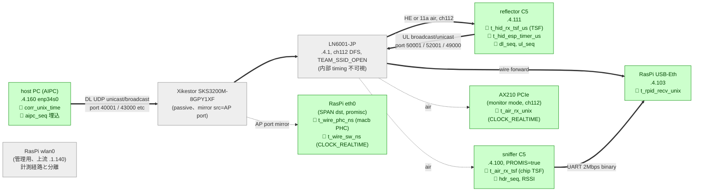
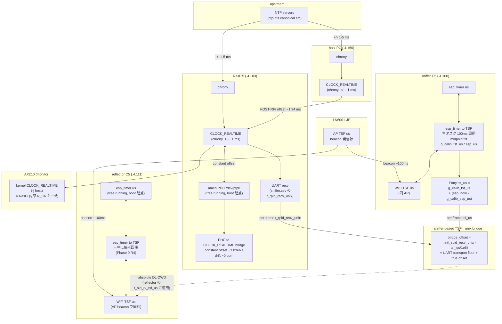

# 計測アーキテクチャ: 機器役割・時刻同期・誤差予算

> Phase 3 現行構成 (LN6001-JP + Xikestor + RasPi5、`docs/phase3_findings.md` §1) で各機器が **何の時刻軸でどんな時刻スタンプを記録しているか**、また **どこで何 μs/ms の不確実性が混入するか** を 1 ページで把握できるよう集約。提出文書の methodology 起稿時、報告数字の精度範囲を答えるときの参照点。

## 1. 機器と測定ポイント



### 1.1 機器ごとの役割と出力

| # | 機器 | 役割 | 接続 | 主要出力 | 備考 |
|---|---|---|---|---|---|
| 1 | **host PC (AIPC)** `.4.160` | 計測上の "AI" 役。`pc_emulator.py` が下り 40001 unicast を 100 Hz 送出、`cal_sender.py` が uc/bc 較正を 2-10 pairs/sec | enp34s0 wired (br0) | `pc_emulator.log` (TX 時刻+seq) | 計測コード持つが production AI とは独立。CLOCK_REALTIME を NTP 同期 |
| 2 | **Xikestor SKS3200M-8GPY1XF** | L2 switch、AP port → eth0 を mirror | wire 5 port + 10G SFP+ | (なし) | passive。**mirror source = AP port** 必須 (host port だと UDP unicast が落ちる、`docs/phase3_findings.md` §3.2) |
| 3 | **LN6001-JP** `.4.1` | AP/router。**ch112 DFS** で `TEAM_SSID_OPEN` (open auth) 配信。192.168.4.0/24 LAN ゲートウェイ | wire (to switch) + WiFi | (内部状態不可視) | 競技想定 AP。queue 内部不可視、DTIM=1 想定 (beacon ~100 ms、`docs/phase3_findings.md` §2.7) |
| 4 | **reflector C5** `.4.111` | HID 模擬 STA。40001 listen → rx_dl 記録、50001/52001 broadcast (10 Hz / per rx_dl)、49000 unicast (試験用、100 Hz) | WiFi STA、USB は電源のみ | air emit のみ (記録は metrics_radio JSON で 52001 経由) | metrics_radio v0、`FORCE_LEGACY_11A=true` (11a 強制試験用フラグ、本走 11ax 時は false) |
| 5 | **sniffer C5** `.4.100` | air capture STA。PROMIS=true で broadcast/MGMT/own-MAC unicast 捕捉、UART 2 Mbps binary 出力 | WiFi STA + UART USB | UART binary → `sniffer.csv` (frame 36B/ea)、`sniffer_cal.csv` (cal record) | 他 STA 宛て unicast は chip filter で取れない (`docs/phase1_findings.md` §3.2)。**cal 試験時は `ENABLE_PROMISCUOUS=false`** |
| 6 | ~~**AX210 PCIe** `wlP1p1s0`~~ → **EC25J (M.2)** | (旧 AX210: 補助 air monitor、§2.7 air-wire diff 計測で使用)。**§2.7 後に廃止予定** → **EC25J (LTE backhaul)** に置換。air monitor は C5 sniffer で代替済 (§2.13、他 STA unicast も取得可) | RasPi5 M.2 B-key | (EC25J: ModemManager 経由 LTE、計測経路と独立) | EC25J GNSS は不使用 (RasPi NTP master 維持)。AX210 の air-wire 計測値は §2.7 に記録済 |
| 7 | **RasPi5 eth0** (no IP) | SPAN destination、wire side hwtstamp 取得 | wire (mirror dst) | `wire_capture.py` → `wire_capture.csv`、tcpdump → pcap | **macb PHC `/dev/ptp0`** で nanosec hwtstamp、`hwstamp_ctl -i eth0 -r 1 -t 0` で RX_ALL filter ON、**eth0 promisc 必須** (`ip link set eth0 promisc on`) |
| 8 | **RasPi5 USB-Eth** `.4.103` | 制御平面。gtnlv-rpid が 50001/52001 socket recv | wire (LAN port) | `gtnlv_rpid.py` → `owd_dl.csv`, `tx_ul.csv`, `metrics_raw.csv`, `uplink_arrivals.csv`, `sniffer.csv`, `sniffer_hb.csv` | ASIX AX88179、software ts のみ (hwtstamp 非対応)、CLOCK_REALTIME |
| 9 | RasPi5 **wlan0** `.1.140` | 上流 `TEAM_SSID` (PSK) 経由の管理 SSH | 上流 LAN | (計測経路外) | 計測 subnet (.4.x) と分離、broadcast 二重受信問題なし |

## 2. 時刻同期フロー



### 2.1 同期チェーンの 3 層

```
層 0: NTP/インターネット
       ↓ ±1-5 ms
層 1: host PC CLOCK_REALTIME ⟷ RasPi5 CLOCK_REALTIME ⟷ AX210 kernel TS
       (相互に ~1-2 ms オフセット、内部は 1 ms ±)
       ↓ "constant offset"
層 2: RasPi5 macb PHC /dev/ptp0
       (nanosec 精度、CLOCK_REALTIME と定数 offset、drift ≈ 0 ppm)

別軸: AP TSF (LN6001-JP 内部、beacon 配信源)
       ↓ beacon ~100 ms 周期で同期、ジッタ ~5-10 μs
      reflector / sniffer C5 の WiFi TSF
       ↓ esp_timer↔TSF 中点フィット (Phase 0 R4、±1-2 μs)
      C5 esp_timer
```

→ **2 つの独立した時刻軸が存在**:
- **A 軸**: unix epoch (host PC、RasPi、AX210)
- **B 軸**: AP TSF (reflector、sniffer)

#### A↔B 軸の bridge (sniffer 経由、現行採用)

sniffer C5 を **dedicated bridge source** として A↔B 軸を結ぶ:

```
sniffer chip:
  esp_wifi_get_tsf_time() ─ midpoint fit (100 ms 周期、主タスク)
                          └→ B 軸サンプル (g_calib_tsf_us)
  esp_timer_get_time()    ─ chip-local C 軸 (g_calib_esp_us)
   ↓ cb 内で per frame に補間
  Entry.tsf_us = g_calib_tsf_us + (esp_timer_now − g_calib_esp_us)
   ↓ UART 2 Mbps binary
RasPi UART recv:
  per frame に t_rpid_recv_unix = time.time() を付与 (A 軸)
   ↓ sniffer.csv に (tsf_us, t_rpid_recv_unix) のペアが揃う
owd_analyzer/sniffer_bridge.py:
  bridge_offset = min over run of (t_rpid_recv_unix − tsf_us / 1e6)
   ↓ B → A 変換式 (TSF を unix に絶対変換)
absolute_unix_time = TSF / 1e6 + bridge_offset
   ↓ reflector の t_hid_rx_tsf_us に適用
絶対 DL OWD = (t_hid_rx_tsf_us / 1e6 + bridge_offset) − corr_unix_time
```

**bridge offset の中身** (理想 vs 実測):
- 理想値 = 真の B↔A 軸絶対 offset (= sniffer が air で frame を受けた瞬間の unix 時刻 − その frame の TSF)
- 実測値 = 理想値 **+ sniffer chip RX → cb → ring → UART → CP2102N → USB CDC → kernel** の最小 transport floor (CP2102N + USB CDC で典型 1-数 ms)
- → 絶対 OWD は transport floor 分だけ正側にバイアス (NTP drift ~2 ms と合算)

**複数 reflector への耐性**: bridge source が sniffer 1 台に集約されるため、reflector が N 台に増えても bridge offset 算出は不変。reflector 側は計測対象 (B 軸のサンプル提供のみ) として独立。

#### 補助経路
- **AX210 kernel TS**: A 軸 (RasPi CLOCK_REALTIME と同じ)。air 側 monitor pcap と eth0 SPAN pcap を **同一 host 内 -j host** で取れば kernel scheduling 揺れ ~10-100 μs のみで join 可 (`docs/phase3_findings.md` §2.7 の air-wire diff)
- **reflector の TSF サンプル**: bridge source 候補だが複数 reflector 環境を考えると不採用 (sniffer dedicated 設計)。reflector は計測対象 (T05) として B 軸サンプル提供のみ

## 3. 各タイムスタンプの一覧

| ID | 名前 | 取得元 | 時刻軸 | 精度 (基準clock 内) | 出力先 |
|---|---|---|---|---|---|
| T01 | `corr_unix_time` | host PC kernel sendto() | A (unix) | 1 ms (NTP) | UDP payload offset 38-45、`pc_emulator.log` |
| T02 | `aipc_seq` (seq、no time) | host PC | — | — | UDP payload offset 52-55 |
| T03 | `t_wire_phc_ns` | RasPi eth0 macb PHC | A (unix-bridge 可) | **1 ns** (hardware) | `wire_capture.csv` |
| T04 | `t_wire_sw_ns` | RasPi eth0 kernel SO_TIMESTAMPING | A (unix) | ~10 μs (kernel sched) | `wire_capture.csv` |
| T05 | `t_hid_rx_tsf_us` | reflector C5 esp_wifi_get_tsf_time() | **B (AP TSF)** | 1 μs (chip)、~5-10 μs jitter | `metrics_raw.csv` (52001 経由) |
| T06 | `t_hid_esp_timer_us` | reflector C5 esp_timer | C (chip 自由) | < 1 μs | metrics_radio 較正用 |
| T07 | `t_rpid_recv_unix` | RasPi USB-Eth UDP socket recv | A (unix) | ~50 μs (kernel sched, no hwtstamp) | `metrics_raw.csv`, `owd_dl.csv` |
| T08 | `t_air_rx_unix` (AX210) | RasPi AX210 kernel TS (-j host) | A (unix) | ~10-100 μs (kernel sched) | air pcap |
| T09 | `rx_timestamp_us` (sniffer) | sniffer C5 PROMIS cb `wifi_pkt_rx_ctrl_t.timestamp` | C (chip 自由、esp_timer 系) | 1 μs (chip) | `sniffer.csv` UART binary |
| **T09b** | **`tsf_us` (sniffer)** | **sniffer C5 主タスクで `esp_wifi_get_tsf_time()` を 100ms 周期で midpoint fit、cb 内で `g_calib_tsf_us + (esp_timer_now − g_calib_esp_us)` を計算** | **B (AP TSF)** | **1-2 μs (midpoint fit)、~5-10 μs jitter** | **`sniffer.csv` UART binary、bridge source** |
| T10 | `hdr_seq` (802.11 seq) | sniffer / AX210 air | — (seq) | — | `sniffer.csv`, air pcap |
| T11 | `dl_seq` / `ul_seq` (内部 monotonic) | reflector metrics_radio | — | — | `metrics_raw.csv` |
| T12 | `t_rpid_recv_unix` (sniffer 経由) | sniffer.csv の各 row、`sniffer_runner` (or `gtnlv-rpid`) が UART read 時に `time.time()` で記録 | A (unix) | ~ms (CP2102N+USB CDC polling) | `sniffer.csv` |
| T13 | `t_hid_tx_tsf_us` (reflector tx) | reflector metrics_radio が UL 送信直前に `esp_wifi_get_tsf_time` (中点フィット適用) で取得、tx_ul JSON に埋め込み 52001 broadcast | **B (AP TSF)** | 1 μs (chip)、~5-10 μs jitter、+ HID 内部 TX queue (chip → air) で μs〜sub-ms 追加遅延 | `metrics_raw.csv` (tx_ul records、52001 経由) |

## 4. 時刻ペア間の不確実性 (誤差予算)

| from → to | typical | worst | 由来 |
|---|---:|---:|---|
| **host PC CLOCK_REALTIME ↔ NTP** | ±1 ms | ±5 ms | chrony tracking 出力、ローカル NTP server からの精度 (RasPi 経由) |
| **RasPi CLOCK_REALTIME ↔ NTP** | ±1 ms | ±5 ms | RasPi が NTP server (`local stratum 10` + canonical 上流)、自身は上流に同期 |
| **host PC ↔ RasPi CLOCK_REALTIME** (master 化前) | ±2 ms | ±10 ms | Phase 3 overnight 中 = +1.94 ms 観測 |
| **host PC ↔ RasPi CLOCK_REALTIME** (NTP master 化後、現行) | **~200 μs** | ~500 μs | AIPC が RasPi に直接同期、wire join 計測 min +244 μs (USB-Eth + UDP stack 物理遅延込み)。chronyc tracking 内部値は sub-μs |
| **RasPi CLOCK_REALTIME ↔ PHC** | 1 μs | 5 μs | 定数 offset (~3,031,793.937977 s)、drift ≈ 0 ppm |
| **AX210 kernel TS ↔ eth0 kernel TS** (同 RasPi) | ~10 μs | ~100 μs | 同 host の kernel scheduling 揺れのみ |
| **reflector TSF ↔ AP TSF** | 5 μs | 50 μs | beacon ~100 ms 毎に同期、ジッタは AP 送信側 (Phase 0 R4) |
| **reflector esp_timer ↔ TSF** (内部較正後) | 1-2 μs | 5 μs | 中点フィット (`(t_before+t_after)/2`)、Phase 0 R4 で p99 確認 |
| **sniffer TSF ↔ reflector TSF** (同 AP 同期) | 5 μs | 50 μs | 2 STA とも同じ AP beacon を見る |
| **sniffer esp_timer ↔ TSF** (内部較正) | 1-2 μs | 5 μs | 主タスクで 100 ms 周期、`esp_wifi_get_tsf_time` を中点フィット |
| **AP TSF ↔ unix epoch** (sniffer bridge 経由) | ~ms | ~10 ms | sniffer の (TSF, unix) ペア → UART transport floor 分のバイアスが乗る、NTP drift と合算 |
| **AP TSF ↔ unix epoch** (絶対 offset) | (不可) | — | 真の絶対 offset は確立できない (TSF は AP boot 起点)、sniffer bridge で実用近似 |
| **wire 区間 (NIC → switch → NIC) 物理遅延** | <10 μs | 100 μs | 1Gbps wire、Xikestor switch fabric ~μs |
| **chip RX path (ESP32 air → memory)** | ~50 μs | 500 μs | C5 chip 固有、内訳不明 (Phase 0 R11 で 2 chip 差 ~2 μs RMS 確認、絶対値は両方とも μs オーダー) |
| **kernel TS → socket recv** (RasPi USB-Eth) | ~50 μs | 1 ms | kernel scheduling + USB bus + UDP stack |
| **AP queue 滞留** | 数 ms | **1-3 sec** | DFS radar / off-channel scan 時の freeze、Phase 3 overnight で 65 events/6h 観測 |
| **DTIM bcast buffering** (DL broadcast 限定) | 50 ms | 100 ms | beacon ~100 ms × DTIM=1、Phase 3 §2.7 で実測確認 |

## 5. OWD 計算に使う time pair と有効精度

実際に報告する OWD 系の数字は、上記の time pair を組み合わせて算出する。組み合わせごとに有効精度が異なる:

| 算出名 | 式 | 関与 time pair | 有効精度 | 用途 |
|---|---|---|---|---|
| **raw OWD** (challenge submit primary) | `t_rpid_recv_unix − corr_unix_time` (T07 − T01) | host ↔ RasPi NTP 経由 | **±2 ms** (host clock offset 含む) | end-to-end の "AI 視点 OWD"、Phase 3 median 0.46 ms (offset 込み) |
| **wifi_leg** (clean baseline) | `t_rpid_recv_unix − t_wire_sw_ns` (T07 − T04) | RasPi 内部のみ | **~50 μs** | AP queue + air + HID + broadcast 復路の純 WiFi 区間、Phase 3 median 2.31 ms |
| **wire arrival OWD** (host→AP boundary) | `t_wire_phc_ns(→unix) − corr_unix_time` | NTP + PHC bridge | **±2 ms** (host clock offset 主) | wire 経路の絶対時間、clock 補正後 ~10 μs オーダー |
| **TSF-bridge OWD** (legacy 方式) | `t_hid_rx_tsf_us − corr_unix_time*1e6 − floor` (T05 − T01 − rolling min) | A↔B 軸跨ぎ、TSF discontinuity 対策で rolling | **~10 μs** (jitter only、絶対値は floor 未確定) | jitter 解析、rolling-window min-filter で吸収 |
| **sniffer-based bridge OWD** (現行推奨、複数 reflector 非依存) | bridge_offset = min(`T12 − T09b/1e6`) over run、`OWD = T05/1e6 + bridge_offset − T01` | sniffer の (TSF, unix) ペアで A↔B 確立、reflector T05 に適用 | **~ms** (NTP drift + sniffer UART floor) | **絶対 DL OWD**、複数 reflector 環境でも sniffer 1 台が dedicated bridge |
| **air-wire diff** (DTIM 計測) | `t_air_rx_unix − t_wire_sw_ns` (T08 − T04) | 同 RasPi 内 kernel TS | **~100 μs** | DL broadcast の DTIM 待ち時間、UL の AP→wire forward 遅延 |

### 5.1 提出文書での主軸数字選択

- **典型 OWD**: **wifi_leg median 2.31 ms** ← clock offset 影響なし、RasPi 単独で内部完結  
- **絶対 OWD (NTP-bound)**: raw median 0.46 ms ← clock offset ~2ms 含むので最大 2-3 ms 程度の真値が想定される。**NTP master 化後は raw ≒ wifi_leg ~2.3 ms** (§8、phase3 §2.10)
- **worst-case OWD**: 2517 ms (DFS event) ← raw でも wifi_leg でも同等の桁、challenge 報告は raw max を採用
- **broadcast 特性**: DL bc air-wire median 19.6 ms (DTIM 由来)、UL bc air-wire median 0.30 ms ← 非対称性を文書化

### 5.2 提示モデル: 経路分解による OWD 算出

本走では sniffer/HID/wire の 4 測定点を組合せて **下り・上りそれぞれを leg 分解** して報告する。各 leg は同軸 (B-B or A-A) で測れる部分と、軸跨ぎで bridge が要る部分に分かれる。

#### 下り (AI PC → HID)

```
1. AI PC 送出          T01 corr_unix_time         (A 軸)
2. mirror port 受信    T04 t_wire_sw_ns            (A 軸)
3. C5 sniffer air 受信 T09b sniffer.tsf_us         (B 軸 = AP TSF)
4. HID rx              T05 t_hid_rx_tsf_us         (B 軸 = AP TSF)
```

| leg | 式 | 同軸性 | 要 bridge_offset | 用途 |
|---|---|---|---|---|
| **3-2 AP 滞留 (下り、broadcast/sniffer 宛 cal で計測)** | `sniffer.tsf_us/1e6 + bridge_offset − t_wire_sw_ns/1e9` | A-B 跨ぎ | あり | AP queue 内の deferral、DTIM 影響 (DL bc median 19.6 ms) |
| **4-3 air → HID 受信** | `t_hid_rx_tsf − sniffer.tsf_us` (両方 TSF) | B-B 同軸 | 不要 | HID chip RX path 内部処理 (~数十 μs) |
| **4-2 wire → HID (合算)** | `t_hid_rx_tsf/1e6 + bridge_offset − t_wire_sw_ns/1e9` | A-B 跨ぎ | あり | AP queue + air + HID RX path、合計 ~ms |
| **2-1 host → wire (NTP 依存)** | `t_wire_sw_ns/1e9 − corr_unix_time` | A-A | 不要 (NTP master 化後 ~0.2 ms 一致) | wire 物理遅延 (<10 μs) + NTP 残差 |

#### 上り (HID → AI PC、broadcast 全件)

```
1. HID tx              T13 t_hid_tx_tsf_us         (B 軸 = AP TSF)
2. C5 sniffer air 受信 T09b sniffer.tsf_us         (B 軸 = AP TSF)
3. mirror port 受信    T04 t_wire_sw_ns            (A 軸 = unix)
```

上り production テレメトリは **全て broadcast** (`50000+id`, `52000+id`) なので C5 sniffer の chip MAC filter (他 STA 宛て unicast 不可) に関係なく **全 packet 観測可能**。

| leg | 式 | 同軸性 | 要 bridge_offset | 精度 |
|---|---|---|---|---|
| **2-1 HID 送信遅延** | `sniffer.tsf_us − t_hid_tx_tsf_us` (両方 TSF) | B-B 同軸 | **不要** | μs オーダー (HID 内 chip TX queue + air propagation + sniffer chip RX) |
| **3-2 AP 内滞留 (上り)** | `t_wire_sw_ns/1e9 − (sniffer.tsf_us/1e6 + bridge_offset)` | A-B 跨ぎ | あり | C5 sniffer 経由で **NTP master 化後 ~0.2 ms** 精度、AX210+eth0 dual `-j host` 方式なら **sub-ms** (§2.7 で UL bc median 0.30 ms 実測済) |
| **3-1 end-to-end UL OWD** | `t_wire_sw_ns/1e9 − (t_hid_tx_tsf_us/1e6 + bridge_offset)` | A-B 跨ぎ | あり | HID app TX → AIPC 視点での到達まで (production 報告候補) |

#### 上り計測の実装上の要点 (2026-06-01 実装・実機検証)

- **sniffer は HID の ToDS 原送信 (802.11 `addr2`=HID) を air 観測点とする**こと。AP の
  FromDS 再送 (`addr2`=BSSID) を使うと、それは AP egress (有線転送より後) なので
  `air→wire` が**負値**になり区間の意味を失う。`sniffer.ino` の stage3/4 を双方向化し
  `addr1==BSSID && addr2==target` の上り原送信も通すよう変更済。
- **per-frame join key は `hid_seq`** (`robot_comm_spec/radio_metrics.md` §3.0 の `meta`、
  payload offset 9 の固定 HEX)。sniffer / WireReader が offset 9 を parse して同一フレームを
  air / wire / host-socket で同定・突合する。production 上り (50000、CU 起源 JSON) は payload を
  触れない (責任分界) ため、同時送出される radio_metrics フレーム (52000、`meta` 付き) を
  **プロキシ**として観測する。
- **送信アンカーの主は `rx_dl.t_tx_tsf_us`** (spec v2.1.0、`b06cf2a`): rx_dl が自身を上り broadcast
  する直前の TSF を持つため、**下り 100Hz に追従した高密度な上り計測**ができ、rx_dl 1 種で
  下り+上り両方向を per-frame 分解できる。`hb (1Hz)` の `t_now_tsf_us` はアイドル/下り無し時の
  アンカー、`tx_ul` (v2.1.0 で任意) は production 上り (50000) そのものを測る場合のプロキシ。
  いずれも CU 無しの本番ファーム (SanRei_HID) のまま測定できる。計測側 `_compute_uplink_legs`
  は rx_dl → hb → tx_ul の優先でアンカーを集める。
- **DL と UL で air/wire の意味が異なる**: DL は air/wire が AP を**挟む** (`air−wire`=AP 通過=
  AP 滞留) のに対し、UL は air(ToDS 原送信)→AP→wire(有線 egress) の**直列**で
  `air→wire`=AP 受信処理+有線転送 (正値)。
- 実測 (SanRei_HID hb 経由、idle): **① HID→air 0.53 ms / ② air→wire +0.35 ms / total 0.86 ms**。

#### 統計推定が要るパラメータ — 実質 1 つに集約

下り/上り双方で `bridge_offset` (= sniffer の TSF↔unix bridge、`tools/owd_analyzer/sniffer_bridge.py` の rolling-min 推定) のみが run ごとに必要。他は実機内部の自動較正 (esp_timer↔TSF midpoint fit) と chrony 同期で済む。

**NTP master 化前後の `bridge_offset` 精度比較**:

| 状態 | bridge_offset 残差 | 影響 |
|---|---|---|
| master 化前 (Phase 3 overnight) | NTP drift 1.94 ms + UART floor → noise 数 ms | AP 滞留 median 0.3 ms を直接観測不可、AX210 dual pcap 必須 |
| **master 化後 (現行)** | NTP drift ~0.2 ms + UART floor → noise ~ms | AX210 dual pcap がなくても sniffer 経由で AP 滞留 trend 観測可、AX210 はあれば sub-ms 精度の補助監視 |

### 5.3 実環境想定の計測 plan (1000 Hz unicast + cal 100 Hz × 2 種)

競技本走は **10 台 robot × 100 Hz unicast = 合計 1000 Hz** の DL 負荷。本走と同等の AP queue 占有を再現し、全 leg を per-packet で観測するための traffic 設計:

```
[AIPC]   ---1000 Hz unicast (.111 集中 or .111-.120 分散)----→ [eth0 SPAN] → [AP] ---uc---→ [HID(s)]
[RasPi]  ---100 Hz broadcast cal (port 43000)---------------→ [eth0 SPAN] → [AP] ---bc---→ [sniffer + 全 HID]
[RasPi]  ---100 Hz sniffer 宛 unicast cal (port 43000)------→ [eth0 SPAN] → [AP] ---uc---→ [sniffer]
```

#### 3 種の traffic の役割

| traffic | source → dst | レート | 役割 |
|---|---|---|---|
| **production DL** | AIPC → HID(s) unicast | 1000 Hz | 本走負荷再現、各 HID で rx_dl 計測 (T05) |
| **broadcast cal** | RasPi → 192.168.4.255:43000 | 100 Hz | broadcast 経路の AP 滞留 (DTIM 込み) を sniffer.tsf_us で per-packet 観測 |
| **sniffer 宛 unicast cal** | RasPi → 192.168.4.100:43000 | 100 Hz | unicast 経路の AP queue 滞留 (DTIM 無し) を sniffer.tsf_us で per-packet 観測。`docs/lessons_learned.md` §C.2 の chip filter 制約を sniffer 自身を宛先にして回避 |

#### 各 leg が取れる手段の一覧

| 求めたい leg | 取得手段 | 担当 traffic |
|---|---|---|
| host TX → wire 着 (T01→T04) | wire_capture (eth0 PHC + sw TS) | production DL |
| wire → broadcast の AP 滞留 (DTIM 込み) | sniffer.tsf_us − t_wire_sw_ns/1e9 + bridge_offset | broadcast cal |
| wire → unicast の AP queue 滞留 (DTIM 無し) | sniffer.tsf_us − t_wire_sw_ns/1e9 + bridge_offset | **sniffer 宛 unicast cal** |
| wire → 各 HID 着の合算 (queue + air + HID RX) | t_hid_rx_tsf − t_wire_sw_ns/1e9 + bridge_offset | production DL (各 HID) |
| HID 送信遅延 (UL) | sniffer.tsf − t_hid_tx_tsf (B-B 同軸) | production UL (HID 自身が broadcast 出力) |
| UL AP 内滞留 | t_wire_sw_ns/1e9 − sniffer.tsf/1e6 − bridge_offset | production UL |

#### 必要な cal sender 配置

- **AIPC 側 production sender** (`tools/pc_emulator/pc_emulator.py`): 既存、`--rate 1000` で .111 集中 unicast 可
- **RasPi 側 cal sender** (`tools/cal_sender/cal_sender.py` を RasPi 上で実行): broadcast + sniffer 宛 unicast を 100 Hz each
- sniffer 受信側 (`tools/esp_firmware/sniffer/sniffer.ino`): port 43000 listener 内蔵済、`ENABLE_PROMISCUOUS=true` 本走 mode で broadcast / 自分宛て unicast 両方を air RX

#### 期待される計測 plan の網羅性

| 区間 | 計測可? |
|---|---|
| wire 物理遅延 (host kernel → enp34s0 → switch → eth0 NIC) | ✅ wire_capture (NTP master 化済) |
| AP queue 滞留 (broadcast、DTIM 込み) | ✅ broadcast cal 経由 |
| AP queue 滞留 (unicast、DTIM 無し) | ✅ **sniffer 宛 unicast cal 経由** |
| air 区間 (AP → 各 HID、unicast HE PPDU) | △ HID rx_dl の合算値から逆算 (chip RX path ~50 μs を差し引き) |
| HID chip RX path 内部処理 | △ Phase 0 R11 で 2 個体差 RMS 2 μs 確認済、絶対値 ~50 μs は不問とする |
| UL HID 送信遅延 (HID chip TX queue + air) | ✅ sniffer (UL broadcast 全件) |
| UL AP 内処理 (air RX → wire egress) | ✅ sniffer + wire bridge |
| end-to-end raw OWD (DL/UL) | ✅ (NTP master 化により AIPC↔RasPi 一致度 ~200 μs) |

→ **AP内 / wire / HID 各 leg の全部を 1 試験で取得可能**。AX210 monitor は AX210 をどうしても外せない事情がなければ不要 (NTP master 化により C5 sniffer 経由でほぼ AX210 同等精度に到達)。

## 6. データ流れと記録ファイル

```
[host PC]
  pc_emulator.py → UDP 100 Hz → enp34s0 → switch
  cal_sender.py  → UDP 2-10 Hz pair (uc+bc) → 同上
  ↓ ファイル
  pc_emulator.log (送信ログ T01)
  send_log.csv (cal 送信 T01)

[switch port mirror = AP port]
  → eth0 SPAN (RasPi)

[RasPi5]
  eth0:
    wire_capture.py (AF_PACKET + SO_TIMESTAMPING) → wire_capture.csv  (T03 + T04)
    tcpdump -j host → wire.pcap (T04 で全 frame)
  USB-Eth:
    gtnlv_rpid.py (UDP socket 52001/50001) → metrics_raw.csv (T05+T07), tx_ul.csv, uplink_arrivals.csv, owd_dl.csv
  /dev/ttyUSB0 (sniffer):
    sniffer_runner → sniffer.csv (T09+T10), sniffer_cal.csv (cal_listener 経由)
  /dev/ttyUSB1 (reflector USB は電源のみ、データは無線で 52001)
  wlP1p1s0 (AX210 monitor):
    tcpdump -j host → air.pcap (T08 で全 frame)

[reflector C5] (.4.111)
  metrics_radio → broadcast :52001 JSON (rx_dl, tx_ul, hb)
  fake_uplink → broadcast :50001
  UL UC test → unicast :49000 (試験中、本走時無効化)
  (USB serial は無接続、ログは air のみ)

[sniffer C5] (.4.100)
  PROMIS → binary record → UART 2Mbps → /dev/ttyUSB0
```

## 7. 既知の制約と対策

| 制約 | 影響 | 対策 / 回避策 |
|---|---|---|
| LN6001-JP 内部 queue 不可視 | AP queue freeze の根本原因が推定のみ | 下流の OWD 分布から間接推定、`docs/phase3_findings.md` §2.5 |
| ESP32-C5 PROMIS は他 STA 宛て unicast を chip filter で reject | sniffer で本番 unicast の air timing 不可 | AX210 monitor mode (HE 不可、11a/legacy のみ) で代替、`docs/phase3_findings.md` §3.2 |
| AX210 monitor は HE PPDU decode 不可 | HE air frame の per-packet timing 取れず | broadcast/MGMT/制御 + radiotap TSFT は取れる、または reflector を `FORCE_LEGACY_11A=true` |
| port mirror で WiFi STA 宛て UDP unicast が host port では落ちる | wire 側 capture 失敗 | **mirror source = AP port** で全 traffic 取れる (`docs/phase3_findings.md` §3.2) |
| host PC ↔ RasPi の CLOCK_REALTIME に ~1-2 ms offset | raw OWD の絶対値が信用しづらい | wifi_leg (RasPi 内部のみ) を主軸に。将来: chrony で host を NTP server 化 or PTP |
| USB-Eth (AX88179) は hwtstamp 非対応 | rx_dl JSON 受信時刻が software TS のみ | wire 経由 PHC TS (eth0) で AIPC 送出時刻を ns 精度補強 |
| AP TSF ↔ unix epoch の絶対 offset は確立不可 | 絶対 OWD は得られない | 相対 + floor 経験値 (MIN_OWD_FLOOR_US 0.5-1 ms 想定) で代用 |

## 8. NTP master 化 (RasPi NTP server、AIPC client)

会場 LAN にインターネットが無い前提のため、**RasPi 自身を NTP master** として AIPC が同期する構成。USB-Eth (AX88179) は hwtstamp 非対応だが、chrony + software TS で AIPC↔RasPi 一致度 < 500 μs (実測 ~200 μs) を達成し、Phase 3 overnight 時の ~1.94 ms から **約 10 倍改善**。

### 8.1 設定 (現行配置済)

**RasPi `/etc/chrony/conf.d/10-ntp-master.conf`** (= NTP server 化):

```
local stratum 10
allow 192.168.4.0/24
```

`local stratum 10` は **上流 NTS unreach 時の fallback** で動き、上流 reach 時は本来の stratum (canonical 経由 3) で配信。会場では canonical unreach → 自動で stratum 10 配信。

**AIPC `/etc/chrony/sources.d/10-raspi-master.sources`**:

```
server 192.168.4.103 iburst minpoll 4 maxpoll 6 prefer
```

### 8.2 開発環境での canonical 切離し (任意)

開発環境では canonical NTS が reach するため、AIPC の chrony が canonical (stratum 2) を best 選択しがち (RasPi は stratum 3 で root_dispersion 大、selectable 評価で負ける)。**会場では canonical unreach なので問題は自然消滅**するが、開発時にも master 化効果を測るなら canonical を動的削除:

```bash
for h in ntp-nts-2.ps5.canonical.com ntp-nts-3.ps5.canonical.com \
         ntp-nts-2.ps6.canonical.com ntp-nts-3.ps6.canonical.com \
         ntp-nts-1.ps6.canonical.com; do
  sudo chronyc -a "delete $h"
done
sudo chronyc -a "burst 4/4 192.168.4.103"
```

`chronyc tracking` で Reference ID = `C0A80467` (192.168.4.103) になれば成功。chrony restart で復元される一時的な切替。

### 8.3 USB-Eth hwtstamp 非対応の影響評価

| 観測点 | 値 | 解釈 |
|---|---|---|
| `chronyc tracking` Last offset (内部精度) | **+0.7 μs** | chrony 同期そのものは sub-μs |
| AIPC→RasPi UDP echo の transit min | **343 μs** | USB-Eth (AX88179) software TS の kernel sched 粒度 + UDP stack |
| wire 起点 join (`min(t_wire_sw − corr_unix)`) | **+244 μs** | enp34s0 (host kernel TS) + switch fabric + macb (RasPi eth0) の software TS |

→ **PTP/hwtstamp 化すれば ~10 μs まで到達できるが、現行 chrony + sw TS で十分**。提示モデル (wire 起点 OWD 算出) では NTP drift を経路から外せるため、この 200 μs 残差は計測の主軸数字に影響しない。

### 8.4 RasPi の絶対時刻源 (LTE NITZ fallback)

NTP master 関係 (RasPi↔AIPC) は **両者の相対一致 (~200 μs)** を担うが、RasPi 自身の**絶対時刻**は別途アンカーが要る。会場 LAN にインターネットが無い場合に備え、RasPi 搭載の **LTE モジュール (Quectel EC25J)** を時刻源 fallback に使う:

- 優先: インターネット接続時は外部 NTP (canonical 経由)。
- fallback: LTE backhaul 経由 NTP、または **LTE 網時刻 NITZ** (`AT+QLTS=2`、**秒精度**) を chrony の参照に投入。
- EC25J は会場での**遠隔アクセス手段** (LTE backhaul) も兼ねる。`raspi_setup.md` §8.5 / CLAUDE.md 参照。

> 注: NITZ は秒精度なので**壁時計 (絶対時刻) のアンカー**用途。OWD は相対量で、µs オーダーの AIPC↔RasPi 同期は LAN 内 NTP master 関係が担うため、LTE 確度には依存しない。

## 9. 関連ドキュメント参照

- `docs/architecture.md` v2 — 全体設計、§3.2 同期チェーン
- `docs/phase0_runbook.md` — R4 (esp_timer↔TSF 較正) / R11 (chip 間遅延差) / R12 (PROMIS) 検証結果
- `docs/phase1_findings.md` — host PC 兼用 30 分計測、PROMIS UDP starve 等の制約
- `docs/phase2_findings.md` — RasPi5 中心 6h 計測、GS308E mirror 問題発見
- **`docs/phase3_findings.md`** — LN6001-JP + Xikestor + PHC bridge + DTIM 検証 (最新の確定数字)
- `docs/sync_alternatives.md` — 不採用にした時刻同期手段の比較
