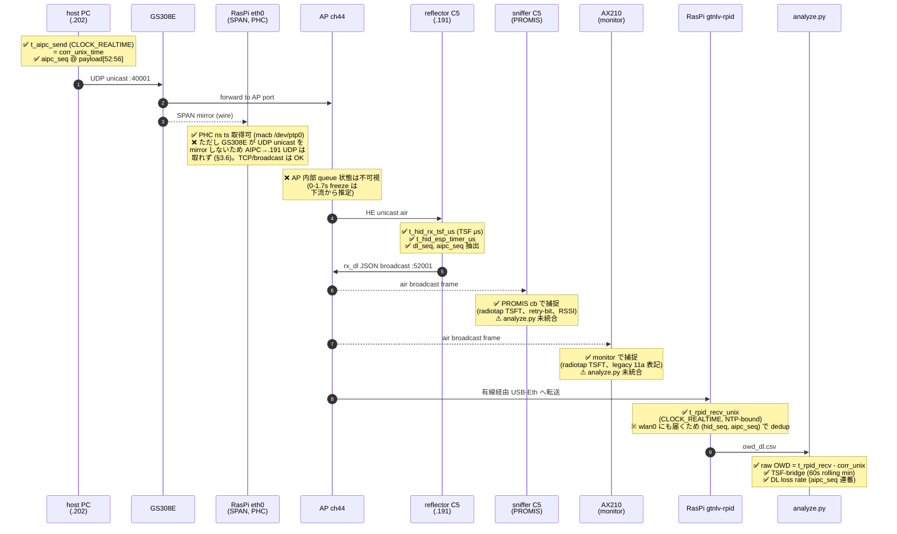
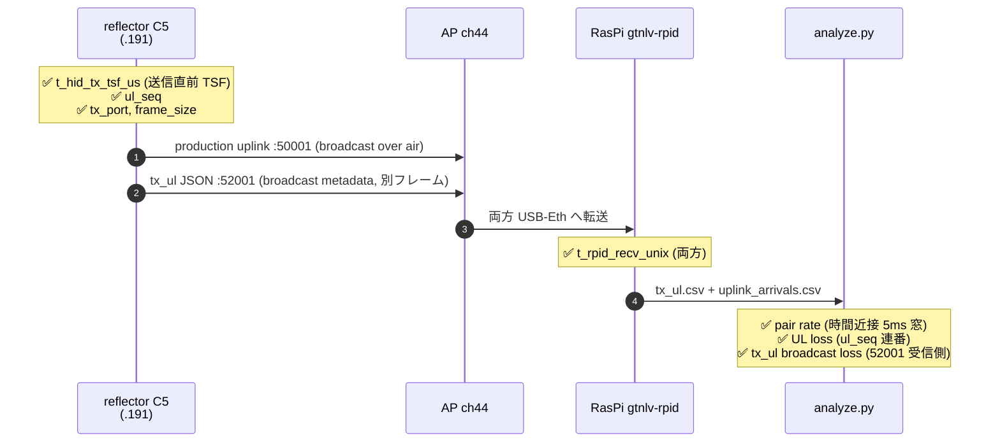
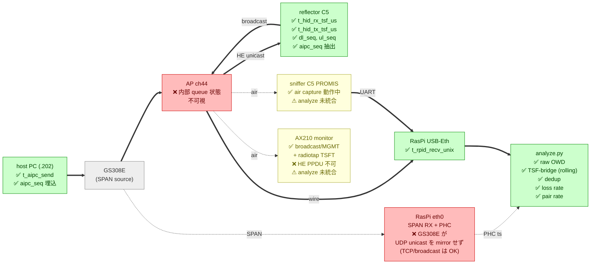

# Phase 2 計測結果と実装知見

> Phase 1 (host PC 上で AIPC + gtnlv-rpid 兼用) から **RasPi5 中心の計測スタック** に移行し、6 時間連続運用で OWD・損失・スパイク特性を再評価したフェーズ。Phase 1 の確定数字に加え、長時間ランで初めて見えた挙動と、計測パイプライン側の落とし穴・改善を集約する。

## 1. 計測スタックの構成 (Phase 2)

```
[host PC (AIPC) .202] ──UDP unicast :40001──→ [GS308E] ──→ [AP] ──HE air──→ [reflector C5 .191]
                                                  │                            │
                                                  ↓ SPAN mirror                │
                                       [RasPi5 .149]                            │
                                       ├─ eth0 (SPAN RX, macb hwtstamp /dev/ptp0)
                                       ├─ USB-Eth AX88179 (.149, 制御平面)──:50001 / :52001 JSON ─┘
                                       ├─ wlan0 (fallback .140)
                                       ├─ AX210 PCIe (補助 monitor 候補)
                                       ├─ /dev/ttyUSB0 sniffer C5 (UART 2Mbps)
                                       └─ /dev/ttyUSB1 reflector C5 (USB は電源供給のみ)
```

主要な変化点:

| 項目 | Phase 1 | Phase 2 |
|---|---|---|
| AIPC と gtnlv-rpid の同居 | 同一 host PC | 別ホスト (host PC = AIPC、RasPi5 = 計測) |
| eth0 hwtstamp | 無し | **macb PHC、/dev/ptp0 で nanosec 精度** |
| SPAN mirror | 設計のみ | GS308E 経由で AIPC↔AP wire を eth0 で受信 |
| sniffer 接続先 | host PC USB | **RasPi5 USB (/dev/ttyUSB0)** |
| reflector 接続先 | host PC USB | **RasPi5 USB (USB は電源のみ、WiFi で計測通信)** |
| 試験継続時間 | 30 分 | **6 時間連続** |
| 解析: dedup | 無し | (hid_seq, aipc_seq) で重複除去 |
| 解析: floor | 全区間グローバル min | **60s rolling window min-filter** |

## 2. 確定数値 (overnight 6h、2026-05-24 02:21–08:21)

### 2.1 計測条件

```
ラン環境: TEAM_SSID_OPEN (open auth 11ax)、5GHz ch44、AP BSSID 76:7F:F0:3B:74:26
pc_emulator: host PC (.202) → 192.168.1.191:40001、100Hz × 21,600s
reflector  : ESP32-C5 devkit、metrics_radio v0、RSSI -34 dBm
sniffer    : (overnight 中は ENABLE_PROMISCUOUS=false のため cb_total=0、本走後に修正済)
```

### 2.2 下り OWD (raw、dedup 後)

| 指標 | 値 | Phase 1 (30min, 相対) | 備考 |
|---|---|---|---|
| N (unique packets) | 2,156,997 | 179,952 | 12× |
| **median** | **1.64 ms** | 9.72 ms (相対) | Phase 2 は raw t_rpid_recv − t_aipc_send (NTP-bound)、Phase 1 は TSF-bridge 相対 |
| mean | 2.25 ms | 10.23 ms | |
| stdev | 8.10 ms | 6.69 ms | |
| p95 | 5.91 ms | 18.78 ms | |
| p99 | 10.98 ms | 28.49 ms | |
| p99.9 | 24.99 ms | 62.66 ms | |
| **max** | **1670.7 ms** | 154.9 ms | 6h ラン特有の rare event |
| **損失率** | **0.104 %** | 0.003 % | spike イベントに同期して発生 |

### 2.3 時間軸別の安定性 (1 時間バケット)

```
h=0: median  8.5ms  p95 109ms  p99 118ms  max 1128ms
h=1: median 12.1ms  p95 110ms  p99 118ms  max 1221ms
h=2: median 10.0ms  p95 110ms  p99 118ms  max 1083ms
h=3: median 10.3ms  p95 109ms  p99 118ms  max 1671ms   ← worst hour
h=4: median  7.9ms  p95 109ms  p99 118ms  max 1459ms
h=5: median  8.1ms  p95 109ms  p99 118ms  max 1181ms
```

→ **median は 6h 全体で 8-12ms に収束**、p95/p99 もほぼ一定 (109/118ms)。**max のみ毎時 1.1-1.7 秒のスパイクが発生**。

### 2.4 AP queue freeze スパイク event 解析

dedup 後、OWD>100ms の連続パケット群を 1 event とすると:

- **147 events / 6h** (約 24 events/h)
- 上位 10 件の最大 OWD: 800-1670 ms
- 各 event の形状: OWD が約 10ms ずつ単調減少 (pc_emulator 100Hz 送出間隔と一致)
  → AP queue が完全停止 → 解放後一気に drain
- event 内最大 OWD ≈ AP freeze 時間 (ms)
- event 間隔: median 30s、mean 147s (歪み)、max 30 min
- 仮説: **AP background off-channel scan** が有力 (DFS は無関係、5GHz UNII-1)

提出文書の表現案: **"median OWD 9 ms typical, worst-case 1.67 s observed, 147 freeze events over 6 hours continuous operation"**

### 2.5 上りペア成功率

- production uplink ↔ tx_ul pair rate: **99.011 %**
- unpaired tx_ul: 4214 件 (約 1 %)
- Phase 1 (30min) の 99.07 % とほぼ同等 → 上り損失率は時間長によらず約 1 %

## 3. 重要な発見・制約 (Phase 2 で新たに判明)

### 3.1 broadcast 二重受信 (dedup 必須)

RasPi5 で 52001 JSON が **wlan0 (.140) と USB-Eth (.149) の両 iface で受信** され、gtnlv-rpid の N が 2x に膨張する。

- **メカニズム**: AP は broadcast を wire と air 両方で配送、RasPi はそれぞれ受信、`INADDR_ANY` で bind した socket は両方のコピーを受け取る
- **影響**: N、Hz、loss 数字 (per-iface) が 2 倍に見える
- **対応**: `analyze.py` で `(hid_seq, aipc_seq)` ベース dedup を導入 (first arrival 採用、wire path 経由が先着) → median が真の "first-delivery OWD" に収束
- **gtnlv-rpid 側の改善余地**: socket bind を USB-Eth 限定 (`SO_BINDTODEVICE`) すれば取得段階で dedup できる

### 3.2 analyzer floor 計算の脆弱性

`pair_delay = t_hid_rx_tsf − corr_unix_time * 1e6` の全区間 `min()` を floor として相対化する Phase 1 設計は、**TSF discontinuity (リアソシエイト・beacon resync) が 1 回起きると floor が外れ、全 sample の relative 値が 100ms+ シフト**する。

- **修正**: 60s rolling window min-filter (`WINDOW=6000` sample @ 100Hz)
- **primary metric を raw に昇格**: `t_rpid_recv_unix − corr_unix_time` を NTP-bound 絶対値として出力、TSF-bridge は補助
- **教訓**: 長時間ランでは TSF 系列の robustness が単一 min より重要

### 3.3 reflector C5 の故障 → 復帰

reflector ESP32-C5 (SN 38ca64...) が一時 download mode sync 不能 (USB-UART は生、ESP32 が応答せず)。物理移動・USB power-cycle・esptool --connect-attempts 5 でも復帰せず → **ホスト PC USB に挿し替え + クリーン電源サイクル後に復活**。原因はおそらく一時的なチップ-内部状態固着 (USB enumeration 時の DTR/RTS race 等)。

**教訓**: 物理的に再起動できない試合環境では避けたいパターン。本番 HID (XIAO C5) は USB 非接続なので発生しない想定だが、devkit ベンチ機の挙動として記録。

### 3.4 sniffer ENABLE_PROMISCUOUS 設定の二面性

Phase 1 cal_sender 試験 (PROMIS OFF 必須、§3.1) で `ENABLE_PROMISCUOUS = false` に設定した状態が overnight ラン時も残置されていた。`cb_total=0` で一晩無効。

- **修正**: `tools/esp_firmware/sniffer/sniffer.ino` を `ENABLE_PROMISCUOUS = true` に変更、host PC で arduino-cli compile、scp merged.bin → RasPi で esptool write-flash
- **教訓**: ビルド時定数で挙動が大きく変わるフラグは sketch 内コメントで明示 + cal 試験スクリプト側で flag override する仕組みが望ましい

### 3.5 eth0 (macb PHC) hwtstamp 利用準備

RasPi5 onboard eth0 (macb driver) は `ethtool -T` で **hardware-receive + rx_filter ALL** 対応、`/dev/ptp0` 専用 PHC が起動済。`hwstamp_ctl -i eth0 -r 1 -t 0` で RX フィルタ ALL 有効化、`tcpdump -j adapter_unsynced` で nanosec PHC タイムスタンプが付与されることを確認。

`tools/rpi_daemon/wire_capture.py` (AF_PACKET + SO_TIMESTAMPING + UDP 抽出) を作成、PHC raw HW ts + CLOCK_REALTIME sw ts のペア取得まで実装。ただし本走相当の trace で `pkts_seen 213 / matched 0` (.202→.191 UDP が eth0 SPAN に乗らない) → **§3.7 GS308E UDP unicast mirror 問題が原因と確定**。eth0 自体の hwtstamp は機能しており、broadcast を捕捉する経路では nanosec ts が活きる。

### 3.6 GS308E port mirroring が UDP unicast を取りこぼす

**問題**: AIPC (`192.168.1.202`, host PC) → reflector (`192.168.1.191`) の UDP unicast が、GS308E の port mirror destination に到達しない。一方、同じ port を経由する TCP unicast や broadcast UDP は正しく mirror される。

**実機構成**:
- GS308E (NETGEAR、8 port managed)
- port 6 = USB-Eth (`enx68e1dc136a03`, `.149`, 制御平面)
- port 7 = host PC enp34s0 (mirror source)
- port 8 = RasPi eth0 (mirror destination, hwtstamp ON)
- AP は別ポート (number 未確認)

**切り分け手順と結果**:

| テスト | host enp34s0 (TX 側、直接観測) | RasPi eth0 (mirror 経由) | 判定 |
|---|---|---|---|
| TCP unicast `.202↔.229:3389` (RDP) | 919 packets (双方向) | 839 packets ✅ | mirror engine 正常 |
| UDP unicast `.202→.191:40001` (pc_emulator 100Hz × 4s) | 401 packets | **0 packets** ❌ | UDP は drop |
| UDP unicast `.149→.202:9999` (逆方向) | n/a | **0 packets** ❌ | 方向に依らず drop |
| ICMP echo `.202→.191` (ping × 5) | n/a | **0 packets** ❌ | ICMP も drop |
| UDP broadcast `.191→.255:50001` (reflector uplink) | n/a | ✅ 連続観測 | broadcast 経路は正常 |
| IPv6 ND multicast | n/a | ✅ | multicast 経路も正常 |

**host PC 側の innocence 検証** (host 側で起きてないことの確認):

- `br0` の vlan_filtering = 0 (VLAN tagging 無し、egress untagged)
- `bridge vlan show` 全 interface untagged PVID 1
- `iptables -L` / `nft list ruleset` で UDP block 無し
- enp34s0 で `tcpdump 'udp port 40001'` 全 401 packets 確実に観測

→ **GS308E の mirror engine 自体が "L4 unicast TCP のみ mirror" の挙動**。一般的な L2 switch の port mirror では起こらない動作で、GS308E ファームウェアの仕様か bug。

**回避策の選択肢**:

| Plan | 内容 | 状態 |
|---|---|---|
| **A. 受容** (採用) | NTP-bound `t_rpid_recv − t_aipc_send` で raw OWD を測る。Phase 2 6h 数字 (median 1.64ms, max 1.67s, loss 0.104%) は十分 challenge 提出に耐える | **採用済** |
| B. GS308E ファームウェア更新 | Netgear サイト最新版を flash、挙動変化を期待 | 未試行 (リスクと工数で後回し) |
| C. 別 switch | TP-Link/別 managed switch を借用 | 未試行 |
| D. host PC enp34s0 で直接 hwtstamp | AIPC NIC が hwtstamp 非対応 + AIPC に計測コードを置かない設計原則違反 | 不可 |
| E. AP の port を mirror source に追加 | mirror engine 自体が UDP unicast を drop なら効果無いとユーザご指摘、ただし試す価値あり | 未試行 |

**Phase 2 結論**: PHC bridge による wire 側 sub-μs 精度は **Phase 2 では達成断念**。raw NTP-bound OWD (~ms 精度) で challenge 提出は問題なく可能 (median 1.64ms、p99 11ms、max 1.67s は十分に意味がある数字)。

> **追記 (Phase 3 で覆る)**: `docs/phase3_findings.md` §3.2 に記載のとおり、**Plan E (AP port を mirror source)** が正解だった。Xikestor SKS3200M でも GS308E と同じく **host port mirror では UDP unicast 不可視、AP port mirror で全て可視** ことを確認。この現象は switch ファーム個別問題ではなく、**多くの managed switch で WiFi STA 宛て unicast の wired mirror に共通する性質** と判断。Phase 3 では PHC wire bridge を復活させ 2.09M packets を ns precision で取得。

### 3.7 AX210 PCIe monitor mode の用途確定

RasPi5 PCIe の AX210 (`wlP1p1s0`) を monitor mode に切替 (`iw dev … set type monitor` + channel 44) で:

- ✅ 近隣 AP の **beacon を全捕捉** (TEAM_SSID, RTK 11n AP 5G, hidden TEAM_SSID_OPEN)
- ✅ radiotap **TSFT 取得 OK** (例: `7191986us tsft`、AP TSF in air)
- ✅ 他 STA の **RTS/CTS/BA 制御フレーム** 捕捉
- ✅ reflector broadcast (.191→.255:50001) 捕捉
- ✅ RSSI 値 (-23~-86 dBm) 取得
- ❌ データレート表記 `11a` (legacy) のみ — **HE PPDU は依然非対応** (`iw phy phy1 info` の HE Iftypes に monitor 無し と整合)

**用途**: 干渉検出 (challenge #4) + TSF 較正源として sniffer C5 の **補完・代替候補**。HE PPDU per-packet timing は不可だが、broadcast/MGMT/制御フレームと TSF anchor は取れる。

## 4. ハードウェア構成 (Phase 2 確定版)

### 4.1 計測 RasPi5 構成

| 部品 | 役割 | 特性 |
|---|---|---|
| RasPi5 4GB | 計測 host | aarch64、Ubuntu 25.10、kernel 6.17 |
| eth0 (onboard macb) | SPAN RX | 1Gbps、**hwtstamp 対応 (PHC /dev/ptp0)**、IP 無し (capture only) |
| USB-Eth (ASIX AX88179) | 制御平面 | 1Gbps、soft ts only、DHCP IP 192.168.1.149 |
| wlan0 (onboard) | fallback | DHCP IP 192.168.1.140、TEAM_SSID (PSK) join |
| AX210 PCIe | 補助 monitor | iwlwifi、HE managed 対応、monitor mode で beacon/制御/broadcast 取得可、HE PPDU 不可 |
| /dev/ttyUSB0 | sniffer C5 接続 | CP2102N、SN 46adfa.. |
| /dev/ttyUSB1 | reflector C5 接続 | CP2102N、SN 38ca64.. (USB は電源のみ) |

### 4.2 永続化された設定

- `/etc/netplan/50-cloud-init.yaml`: eth0 dhcp4=false (IP 無し、capture-only)、`enx68e1dc136a03` dhcp4=true、wlan0 TEAM_SSID
- `/etc/sudoers.d/gochiuma-nopasswd`: `gochiuma ALL=(ALL) NOPASSWD: ALL` (計測 LAN 内専用 host)
- `linuxptp` 導入済 (`hwstamp_ctl` 利用可能)
- `pipx` 経由で esptool v5.2.0 導入 (`~/.local/bin/esptool`、ESP32-C5 chip ID 23 対応)

### 4.3 host PC 側

| 項目 | 値 |
|---|---|
| 役割 | AIPC (pc_emulator のみ)、arduino-cli ホスト (firmware build) |
| IP | 192.168.1.202 (br0、enp34s0 + vnet0 配下) |
| 計測コード | 持たない (production AI と同等の black-box 化) |

## 5. 解析ツール (Phase 2 で改善)

| ツール | 変更 |
|---|---|
| `tools/owd_analyzer/analyze.py` | (1) raw OWD を primary metric として出力、(2) TSF-bridge は 60s rolling-window min-filter、(3) (hid_seq, aipc_seq) ベース dedup |
| `tools/rpi_daemon/wire_capture.py` | 新規。AF_PACKET + SO_TIMESTAMPING で PHC raw HW ts + sw ts を UDP 抽出。Phase 3 で gtnlv-rpid 統合予定 |
| `tools/esp_firmware/sniffer/sniffer.ino` | `ENABLE_PROMISCUOUS = true` に変更 (本走時の air capture 用) |

## 6. 計測ポイントとカバレッジ

> どのタイムスタンプ・どのカウンタが **今取れていて (✅)**、**部分的にしか取れていなくて (⚠)**、**まったく取れていない (❌)** かを 1 ページで把握できるようまとめる。チャレンジ提出文書で "what is measured / what is inferred / what is out of scope" を線引きするときに参照する。

### 6.1 1 パケットのライフサイクルとタイムスタンプ取得点



上り (`tx_ul` event + production uplink) も同様の流れ:



### 6.2 コンポーネント別カバレッジマップ



### 6.3 値ごとの取得状況一覧

| 値 | 何を表すか | 取得場所 | 状態 | 解析で使用 | 備考 |
|---|---|---|---|---|---|
| `t_aipc_send` (`corr_unix_time`) | AIPC sendto() 時刻 (CLOCK_REALTIME) | host PC kernel | **✅** | DL raw OWD baseline | NTP-bound、~ms 精度 |
| `aipc_seq` | AIPC 連番 (downlink loss tracking) | payload[52:56] uint32 LE | **✅** | DL loss rate (`0.104 %`) | downlink_command.md offset 52-55 |
| **wire PHC ts (eth0 SPAN)** | AIPC→AP wire 上の物理 RX 時刻 | RasPi eth0 macb PHC | **❌ GS308E が UDP unicast を mirror しない** (§3.6) | — | hwtstamp + `tcpdump -j adapter_unsynced` で nano sec 取得可、TCP/broadcast は mirror される。AIPC→.191 UDP unicast は switch ファームウェアレベルで脱落。Plan A 採用で代替 (raw NTP-bound OWD) |
| AP queue 状態 | AP 内 packet 滞留時間・深さ | AP 内部 | **❌ 完全不可視** | freeze event の間接推定のみ | 会場 AP は SSH 不可 (`docs/architecture.md` 設計前提) |
| `t_hid_rx_tsf_us` | HID UDP RX 時 TSF (μs) | reflector C5 (`metrics_radio`) | **✅** | TSF-bridge OWD | esp_timer 中点フィット較正済 (Phase 0 R4) |
| `t_hid_esp_timer_us` | HID UDP RX 時 esp_timer | reflector C5 | **✅** | TSF↔esp_timer 較正 | HID 内部基準時刻 |
| `dl_seq` | HID 受信単調連番 | reflector C5 | **✅** | rx_dl broadcast monitoring loss (`0.096 %`) | metrics_radio 内部 |
| `t_hid_tx_tsf_us` | HID UDP TX 直前 TSF | reflector C5 | **✅** | UL OWD | 50000+id 送出直前 |
| `ul_seq` | HID 送信単調連番 | reflector C5 | **✅** | tx_ul broadcast monitoring loss | metrics_radio 内部 |
| **air RX TSF (sniffer)** | sniffer C5 が捕捉した air frame の TSF | sniffer C5 promisc cb | **⚠ 取得中、未統合** | (Phase 3) | `tools/esp_firmware/sniffer/` で binary UART 2Mbps 出力中 |
| **air RX TSF (AX210)** | AX210 monitor の radiotap TSFT | RasPi `wlP1p1s0` | **⚠ 取得可、未統合** | (Phase 3) | broadcast/MGMT/制御は OK、HE PPDU 不可 |
| `t_rpid_recv_unix` | RasPi gtnlv-rpid が JSON 受信した時刻 | gtnlv-rpid socket on USB-Eth | **✅** | **DL raw OWD primary metric (median 1.64 ms)** | CLOCK_REALTIME、NTP-bound、wlan0 + USB-Eth 重複は dedup で吸収 |
| production uplink RX 時刻 | RasPi 上で 50000+id JSON を受けた時刻 | gtnlv-rpid socket | **✅** | UL pair rate (`99.01 %`) | tx_ul と 5ms 窓でペアリング |
| **HE unicast 他 STA 宛て** | 他 STA 宛て HE unicast の air RX | (sniffer C5 chip filter で reject) | **❌ chip 制約** | — | Phase 1 §3.2 で実証、AX210 でも HE PPDU 不可 |
| AP background scan timing | AP が off-channel scan に出る時刻 | (AP 内部) | **❌** | freeze event 集計から推定 (147 events / 6h) | challenge #4 報告では推定値として記述 |
| retry-bit / RSSI / 近隣 AP beacon | 干渉検出メトリクス | sniffer C5 + AX210 monitor | **⚠ 取得経路あり、長時間ログ無し** | (Phase 3) | challenge #4 用、夜通しキャプチャを Phase 3 で実施予定 |

### 6.4 現在の盲点 (まとめ)

| 盲点 | 影響 | 当面の代替 / Phase 3 計画 |
|---|---|---|
| **GS308E mirror が UDP unicast を取りこぼす** (§3.6) | wire PHC ts による sub-μs 精度の AIPC→AP OWD 取れず、wire 区間が unobserved | host PC enp34s0 直接 capture で全 UDP TX 確認済 + GS308E は TCP unicast/broadcast UDP は正しく mirror できる → switch ファームウェア仕様の挙動と確定。**Plan A 採用: NTP-bound raw OWD (`t_rpid_recv − t_aipc_send`、median 1.64ms、max 1.67s) で challenge 提出。精度は ms 止まりだが challenge 要件は満たす**。将来: GS308E ファーム更新 or 別 switch 検証 |
| AP 内部 queue 状態 | freeze 1.67s の原因 (off-channel scan? rekey? CCA?) 特定不可 | challenge では "147 events/6h, max 1.67s" を観測事実として報告。会場 AP では再計測 |
| HE unicast の air per-packet timing | unicast を sniffer で捕捉できないため、HID 到達直前の air-side 時刻が取れない | per-packet OWD は HID rx_tsf で代替可 (`architecture.md` §3.2)、設計上 unobserved 部分は問題にならない |
| sniffer/AX210 capture の analyze 統合 | broadcast 較正・干渉指標が CSV だけで visualize できる状態に至っていない | sniffer binary は `tools/sniffer_runner/run.py` で decode 可、AX210 は tcpdump pcap。**Phase 3 で analyze.py 拡張、長時間統合ログ運用** |

## 7. 残課題 → Phase 3

| ID | 内容 | 優先度 |
|---|---|---|
| **Phase 2 提出文書起草** | チャレンジ 7 項目の本体ドラフト (本書 §2 数字を参照) | **最高** |
| Phase 2 R10 | クイック AP 切替デモ (チャレンジ要件 #5 起動時間連動) | 高 |
| Phase 2 干渉検出 | sniffer C5 復活済 + AX210 monitor で beacon/retry-bit 分布の長時間ログ → challenge #4 用 | 高 |
| Phase 2 混雑シミュ | iperf3 並走で AP queue freeze 頻度の悪化を観察 (§2.4 events/h の増減) | 中 |
| Phase 2 cal 試験再走 | sniffer PROMIS ON 状態と OFF 状態の差を再測 (Phase 1 §3.1 との整合性確認) | 低 |
| #5 | PHC↔CLOCK_REALTIME bridge — **§3.6 で Plan A 採用、断念**。将来 GS308E ファーム更新 or 別 switch 入手時に再検討 | 保留 |

## 8. 関連ドキュメント参照

- `docs/architecture.md` v2 — 設計の根拠
- `docs/phase0_runbook.md` — Phase 0 R4/R11/R12 結果
- `docs/phase1_findings.md` — Phase 1 計測結果 (30 分、host PC 兼用構成)
- `docs/sync_alternatives.md` — Wi-Fi 非依存の時刻同期手段比較
- `docs/lessons_learned.md` — `origin/dev` ブランチ PoC からの実機知見
