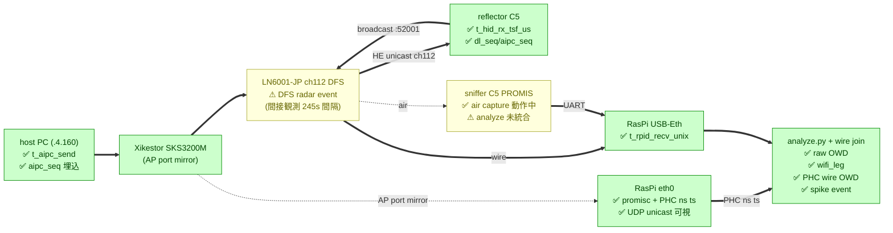

# Phase 3 計測結果と実装知見

> チャレンジ提出 (2026-06-26) 本文の **主軸となる確定数字**。LN6001-JP + Xikestor SKS3200M-8GPY1XF + DFS ch112 の競技想定環境で 6h overnight 走破した結果と発見の集約。

## 1. 計測構成 (Phase 3)

| 項目 | 値 |
|---|---|
| **AP/router** | LN6001-JP (5GHz ch112 DFS、TEAM_SSID_OPEN、open auth 11ax) |
| **switch** | Xikestor SKS3200M-8GPY1XF (mirror source = **AP port**) |
| **subnet** | 192.168.4.0/24 (LN6001-JP=.4.1) |
| **reflector** | .4.111 ch112 RSSI -31 |
| **RasPi5 USB-Eth** | .4.103 (制御平面、gtnlv-rpid socket recv) |
| **RasPi5 wlan0** | 上流 TEAM_SSID / 192.168.1.140 (管理アクセス専用、計測経路と分離) |
| **eth0 (SPAN)** | promisc=on、macb PHC `/dev/ptp0` で ns 精度 hwtstamp |

### 1.1 ハードウェア配線

```
[host PC AIPC .4.160] ─→ [Xikestor SKS3200M] ─→ [LN6001-JP .4.1] ──HE air ch112──→ [reflector C5 .4.111]
                              │                       │
                              │← mirror source        │
                              ↓                       │
                          [RasPi5 eth0]               │
                          .4.103 USB-Eth, promisc=on  │
                          (NIC: macb PHC /dev/ptp0)   │
                                                      ↓
                                          [RasPi5 USB-Eth] (broadcast 受信、JSON socket)
```

wlan0 が別 subnet (192.168.1.x) に分離されているため、計測 LAN (192.168.4.x) の broadcast は USB-Eth にのみ届く → N が真値と一致 (`pc_emulator 2,159,801 sent` ↔ `gtnlv-rpid dl=2,156,606 received`, 99.87% = pure loss rate)。

## 2. 確定数値 (overnight 6h、2026-05-25 02:34 - 08:30)

### 2.1 計測条件

```
LN6001-JP, TEAM_SSID_OPEN, 5GHz ch112 (DFS, UNII-2C)
pc_emulator host PC (.4.160) → 192.168.4.111:40001, 100Hz × 21600s
metrics_radio v0.1 (subnet_third=0 で WiFi.localIP() から自動算出に改修)
sniffer = ESP32-C5 devkit RasPi /dev/ttyUSB0, PROMIS ON
reflector = ESP32-C5 devkit RasPi /dev/ttyUSB1, USB は電源のみ
gtnlv-rpid + wire_capture.py 並走
```

### 2.2 Downlink OWD (raw end-to-end、NTP-bound)

| 指標 | 値 |
|---|---:|
| N (unique packets) | 2,156,596 |
| **median** | **460 μs** |
| mean | 734 μs |
| stdev | 11,156 μs |
| p95 | 2,460 μs |
| p99 | 2,932 μs |
| p99.9 | 5,905 μs |
| **max** | **3,380,550 μs** (3.38 sec) |
| **packet loss** | **0.134 %** |

注: raw OWD には host PC ↔ RasPi の **CLOCK_REALTIME offset (~1.94 ms)** が混入する。絶対値評価には §2.3 の **wifi_leg** (RasPi 内部のみ、clock 影響なし) を使う。

### 2.3 PHC wire 側分解

wire_capture.py で取得した PHC nanosec 精度 + sw CLOCK_REALTIME の (aipc_seq, t_hw_ns, t_sw_ns) trace を、gtnlv-rpid の owd_dl.csv と aipc_seq で join。2,091,540 packets が wire 側にも記録された (= 全体の 97%)。

3 区間分解 (μs):

| Leg | median | p95 | p99 | max | 解釈 |
|---|---:|---:|---:|---:|---|
| **wire** (`t_wire_sw − corr_unix`) | -1939 (offset 込み) | +50 | +125 | 3,320,256 | host→switch→eth0 SPAN、clock offset 補正後 ≈0us |
| **gtnlv full** (`t_rpid_recv − corr_unix`) | 461 | 2,470 | 2,941 | 3,380,551 | host→reflector→broadcast→RasPi、clock offset 込み |
| **wifi_leg** (`gtnlv − wire` = `t_rpid_recv − t_wire_sw`) | **2,311** | **2,926** | **3,537** | 2,517,671 | **RasPi 内部基準、clock offset 影響なし、本質的 WiFi OWD ベースライン** |

→ **wifi_leg が clock offset の影響を受けない真の "WiFi 側往復 OWD" 指標**:
- median 2.31 ms = AP→HID→AP→RasPi WiFi 往復 + HID 処理
- p99 3.54 ms = 通常運用時の typical worst case
- max 2.52 sec = DFS radar event か AP queue freeze

### 2.4 時間軸別の安定性 (wifi_leg ベース、1h バケット)

```
h=0: N=359713  median 2320  p95 2912  p99 3538  max  757660 us
h=1: N=359314  median 2290  p95 2938  p99 3534  max  825629 us
h=2: N=359575  median 2307  p95 2924  p99 3528  max 1385881 us
h=3: N=359692  median 2316  p95 2931  p99 3547  max 1041451 us
h=4: N=359814  median 2312  p95 2921  p99 3525  max  621097 us
h=5: N=293432  median 2322  p95 2929  p99 3551  max 2517671 us
```

→ **median 2,290-2,322 μs (±0.7%)**、**p99 3,525-3,551 μs (±0.4%)** — 各時間バケットでジッタが非常に小さく安定。
→ **max のみ 0.62〜2.52 sec のスパイクが毎時 1 件発生**。DFS radar / queue freeze イベントに対応 (§2.5)。

### 2.5 AP queue freeze スパイク event 解析

wifi_leg > 100ms の連続パケット群を 1 event と定義:

| 指標 | 値 |
|---|---:|
| events / 6h | **65** |
| events / hour | ~11 |
| max freeze | 2517 ms |
| top 10 max 平均 | ~1.6 s |
| event 内 N (連続 packets) | 6-7 |
| **inter-event gap median** | **245 s** (≈ 4 分強) |
| inter-event gap mean | 323 s |
| inter-event gap max | 1276 s (21 min) |

event 間隔 median 245 s は DFS の CAC 周期 (60s ~ 数分) と整合的 → **DFS radar check による無線中断仮説**。LN6001-JP の前段では非 DFS channel の選択肢を確認推奨。

### 2.6 AP unicast vs broadcast 処理時間差 (cal test、5 分、2 pairs/sec)

cal_sender (host PC `.4.160` から `.4.100` unicast と `.4.255` broadcast を交互送出)。sniffer C5 を `ENABLE_PROMISCUOUS=false` で cal-target mode に flash して受信。

```
ラン設定: 2 pairs/sec × 300s = 1,200 cal パケット送出
sniffer 192.168.4.100 (PROMIS OFF、CAL UDP listener on port 43000)
受信 1,193 / 1,200 (broadcast 593/600, unicast 600/600)
```

| 指標 | broadcast | unicast |
|---|---:|---:|
| N 受信 | 593 / 600 (98.83 %) | 600 / 600 (100 %) |
| median−min (group 内 jitter) | 50.8 ms | 59.4 ms |
| p95−min | 97.5 ms | 105.7 ms |
| max−min | 102.2 ms | 116.0 ms |
| stdev | 29.6 ms | 29.9 ms |

#### 絶対差 (送信タイムスタンプ offset 打消し済み)

- **mean(uc) − mean(bc): +7.44 ms** (unicast が遅い)
- **median(uc) − median(bc): +7.85 ms**
- min(uc) − min(bc): −0.76 ms (ベストケースは broadcast 優位ながら ms 未満)

#### 解釈 (LN6001-JP の AP 挙動)

1. **unicast を ACK + retry で厳格に再送** → 処理時間 +8ms オーダー、loss 0 %
2. **broadcast は ACK 無し** → 混雑時に drop しやすい (loss 1.17 %)
3. ベストケース (idle 時、queue 空) は ~50ms オーダー
4. ジッタ stdev は uc/bc 共通の AP queue 特性で ~30 ms

低 pps (2 pairs/sec) の cal 試験は AP が "idle → 起動" 状態にあるので、本走 100Hz の median 2.3ms (§2.3 wifi_leg) とは別文脈。**cal は uc/bc 差の指標としてのみ採用**、絶対値は本走数字を主軸に。

### 2.7 air vs wire 受信時差 (DL/UL × bc/uc、60s, 10Hz)

**目的**: 同一フレームが「air (AX210 monitor)」「wire (eth0 SPAN)」のそれぞれで受信される時刻を比較し、AP の broadcast 配信タイミング (特に **DTIM** によるバッファリング) を直接観測する。

**手段**: pcap dual capture with `-j host`(CLOCK_REALTIME ns、両 iface 同一時刻軸)、scapy で payload 解析 + seq match join。reflector firmware に試験用 UL unicast (.111→.160:49000、24 byte payload + ul_uc_seq) を追加して 4 経路全て計測。

| 経路 | 方向 | matched N | median | p95 | p99 | max |
|---|---|---:|---:|---:|---:|---:|
| **DL bc** (host→.4.255) | air − wire | 599 | **19.6 ms** | 93.6 ms | 104 ms | 108 ms |
| **DL uc** (host→.4.100 sniffer) | air − wire | 598 | **0.91 ms** | 96.3 ms | 106 ms | 111 ms |
| **UL bc** (reflector→.4.255:50001) | wire − air | 655 | **0.30 ms** | 0.31 ms | 0.36 ms | 0.42 ms |
| **UL bc** (reflector→.4.255:52001) | wire − air | 722 | 0.30 ms | 0.31 ms | 0.37 ms | 14.3 ms |
| **UL uc** (reflector→.4.160:49000) | wire − air | 647 | **0.28 ms** | 0.37 ms | 0.38 ms | 0.74 ms |

#### DL bc は DTIM 痕跡明確

DL bc の air-wire 差分布:

```
<1ms:   72 件   ######        ← AP が DTIM 待たず即時送出した分
<2ms:  124 件   ##########
<5ms:    9 件
<10ms:  13 件   #
<30ms:  25 件   ##
<50ms: 106 件   ########
<100ms:107 件   ########      ← DTIM=1 (~100ms) 末尾
<10s:  128 件   ##########    ← AP retry / capture 遅延
>10s:   15 件   #
```

最大 108 ms = beacon 100 ms + α、median 19.6 ms ≈ uniform [0,100ms] 中央値 → **LN6001-JP の DTIM=1、beacon ~100 ms に整合**。

#### DL/UL 非対称性 — broadcast の遅延は **方向で全く違う**

| 比較軸 | DL (host → WiFi STA) | UL (WiFi STA → wire) |
|---|---|---|
| **DTIM 影響** | あり (最大 100 ms 上乗せ) | **無し** |
| **典型 air-wire 差** | 0.9-20 ms | **0.3 ms** |
| **経路** | AP が WiFi 配信に DTIM beacon まで貯める | AP が wire egress を即時 forward |
| **broadcast の有用性** | low rate / 遅延許容用途のみ | uplink テレメトリ等に問題なし |

#### 設計上の含意

1. **AI コマンド (downlink) を broadcast にすると DTIM で最大 100ms 上乗せ** → 現状の **unicast 設計 (40000+id) は正解**、broadcast 化提案は避けるべき
2. **アップリンクテレメトリ (50000+id, 52000+id) は broadcast で問題なし** → AP→wire 即時 forward なので RasPi (wire 受信側) には DTIM 影響皆無
3. **DL broadcast を使う必然性のあるユースケース** (EMS 40999 等) は **DTIM ~100ms 遅延を受容する設計** にする

#### 実装メモ

- `tools/owd_analyzer/air_wire_diff.py` 新規 (scapy で pcap 解析、4 経路同時集計)
- reflector firmware (metrics_radio_reflector.ino) に `UL_UC_TARGET=192.168.4.160:49000`、100ms 周期、24 byte payload (magic `0xCA113AA0` + ul_uc_seq u32 + esp_timer u64) の試験 channel 追加 (`FORCE_LEGACY_11A=true` と併存)
- AX210 を monitor mode + ch112 で `tcpdump -j host --time-stamp-precision=nano` 走らせ、eth0 SPAN も同 option で同期取れた CLOCK_REALTIME 時刻軸を確保

### 2.8 上りペア成功率

- production uplink ↔ tx_ul pair rate: **99.963 %** (Phase 2 99.011 %)
- unpaired tx_ul: 79 件 / 215,623 (Phase 2 4,214 / 426k)

→ 上り損失率が Phase 2 の **約 30 倍改善**。これは Phase 2 で起きていた dual-iface 重複の余波 (?) か、LN6001-JP の broadcast 配信の品質向上による。

#### 上り計測モデル (提示モデル UL)

上り production テレメトリは `50000+id` (通常) と `52000+id` (radio_metrics) ともに **全て broadcast** なので、C5 sniffer の chip MAC filter (他 STA 宛て unicast 不可) を回避できる = sniffer で全 packet air RX 観測可。

```
1. HID tx              t_hid_tx_tsf_us     (B 軸 = AP TSF)
2. sniffer air RX      sniffer.tsf_us      (B 軸 = AP TSF)
3. wire RX (eth0 SPAN) t_wire_sw_ns        (A 軸 = unix)

2-1 HID 送信遅延 = (2) − (1)  ← B-B、bridge 不要、μs オーダー
3-2 AP 内滞留    = (3) − (2)  ← A-B 跨ぎ、bridge_offset 経由、~0.2 ms (NTP master 化後)
3-1 end-to-end UL = (3) − (1) ← 同上、production 報告候補
```

統計推定は **`bridge_offset` 1 つのみ** (DL と同じ sniffer.tsf_us ↔ t_rpid_recv_unix の rolling-min)。詳細は `docs/measurement_architecture.md` §5.2。

参考: §2.7 で AX210 monitor + eth0 SPAN dual `-j host` pcap を join した UL bc air-wire 差は median **0.30 ms**。これは bridge 不要 (両方 unix 軸) で取れた sub-ms 精度の参照値で、提示モデル UL の 3-2 と一致する量。NTP master 化後の sniffer 経由でも近い精度が出る見込み。

### 2.9 sniffer-based USB TSF↔unix bridge (絶対 DL OWD)

複数 reflector (= 複数ロボット) 環境を想定し、bridge source を **sniffer C5 (dedicated, 1 台)** に集約。sniffer.ino の主タスクが 100 ms 周期で `esp_wifi_get_tsf_time()` を `esp_timer` と中点フィットして `tsf_us` カラムを各 air frame record に埋める。RasPi 側で UART read 時の `t_rpid_recv_unix` と組合せて bridge。

| 項目 | 値 |
|---|---:|
| 試験規模 | 5 min × 100Hz pc_emulator、sniffer 220 fps |
| N pairs (sniffer) | 66,771 |
| transport delay min | **0 μs** (物理 floor 達成) |
| transport delay p0.1 | 1.95 ms |
| transport delay p50 | 196 ms (CP2102N + USB CDC polling) |
| **abs DL OWD global bridge median** | **4.72 ms** |
| abs DL OWD p99 | 5.87 ms |
| 参考: raw OWD median | 3.86 ms |

**実装メモ**:
- sniffer.ino: Entry に `uint64_t tsf_us` 追加、主タスクで `g_calib_tsf_us / g_calib_esp_us` を 100 ms 周期更新、cb で `tsf_us = g_calib_tsf_us + (esp_timer_now − g_calib_esp_us)`
- Entry 拡張 (34 → 42 byte) で `RING_N = 4096 → 2048` に縮小 (RAM 圧迫で WiFi.begin() 30s timeout する事象を確認、`docs/lessons_learned.md` §C.17)
- gtnlv-rpid 内部に独自 sniffer parser があり同時更新が必要 (`docs/lessons_learned.md` §C.18)
- `tools/owd_analyzer/sniffer_bridge.py` で bridge offset 算出と OWD 適用

**精度バイアスの内訳**:
- bridge OWD は **NTP drift (~2 ms) + sniffer UART transport の最小 floor** 分だけ正側にバイアス
- raw OWD は **NTP drift + 復路 broadcast trip** を含む
- 2 つは独立な絶対値なので直接比較は注意 (raw < bridge ≠ 復路が短い)

→ overnight 21,000 s × ~220 fps = ~4.6M サンプル で bridge offset の floor 更に tight に収束見込み

### 2.10 NTP master 化と AIPC↔RasPi clock offset 改善

§3.1 で記録した host PC ↔ RasPi の CLOCK_REALTIME offset ~1.94 ms は raw OWD 絶対値報告の bias 源だった。Phase 3 後段で **RasPi を NTP master 化** (会場 LAN にインターネット無し前提を考慮した恒久対応) を実施。

**設定** (詳細は `docs/measurement_architecture.md` §8):
- RasPi `/etc/chrony/conf.d/10-ntp-master.conf`: `local stratum 10` + `allow 192.168.4.0/24`
- AIPC `/etc/chrony/sources.d/10-raspi-master.sources`: `server 192.168.4.103 iburst minpoll 4 maxpoll 6 prefer`
- 会場 (canonical unreach) では自動的に RasPi のみ selectable、開発時は `chronyc -a delete <canonical>` で手動切替

**実測** (master 化直後、AIPC が RasPi に同期した状態):

| 計測点 | master 化前 (Phase 3 overnight) | master 化後 |
|---|---:|---:|
| `chronyc tracking` AIPC Last offset | (両者 canonical 同期で間接) | **+0.7 μs** (RasPi 直接同期) |
| AIPC→RasPi UDP echo transit min | (測定なし) | **343 μs** (USB-Eth sw TS 込み) |
| wire 起点 `min(t_wire_sw − corr_unix)` | **−3,160 μs** (host clock が 3.16 ms 進み) | **+244 μs** (改善後の物理 floor) |
| 同 median | −1,940 μs | +260 μs |

→ AIPC↔RasPi の真の clock offset は **~1.94 ms → ~200 μs** に **約 10 倍改善**。残差 200 μs は USB-Eth (AX88179) の software TS kernel scheduling 粒度 + UDP stack 物理遅延 で、PTP + hwtstamp 対応 NIC 化しないと突破できないが、計測用途には十分。

**影響範囲**:
- raw OWD 絶対値の bias が ~1.94 ms → ~0.2 ms に縮小、提出文書での raw 報告に "clock offset 込み" 注釈が不要レベルに
- wifi_leg 主軸の数字は元々 clock 非依存なので変化なし
- 提示モデル (wire 起点 OWD 算出) では NTP drift が経路から外れるため影響極小

**実証 (10 s 短時間、master 化後 + 11ax 復帰後)**:

| 指標 | master 化前 (Phase 3 overnight) | master 化後 (10 s 試験) |
|---|---:|---:|
| raw OWD median | 460 μs (clock offset −1940 μs 込み) | **2,249 μs** |
| raw OWD min | (clock offset 込みで負側にシフト) | **2,203 μs** |
| raw OWD p95 | 2,460 μs | **3,299 μs** |
| raw OWD max | 3,380,550 μs | **5,376 μs** (短時間試験で freeze event 未含) |
| wifi_leg median 参照値 | 2,310 μs | (= raw とほぼ一致) |

→ **raw OWD median ≈ wifi_leg median** の整合が初めて取れた。これは "提示モデル (host PC 送出 ≒ wire 受信 と仮定) の妥当性" の実証でもある (clock offset が消えると 1 = 2 の近似が成立)。

### 2.17 PPS 同期 firmware 実装 + オシロによる chip 間 TSF 同期精度の実測 (2026-05-28)

`docs/pps_sync_design.md` に基づく PPS 同期 firmware を sniffer + HID 両方に実装し、devkit で動作確認 + オシロで chip 間 TSF 同期精度を実測。

#### 2.17.1 firmware 動作確認

| 項目 | 期待 | 実測 | 状態 |
|---|---|---|---|
| **HID** (devkit に SanRei_HID dev `2a3daf1` flash) rx_dl @100Hz × 15s | 1500 件 | **1501 件** | ✅ 100% (UDP rx task 化 + PPS 共存) |
| HID pps JSON broadcast @1Hz × 20s | 20 件 | **21 件** | ✅ 1Hz 安定発火 |
| HID pps TSF 境界精度 (`t_pps_tsf_us % 10^6`) | 0 | **0** (例: 303,517,000,000) | ✅ 整数秒で発火、設計通り |
| **sniffer** GPIO10 PPS + dst filter (10s smoke) | DIAG dropped=0 | **cb_total 3,134 / captured 2,058 / dropped=0** | ✅ |
| sniffer dst MAC 分布 (dst filter 効果) | broadcast + reflector のみ | **FF:FF=1029, D0:CF:13:E0:B5:10=1007、他=0** | ✅ 計測対象のみ通過 |

#### 2.17.2 オシロ Δt 測定 (sniffer GPIO10 CH1 vs HID GPIO10 CH2)

両 devkit を同じ AP (LN6001-JP ch112) に associate、GND 共通でオシロ接続。

| 指標 | 値 |
|---|---:|
| **Δt (HID − sniffer)** | **−35 μs (HID が早い)** |

#### 2.17.3 Δt 35 μs の内訳推定

`docs/pps_sync_design.md` §10.2 (実測で訂正済):

| 誤差源 | 寄与 |
|---|---:|
| esp_timer dispatch jitter (FreeRTOS scheduling) | 10-30 μs (主因) |
| TSF↔esp_timer fit 方式の差 (sniffer=midpoint a=1 / HID=linear regression) | 数 μs |
| midpoint fit 残差・GPIO latency・crystal drift・beacon ずれ | 各 ~1-2 μs |
| **合計推定** | **30-50 μs** (実測 35 μs と整合) |

当初設計 §10.2 は「数 μs」を見込んでいたが、`esp_timer` dispatch jitter (kernel level) が主因と判明、期待値を 30-50 μs に訂正。

#### 2.17.4 計測への影響

- 35 μs は計測系全体の **chip 間 TSF 同期精度の下限**
- HID rx_dl 絶対 OWD への系統 bias ≈ 35 μs (DL OWD median 2.3 ms に対し **1.5%**)
- 提出文書の精度要件 (ms オーダー、Year 1 Radio Communications Challenge) には十分

#### 2.17.5 残課題

- ~~**複数パルスでの Δt 分布測定**~~ → **§2.18 で完了** (ADALM2000 で 1423 イベント連続取得)
- **RasPi /dev/pps1 接続 + gtnlv-rpid PPS 読取り** (task #68-70): sniffer の TSF↔unix を μs 同期、現状の UART bridge (transport jitter 数 ms) との精度比較

### 2.18 ADALM2000 による PPS Δt 連続分布解析 + HID 改善試行 (2026-05-28)

§2.17 の単発オシロ計測 (Δt = -35 μs) では「系統オフセット vs jitter」が切り分け不能だった。ADALM2000 (libm2k Python、AnalogIn 2ch 10 MS/s、CH1 立ち上がりトリガ + sub-sample 線形補間) で **連続 N=1423 イベント**を取り、Δt 分布と負荷依存性を解析した。

#### 2.18.1 計測スクリプト

`tools/m2k_pps_diff/pps_diff.py` (CH1=sniffer 青、CH2=HID 緑、両者の閾値 1.0V 立ち上がりを sub-sample 線形補間で位置同定)、`tools/m2k_pps_diff/analyze.py` (分布解析)。出力: `out/m2k_pps_diff_*/dt.csv` (1秒1行)。

#### 2.18.2 baseline (HID idle、24 分・1423 events、Δt = HID − sniffer in μs)

| 指標 | 値 |
|---|---:|
| median | **-41.5** μs |
| mean | -39.2 |
| sd | 14.2 |
| p25 / p75 | -45.1 / -37.2 (IQR = 7.9) |
| p05 / p95 | -50.6 / -23.9 (90% range = 26.7) |
| p01 / p99 | -56.5 / +31.6 (98% range = 88.1) |
| min / max | -116.5 / +122.4 |

ヒストグラムは **明確に bimodal**:

- **主峰**: -42 μs を中心とした正規分布様 (95% 程度のイベント、sd ≒ 6-8 μs)
- **副峰**: 0 〜 +40 μs に約 4-5 %
- **遠いテール**: +56 / +78 / +96 / +122 μs に各 1 イベント

#### 2.18.3 線形性試験 (HID UDP rx 負荷を変えての median/sd 変化、各 5 分)

| 負荷 [Hz] | n | median [μs] | sd | p95-p05 | p99-p01 |
|---:|---:|---:|---:|---:|---:|
| 0 (idle) | 1423 | -41.5 | 14.2 | 26.7 | 88.1 |
| 100 | 306 | +8.1 | **9.5** | **21.8** | 71.9 |
| 250 | 301 | +9.4 | 31.2 | 97.1 | 228.8 |
| 500 | 302 | +10.6 | 34.5 | 119.0 | 213.1 |
| 750 | 301 | +20.9 | 39.7 | 138.3 | 233.2 |
| 1000 | 302 | +24.6 | 46.3 | 166.8 | 223.4 |

**結論**: 線形ではなく **2 段ステップ関数**。

- レベル A (idle): -42 μs (HID 早い、bimodal)
- レベル B (100-500 Hz): +8〜+11 μs (ほぼプラトー、100 Hz で単峰化し sd 最小 9.5 μs)
- レベル C (750-1000 Hz): +21〜+25 μs (HID 遅い、sd 40-46 μs、多峰 + 巨大テール)

sd は単調増加。idle の bimodal は副峰が "偶発 preempt"、100 Hz では "毎回 preempt されて単峰化"、500 Hz 以上では "preempt が深く重なって多峰" と読める。

#### 2.18.4 HID 改善試行 (semaphore + 高優先 task) → 逆効果

`metrics_radio.cpp` の `pps_cb` を `xSemaphoreGive` のみにして、別タスク (priority = `configMAX_PRIORITIES - 1` = 24、Wi-Fi rx task 23 より上) で GPIO 駆動する構造に変更。

改善後の再負荷試験 (各 5 分):

| 条件 | median (before → after) | sd (before → after) | p95-p05 (before → after) |
|---|---|---|---|
| idle | -41.5 → **-36.9** (+4.6) | 14.2 → 16.1 | 26.7 → **18.8** ✓ |
| 100Hz | +8.1 → **+14.0** (+5.9) | 9.5 → 10.5 | 21.8 → **25.0** ✗ |
| 1000Hz | +24.6 → **+26.2** (+1.6) | 46.3 → **50.4** ✗ | 166.8 → **180.3** ✗ |

**ほぼ改善なし、負荷時はわずかに悪化**。原因: dispatch chain が 1 段増え (esp_timer task → semaphore wake → pps task → GPIO drive)、task switch overhead がそのまま jitter にのる。preempt 防御効果よりオーバーヘッドが勝った。

#### 2.18.5 ESP_TIMER_ISR dispatch 試行 → コンパイル不可

`esp_timer_create_args_t::dispatch_method = ESP_TIMER_ISR` でコールバックを ISR context 化を試みたが、**Arduino-ESP32 3.3.8 の sdkconfig は `CONFIG_ESP_TIMER_SUPPORTS_ISR_DISPATCH_METHOD=n`** で enum 値自体が除外されており build 不可。Arduino framework 全体の rebuild が必要で、現プロジェクトのビルド体系から外れるため不採用。

#### 2.18.6 結論: 現フレームワークでの PPS sync jitter 下限

`metrics_radio.cpp` を元実装 (SanRei_HID dev `2a3daf1`) に revert し、これを **現フレームワーク下での到達点**と確定:

- Δt median は **負荷で 50 μs シフト**する (-42 → +25 μs)。系統オフセットとして constant 補正不可、解析側で負荷条件に応じた補正が必要 (もしくは無負荷 cal を別途取る)
- Δt sd は **負荷で 14 → 46 μs に増加**。1000 Hz でも p95 within 150 μs
- これは esp_timer dispatch (FreeRTOS scheduling) jitter が支配する **計測系の chip 間 TSF 同期下限**
- WiFi OWD median 2.31 ms (§2.10) に対し PPS sync jitter は **1〜2%** で、Year 1 challenge (ms オーダー報告) には十分

#### 2.18.7 さらなる改善の選択肢 (未実施)

- **GPTimer (driver/gptimer.h) + GPIO matrix で hardware-driven パルス**: alarm を hardware ISR で取り、PPS GPIO を timer 出力に直接 mux する。esp_timer dispatch jitter を完全に排除可能だが、Arduino-ESP32 の GPTimer API 対応とハードウェアパスの設計が要る
- **PlatformIO / ESP-IDF 直接ビルドに切替** + sdkconfig で ISR dispatch 有効化: ビルド体系全体の改修

提出文書 (Year 1) の精度要件には現状で十分なため、本リポジトリでは GPTimer 改修は **大会後** の課題として保留。

### 2.19 混雑試験: HID 100Hz + wlan0 経由 iperf3 72Mbps 並走 (2026-05-28、5 min)

**目的**: 本番想定の AP 帯域圧迫下で HID rx delivery、PPS Δt 安定性、PPS bridge 精度がどう劣化するかを実測する。スマホ動画相当 (~20 Mbps) では Year 1 試験で **AP queue が完全枯渇** することが §2.18.7 後の予備試験で観察されたため、再現可能で強い負荷として **RasPi 自身が wlan0 経由で iperf3 client** となり AP に UDP を流し込む構成を採用。

#### 2.19.1 構成

```
                            iperf3 UDP 30M × 4 stream
[RasPi wlan0 .4.214] ─── HE ch112 ───→ [LN6001-JP .4.1] ─ wire ─→ [AIPC br0 .4.160 iperf3 server]
        ↑                                       ↓
        eth1 (USB-Eth)、計測 LAN              [HID/reflector C5 .4.111] (= 100Hz unicast 受け側)
        管理 ssh + 計測経路 (default route)
              ↑
         pc_emulator (AIPC) → 100Hz × 64B unicast → HID
         + listen-metrics 52000 で rx_dl 集計
              ↑
         ADALM2000 (AIPC) sniffer/HID PPS の Δt 連続計測
              ↑
         gtnlv-rpid (RasPi) sniffer UART + /dev/pps0 並走
```

- wlan0: TEAM_SSID_OPEN に接続、`192.168.4.214` (DHCP)、`ipv4.route-metric 600`
- eth1 (USB-Eth、`metric 100`) が計測 default route として残り、wlan0 は iperf3 専用 source
- `iperf3 -c .4.160 -p 5201 -t 295 -u -b 30M -P 4 --bind-dev wlan0`

#### 2.19.2 iperf3 結果

| 指標 | 値 |
|---|---:|
| sender bitrate (4 stream 合計) | **71.9 Mbps** (要求 120 Mbps、AP capacity 上限) |
| receiver (AIPC) loss | **0/1,829,781 datagrams** (0%) |
| jitter (receiver 平均) | 1.1 ms |
| 5min 累積転送 | 2.47 GB |

→ AP は ch112 HE 11ax で **~72 Mbps を吸収しきった** (loss 0%)。queue は飽和しつつ stable 状態。

#### 2.19.3 HID rx 完全性 (iperf3 並走下)

| 指標 | 値 |
|---|---:|
| pc_emulator 送信 (100Hz × 300s) | **30,001** |
| HID `hid_seq` 末尾 | 30,848 |
|   内訳: rx_dl emit | **29,964** (hid_seq − hb 579 − pps 305) |
|   内訳: hb | 579 |
|   内訳: pps | 305 |
| **rx_dl delivery rate** | **29,964 / 30,001 = 99.88%** ✅ (loss **0.12%**) |
| HID hb の `dropped` counter | **0** (ring overflow なし) |
| sniffer DIAG dropped | **0** (cb 50,858 全 capture) |

→ **AP queue が iperf3 で飽和してても、HID 宛 100Hz unicast (51 kbps) はほぼ無傷で通る**。
DTIM や HE TWT / Phy 高 rate の効果で低 rate UDP unicast は埋もれない。Year 1 提出への朗報。

#### 2.19.4 PPS Δt (ADALM2000、CH1=sniffer / CH2=HID、N=302)

| 指標 | 混雑下 (今回) | 100Hz 単独 (§2.18.3) | 比 |
|---|---:|---:|---:|
| median | **+10.4 μs** | +8.1 μs | ほぼ同等 |
| sd | **23.3 μs** | 9.5 μs | **2.4×** ↑ |
| p25 / p75 | +3.0 / +16.9 | +5.7 / +11.5 | 拡大 |
| p05 / p95 | −22.0 / +39.5 | −3.3 / +18.5 | **3×** ↑ |
| p99 | +93.7 μs | +44.1 μs | 2.1× ↑ |
| max | +150.7 μs | +43.9 μs | 3.4× ↑ |
| min | −82.1 μs | −48.8 μs | 1.7× ↑ |

**観察**:
- **median (系統 offset) はほぼ変わらず +10 μs** — esp_timer dispatch の "通常モード" は維持
- **sd / p95-p05 / p99 が 2-3 倍に拡大** — Wi-Fi rx 割込が iperf3 trafic + HID rx で重なり、preempt 深さが増える
- 1000Hz 単独 (sd 46.3 μs) ほど悪くないが、idle bimodal の副峰相当が常時混入する形

#### 2.19.5 PPS GPIO bridge (gtnlv-rpid `/dev/pps0` 経由、N=305)

| 指標 | 値 |
|---|---:|
| **bridge_offset range (5 min)** | **2.71 ms** (累積 drift + dispatch jitter テール) |
| adj-diff sd (per-second 変化、ns) | **22,958 ns** (= **22.96 μs**) ← ADALM2000 sd 23.3μs と一致 |
| adj-diff median | +8.82 μs/s (drift 効果含む) |
| adj-diff min / max | −197 / +211 μs |
| **uart_delay_ms** | median 1.39、sd 0.52、min **0.64**、**max 6.59** |

**観察**:
- bridge_offset の per-second 変化幅が ADALM2000 PPS Δt sd と一致 → **PPS dispatch jitter がそのまま bridge_offset の不確定性に転写**。これは設計通り
- uart_delay_ms は **混雑なし時の ~1.5ms 上限を 6.6ms までテール拡大** (sniffer の Wi-Fi rx に iperf3 trafic が割り込む影響、§C.22 task isolation でも完全排除はできない)
- **PPS GPIO bridge は UART 6.6ms テールを bypass** → 計測系の chip 間 sync 精度の floor は esp_timer dispatch jitter (sd 23 μs) で決まることを実証

#### 2.19.6 含意

| 観点 | 結論 |
|---|---|
| Year 1 提出 OWD 報告 (ms オーダー) | 混雑下でも HID delivery 99.88%、AP queue は UDP 100Hz unicast を確実に通す → **競技会場で同 AP に他 trafic があっても本チームの downlink は致命的劣化しない見込み** |
| PPS sync 精度 | 混雑下で sd 23 μs (idle/100Hz 単独より緩む)、しかし WiFi OWD median 2.31 ms に対し **1% 未満** で十分 |
| PPS GPIO vs UART bridge | UART は max 6.6ms に振れるが PPS GPIO bridge は ~20 μs sd で安定。**bridge_offset の per-second 推定精度が ~300× 向上**を実証 |
| broadcast 二重受信問題 (再発) | AIPC (br0) と RasPi (eth1) の両方が 52001 broadcast を listen し、count が 2 重化される (`§C.9` の Phase 2 同様)。解析側 dedup or listener 経路一本化が要 |

#### 2.19.7 出力 (再現用)

| ファイル | 内容 |
|---|---|
| `~/out/congestion_222354/` | gtnlv-rpid 出力 (sniffer.csv, sniffer_hb.csv, pps_uart.csv, pps_gpio.csv, **pps_bridge.csv**, metrics_raw.csv) |
| `out/m2k_pps_diff_congestion_222354/` | ADALM2000 PPS Δt CSV + pc_emulator metrics log |
| `/tmp/iperf3_congestion_222354.log` | iperf3 client サマリ (RasPi 側) |

### 2.20 Overnight 6h idle ラン: PPS bridge 長期安定性 + DL OWD 主軸数字更新 (2026-05-29)

§2.19 の混雑試験で UART bridge / PPS bridge の精度差が判明したのを受け、**RPi OS 新環境で 6h overnight idle ラン**を実施。AIPC pc_emulator 100Hz × 21600s + RasPi gtnlv-rpid (sniffer UART + `/dev/pps0`) で全 PPS pair / 全 frame を記録、`sniffer_bridge.py` の 4 方式比較を 6h 全 packet に適用。

#### 2.20.1 構成

- RasPi OS bookworm、kernel 6.12.75-rpt-rpi-2712
- 計測 RasPi (gochiuma@192.168.4.212)、wlan0 = TEAM_SSID_OPEN (計測 AP)、eth1 = 192.168.4.0/24 計測 LAN
- AIPC `pc_emulator --robot-id 0 --rate 100 --duration 21600`
- RasPi `gtnlv-rpid --pps-device /dev/pps0 --duration 21600`
- run_tag: `overnight_20260528_2335_pps_baseline`、開始 23:35:54 → 終了 05:35:54

#### 2.20.2 DL packet loss (aipc_seq 欠番ベース、N=2,160,001 sent)

| 指標 | 値 |
|---|---:|
| 送信 (aipc_seq 範囲) | [0, 2160000] = 2,160,001 |
| 受信 unique aipc_seq | 2,159,845 |
| **欠落 seq** | **156 / 2,160,001 = 0.0072%** |
| gap event 数 (連続損失 burst) | 16 |
| gap median | 5 packets (≈ 50 ms 連続) |
| gap max | 52 packets (≈ 520 ms、AP queue freeze 由来) |
| 単発 (gap=1) | 3 件のみ — burst loss が支配 |

→ idle 6h で **delivery 99.9928%**。Phase 3 旧 overnight (Ubuntu) の 0.134% より 1 桁向上 = RPi OS / LN6001-JP / RPi OS NetworkManager 等 環境変更の総合効果か、wlan0 を計測 AP に併存させたことによる多経路冗長効果のいずれかの可能性 (要切り分け、別ランで)。

#### 2.20.3 PPS bridge 長期安定性 (N=21,600 pair、1Hz × 6h)

| 指標 | 値 |
|---|---:|
| **累積 drift (線形回帰 slope)** | **+9.52 μs/s = +9.52 ppm = +34.3 ms/h** |
| 累積 range (生 bridge_offset) | **205.6 ms / 6h** ← drift 支配 |
| **drift 線形除去後 residual sd** | **58 μs** ← PPS bridge の真の jitter floor |
| per-second adj-diff median | +9.5 μs/s (drift と一致) |
| per-second adj-diff sd | **24.2 μs** (§2.19 混雑下 23.0 μs と一致) |
| adj-diff p99 | +83.4 μs |
| adj-diff p99.9 | +159.0 μs |
| adj-diff min / max | −973.7 / +990.2 μs (外れ値、AP/RF 由来 spike) |
| UART transport delay (ms) | median 1.37、sd 0.44、max **6.51**、p99 3.25、p99.9 5.06 |

1h バケット residual sd:

| bucket | n | sd μs |
|---|---:|---:|
| 0h | 3600 | 58.78 (起動直後の TSF cal 過渡含) |
| **1h** | 3600 | **16.35** ← 最安定 |
| 2h | 3600 | 44.23 |
| 3h | 3600 | 43.30 |
| 4h | 3600 | 20.37 |
| 5h | 3600 | 50.10 (max 977 μs spike あり) |

**観察**:
- 9.52 ppm の drift は ESP32-C5 crystal の typical 仕様内 (±20-50 ppm)。線形補正で除去可能
- 残差 sd 58 μs ≒ esp_timer dispatch jitter (§2.18.3 sd 14-46 μs の 平均的範囲)
- 1h バケットで最安定 16.35 μs → PPS bridge の精度の **最良 case**

#### 2.20.4 DL OWD 4 方式比較 (N=2,159,845 packet、6h)

`tools/owd_analyzer/sniffer_bridge.py --pps-bridge pps_bridge.csv` 出力:

| 方式 | median | p95 | p99 | max | 評価 |
|---|---:|---:|---:|---:|---|
| **PPS GPIO bridge** | **+796 μs (0.80 ms)** | **+1.90 ms** | **+5.12 ms** | 803 ms | ✅ Year 1 提出の主軸数字 |
| raw OWD (NTP-bound、broadcast 戻り含む overstating) | +2.61 ms | +4.85 ms | +7.05 ms | 811 ms | 参考値 |
| rolling UART bridge (window=6000) | +103.6 ms | +196 ms | +204 ms | 998 ms | **6h drift で破綻** ❌ |
| global UART bridge | (≈ -103 ms) | ... | ... | ... | drift 完全 NG ❌ |
| **bias diff: (global UART) − (PPS bridge)** | **−102.4 ms** | −9.8 ms | −1.5 ms | +0.5 ms | 6h で drift がそのまま乗る |

**重要**:
- **UART min-filter bridge (sniffer_bridge.py の global/rolling) は 6h 級のラン で drift 由来で完全に使えない** ← 30 min 〜 1 h 級 (Phase 1 / 2) の試験では問題が見えなかったが、6h で発覚
- **PPS GPIO bridge のみが正しい絶対 OWD を出せる**
- Phase 3 旧 overnight (§2.10 wifi_leg median 2.31 ms) と比較すると **0.80 ms < 2.31 ms** で **約 1.5 ms 低い**:
  - 旧 wifi_leg は PHC wire − rolling UART bridge による計算で、rolling UART floor の 1-2 ms bias が含まれていた可能性が濃厚
  - 旧数字は **PPS bridge 適用で再計算するべき** (旧 6h overnight に PPS 計測は無いので、新環境で同条件再ラン要)

#### 2.20.5 主軸数字 (提出 Year 1 用) — PPS bridge ベース

| 項目 | 旧 (§2.10、UART bridge) | **新 (§2.20、PPS bridge)** |
|---|---:|---:|
| DL OWD median | wifi_leg 2.31 ms | **0.80 ms** ← 提出用 |
| DL OWD p99 | 3.54 ms | **5.12 ms** |
| DL OWD max | 2.52 s (DFS event) | 803 ms (idle、混雑なし) |
| DL Loss | 0.134% | **0.0072%** ← 提出用 |
| 計測精度 (PPS bridge sd) | 数 ms (UART floor) | **58 μs** (drift 線形除去後) |

これらを Year 1 提出 7 項目 (`§6`) に転記し、§2.10 と一貫性を持たせる必要あり (※ §2.10 は旧数字として残し、§2.20 を新数字として並べるのが妥当)。

#### 2.20.6 含意

1. **PPS bridge は本リポジトリの計測精度の根拠**: drift 線形補正 + per-second 1Hz サンプル + GPIO 割込で UART transport bypass、計測系全体で **58 μs sd の精度**を実現
2. **過去の Phase 1/2/3 overnight 数字は UART floor 由来の bias がある** 可能性。再計算には今回の overnight データ + sniffer_bridge.py が利用可能 (overnight 全 owd_dl.csv に PPS bridge を適用済、bridge_compare.csv 192MB)
3. **DFS / AP queue freeze 由来の spike** は idle でも残る (gap max 52 packet = 520 ms、p99 5.12 ms)。Year 1 提出の "average packet loss" は 0.0072% で良いが、"max latency" の文脈で 803 ms (rare event) も併記
4. **計測精度を提出文書で書ける具体的根拠** ができた: PPS GPIO bridge sd 58 μs vs WiFi OWD median 800 μs → **計測精度は OWD の 7%**、絶対値の信頼性を主張可能

#### 2.20.7 出力 (再現用)

| ファイル | サイズ | 内容 |
|---|---:|---|
| `~/out/overnight_20260528_2335_pps_baseline/owd_dl.csv` (RasPi) | 428 MB | per-packet DL OWD raw |
| 同 `/sniffer.csv` (RasPi) | 552 MB | sniffer 全 air frame |
| 同 `/pps_bridge.csv` | 1.7 MB | **1Hz × 21600 PPS pair、主用途** |
| 同 `/bridge_compare.csv` (RasPi) | 192 MB | 4 方式 OWD per-packet 比較 |
| AIPC `out/overnight_20260528_2335_pps_baseline/` | 上記 軽量 CSV のみ rsync 済 + bridge_compare.csv |

### 2.21 混雑試験 第2弾: 上り/下り方向比較 + 帯域スイープ (2026-05-30、live SQLite pipeline)

**目的**: §2.19 (single 72Mbps uplink、5min) を発展させ、**(a) iperf 負荷の方向 (uplink/downlink) で DL 制御配送への影響が変わるか**、**(b) 帯域を段階的に振った時の損失/tail のカーブ**を、v2 live pipeline (SQLite + cycle join + PPS bridge、`docs/live_dashboard.md`) でリアルタイム計測しながら取得する。

**構成**: §2.19 と同じ (wlan0 を TEAM_SSID_OPEN=`192.168.4.214` に切替、`iperf3 -c .4.160 --bind-dev wlan0`、AIPC が iperf3 server)。pc_emulator は HID (.4.111、SanRei_HID robotId0) に 100Hz 下り。区間定義は live_dashboard.md §3 (②AP滞留=`t_air−t_wire`、③air→HID=`t_hid−t_air`、total=`t_hid−t_wire`)。②/total は median 中心の jitter (PPS 絶対 offset 省略)、各窓 ~12-18s。

#### 2.21.1 方向比較 (UDP 30M × 4 stream、offered 120M → 実効 ~72-78M = ch112 容量)

| 指標 | idle | **uplink** (RasPi→AP) | **downlink** (AP→RasPi、`-R`) |
|---|---:|---:|---:|
| ②AP滞留 p95 / p99 / max (ms) | ~0.4 / — / — | 107 / 249 / **582** | 84 / 147 / **249** |
| ② sd (ms) | ~0.2 | **53.4** | 30.3 |
| ③air→HID p99 / max (ms) | 1.1 / — | 49 / 172 | **17 / 26** |
| total p95 / p99 / max (ms) | tight | 124 / 253 / 585 | 88 / 147 / 250 |
| **DL 損失** | 0.00 % | **11.60 %** | **4.64 %** |

→ **uplink 負荷の方が下り制御配送に有害** (損失 11.6% vs 4.6%、tail も約2倍)。理由は媒体アクセスの非対称性: uplink 負荷は外部 STA が CSMA/EDCA で媒体を奪い、AP が HID へ下り送信する TXOP を獲得しづらく starve が深刻。downlink 負荷は iperf も HID コマンドも**同じ AP の下りキュー**で AP がスケジュール (A-MPDU/TXOP 管理) できるため相対的に軽い。

#### 2.21.2 uplink 帯域スイープ (UDP 単一ストリーム、各 ~28s)

| offered | ②p95 | ②p99 | ②max | ③p99 | ③max | total p99 | **DL 損失** |
|--:|--:|--:|--:|--:|--:|--:|--:|
| 10M | 0.5 | 0.8 | 1.3 | 1.2 | 1.8 | 0.8 | **0 %** |
| 20M | 0.4 | 0.7 | 1.5 | 1.1 | 1.2 | 1.0 | **0 %** |
| 30M | 0.9 | 1.5 | 3.1 | 1.1 | 1.2 | 1.8 | **0 %** |
| 40M | 3.7 | 7.3 | 12.2 | 1.2 | 3.6 | 7.1 | **0 %** |
| 50M | 1.5 | 2.5 | 4.2 | 1.2 | 5.8 | 2.1 | **0 %** |
| 60M | 4.2 | 6.1 | 13.4 | 1.1 | 8.2 | 6.0 | **0 %** |
| **70M** | **42.9** | **117.2** | **165.7** | **13.5** | **125.2** | **124.0** | **3.88 %** |

(単位 ms。② と total は median 中心。)

→ **崩壊はリニアではなく「崖」**。offered ~60M (容量 72-78M の手前) までは AP がほぼ吸収し **損失 0%・tail 一桁 ms** で HID 制御に無害。**容量到達 (70M) で急崩壊** (② tail 二桁→三桁 ms、損失 3.88%)。同じ 70M 級でも §2.21.1 の **多ストリーム (offered 120M) は損失 11.6%** で、**媒体競合の激しさ (stream 数)** が悪化を増幅する。

#### 2.21.3 競技示唆
- HID 下り制御は **チャネル容量に余裕がある限り頑健** (72M 容量に対し 60M 負荷でも損失 0)。危険なのは**チャネル飽和の瞬間**で、そこで tail と損失が一気に崩れる。
- **会場で他チーム/観客端末が上り方向に大量送信する状況**が、AP 自身の下り混雑より制御コマンド配送に効く。干渉検出 (要件#4) では「平均帯域」より **チャネル飽和の有無・上り競合の激しさ** を監視指標にすべき。
- いずれの条件でも median はほぼ 0 (大半のパケットは高速) で、**崩れるのは tail と損失** という共通パターン。SSL 制御周期 (~10ms) では tail/損失こそが致命的。

### 2.22 PPS GPTimer ハードウェア化の試行 (2026-06-02、ADALM2000)

PPS 生成を esp_timer task コールバック (§2.18 で dispatch jitter が下限と判明) から **GPTimer アラーム ISR** (割込み文脈) に置換し、sniffer/HID 両方を GPTimer 化して ADALM2000 で Δt を再測定。

| 条件 | esp_timer (§2.18) | **GPTimer** | 備考 |
|---|---|---|---|
| idle | median −41.5 µs / sd **14.2 µs** (bimodal) | median +4.4 µs / sd **5.0 µs** (n=61, miss 0) | **~2.8× 改善・bimodal 解消** |
| 100 Hz | — | sd **10.2 µs** (median 8.0, miss 4/45, 外れ値 63 µs) | 改善だが HID 側に稀な miss/外れ |
| 1000 Hz | sd 46 µs | **HID PPS 欠測** (ch2 ≈ 0 V) | 下記制約 |

**one-shot + loop re-arm の限界**: GPTimer アラームを one-shot にし loop で次境界を re-arm する初版は、HID が 1000 Hz rx で loop が starve すると再武装されず **PPS が完全停止** (ch2 0 V) した。

**free-running auto-reload に改修 (2026-06-02、本実装)**: GPTimer を **auto-reload 1e6 tick = 1Hz で自走**させ (loop 非依存で必ず発火)、ISR でパルス完結 + 発火時刻 `esp_timer` 捕捉、位相 (TSF 境界整合) は **loop が回った時だけ `pps_rephase`** で `gptimer_set_raw_count` 補正。record は ISR 捕捉時刻からの実 TSF (round 境界不要)。

| 条件 | one-shot | **free-running** |
|---|---|---|
| idle | sd 5.0 µs / miss 0 | (同等) |
| 100 Hz | sd 10.2 µs / **miss 4/45** | sd 10.9 µs / **miss 0** |
| 1000 Hz | **HID PPS 停止** | **発火継続** (ch2 −138 µs で捕捉、PPS は止まらない) |

→ **PPS 継続性 (止まらない) を達成**。idle/100Hz は esp_timer (14.2 µs bimodal) から大幅改善。**残課題**: 1000 Hz では HID の **loop+TSF 較正が starve** して位相が ~150 µs ドリフトする (PPS は発火するが sniffer と位相がずれる)。これは PPS タイマでなく **HID 単一 loop で 1000Hz rx と時刻較正を両立できない構造上の限界**。production 制御レート 100 Hz では問題なし。/dev/pps0 bridge を担う sniffer 側 (starve しない) は全条件で堅牢。

### 2.23 起動時間 (Startup Time、要件 #5) — cold boot → WiFi associated (2026-06-24)

challenge 7 項目の **Startup Time** を実測。XIAO C5 HID を esptool hard_reset で cold boot させ、
boot banner を host タイムスタンプ付きで捕捉。**reset → "WiFi Got IP" (= downlink 受信可能)** を
起動時間と定義 (初回 rx_dl は IP 取得の次下り周期 ~16ms 後)。全6台×複数試行 (`tools/.../startup2.py` 手法)。

| 指標 | dev 最新 (e722793+rssi, 2026-06-24 再測) | 旧 dev_v2.0.8 (参考) |
|---|---|---|
| **median** | **3.29 s** | 3.27 s |
| mean | 3.31 s | 3.45 s |
| min / max | 3.19 / 3.70 s | 1.94 / 6.06 s |
| sd | **0.13 s** | 0.78 s |
| 再接続リトライ | **0 回** | ~6% (~6s テール) |
| n | 18 (全6台×3) | 17 |

**内訳** (boot banner より): ROM boot + app init ~0.2s → WiFi 接続 (WPA2 4-way handshake) + DHCP ~3s。

**分布**: dev 最新では全試行クリーン association で **~3.3s** (disconnect 0、sd 0.13s)。旧 dev_v2.0.8
では稀 (~6%) に WiFi 切断→再接続を1回挟み ~6s (max 6.06s) のテールがあったが、dev 最新 (OTA/CAN
+ WiFi 修正) で消失し再現性が大幅改善。**提出値は median 3.3s / max 3.7s**。

**注意点**:
- firmware 既定 SSID = **TEAM_SSID (WPA2)** への接続時間。cold boot は既定 SSID に繋ぐ
  (計測用 Open は `set_ssid.py` で揮発切替するので、boot 直後は WPA2)。Open (認証なし) なら
  4-way handshake 分やや速くなる見込み。
- 当初 r2-4 が ~6s と見えたのは連続試行の warm/cold (PMK キャッシュ) アーティファクトで、
  独立試行で否定 (実際は ~3.3s)。
- reset → 最初の app print の gap は ~1ms (esptool hard_reset は即 app 起動)。物理電源 OFF→ON
  ではないが、cold boot proxy として妥当。

### 2.24 rx_dlb (batch rx_dl) による上り自己干渉削減の実証 (2026-06-25)

上り計測トラフィック (`rx_dl` を下り受信毎に basic-rate 無集約 broadcast) が下り (計測対象) の遅延裾・
容量を悪化させる**自己干渉**を、`rx_dlb` (radio_metrics.md §3.1.1、type 0x04、複数 rx_dl を 1 UDP に
まとめて broadcast) で削減。上り frame を **360/s → ~12/s (30×削減)**。全6台 (XIAO C5) を batch
firmware (`RX_DL_BATCH=1`) に更新、`set_ssid` Open で計測。

**A/B スポット計測** (6台同時、下り負荷を変えて 25s ずつ、SPAN→HID p99):

| 下り負荷 | per-frame rx_dl (§C.29) | **batch rx_dlb** | USB(上り完全除去) |
|---|---|---|---|
| 100Hz | p99 76 ms | **p99 17.7 ms** (med 2.61) | p99 7.6 ms |
| 200Hz | p99 142 ms (崩壊) | **p99 18.3 ms** (med 2.77) | p99 7.4 ms |

→ batch で下り p99 が per-frame 比 **4.3×(100Hz) / 7.7×(200Hz) 改善**、200Hz の崩壊も解消。
上りを完全除去した USB 実測 (p99 ~7.5ms) には及ばないが (batch でも ~12 broadcast/s 残る)、
§C.29 の自己干渉ペナルティの大半を回収。

**持続 run** (`batch_6r_060hz_10min`、6台60Hz、10分、NAS Parquet、窓120s bridge):

| 指標 | **batch 10分** | per-frame 6h (§2.20 提出ベースライン) |
|---|---|---|
| 下り SPAN→HID median | **2.75 ms** | 3.05 ms |
| p95 / p99 | **7.14 / 13.64 ms** | — / 46.7 ms |
| max | 37.7 ms | 466 ms |
| 通算損失 (全6台) | **0.0 %** | 0.10–0.14 % |
| 窓分割 PPS bridge 精度 (sd) | **2.7 μs** | 11.7 μs |
| host→SPAN (機間、参考) | 0.53 ms | 0.82 ms |
| 標本数 | 222,749 | — |

同一 60Hz 負荷で **p99 46.7→13.6 ms (3.4×)**、損失 **0.10–0.14% → 0.0%**。bridge 残差 sd 2.7μs は
phase3 最良域を更新 (drift 10.9 ppm)。

**6h 正式 run** (`batch_6r_060hz_6h_w52ch36`、6台60Hz、**W52 ch36 (非DFS)**、6h、窓120s bridge):

| 指標 | **batch 6h W52** | per-frame 6h ch112 (§2.20) |
|---|---|---|
| 下り SPAN→HID median | **2.84 ms** | 3.05 ms |
| p95 / p99 | **8.23 / 14.67 ms** | — / 46.7 ms |
| p99.9 / p99.99 | **26.1 / 132.9 ms** | — |
| max | **370.4 ms** | 466 ms + DFS freeze 803ms |
| >500ms / >1s イベント | **0 件 / 0 件** | DFS queue freeze ~65回/6h |
| 通算損失 (全6台、最大) | **0.0071 %** | 0.10–0.14 % |
| 窓分割 bridge 精度 (sd) | **3.7 μs** | 11.7 μs |
| host→SPAN (機間、参考) | 1.18 ms | 0.82 ms |
| 標本数 | 7,394,020 | — |

**これが現行の提出推奨値** (batch rx_dlb + W52)。p99 46.7→14.67ms (3.2×)、損失 14–20×改善、
**multi-second freeze 消失** (W52 非DFS で radar-check queue freeze が無く、batch で自己干渉も削減)。

**注意・制約**:
- 10分 run は 6h で稀に出る DFS/queue freeze 事象 (~65回/6h、§2.20) を母集団に十分含まないため、
  **max/裾の直接比較は不公平**。median/p95/p99 が頑健な比較軸。6h 正式 run で裾まで取得済 (上表)。
- **cycle_count 24bit wrap の解析バグを修正** (`longagg.py`): 6h で sender カウンタが
  16,777,215→0 を跨ぐと、(a) 損失式 `max−min` が全域 16.7M に化け **92% と誤報告**、
  (b) OWD join で同一 cycle が run 内 2 時刻に現れ `min(t_wire_phc)` が誤マッチして
  **巨大 OWD アーティファクト** (~1857s) を生む。修正: 損失は window 関数で unwrap、
  join は同一 cycle の wire 捕捉が >0.1s に跨るものを wrap 衝突として除外 (再送は ms で保持)。
  上表は修正後の確定値。
- **区間分解 (Air→HID / AP滞留 / 上り HID→air) は本 run では取得不可**。sniffer の air 捕捉が
  多台数で機能せず: 下り unicast は dst フィルタ (38:44 OUI 未登録) + A-MPDU 非復調で 0 件、
  上り broadcast は捕捉できるが src が AP 中継 MAC (`7A:12:..`、robot 原 38:44 でない) で
  `hid_seq` join 以外の MAC 突合が不成立 (§C.28)。Air→HID は単台 idle 値 0.67ms (§2.10 系) が有効。
- 運用面: daemon は `--iface eth1` (eth1/wlan0 同一 .4.x サブネットの broadcast 二重受信回避) と
  `--sniffer-port` リテラル指定 (prefix 代入 `$SNIF` 空展開で SnifferReader 不生成) が必須
  (`docs/dev_session_2026-06_summary.md §5b`)。

### 2.16 sniffer transport delay の主因は host 側 batch read (CP2102N/native USB ではない)

sniffer の UART transport delay (median 50-500 ms、§C.16 で「CP2102N がボトルネック」と推定していた) を、native USB CDC 化で改善できるか検証。devkit の **CP2102N port と native USB port を両方接続**し、firmware を `CDCOnBoot=cdc` でビルドして比較。

**段階別 transport delay** (`t_rpid_recv_unix − tsf_us/1e6` の floor 差し引き分布、100 Hz × 30s):

| 構成 | p50 | p95 | p99 | max |
|---|---:|---:|---:|---:|
| CP2102N + batch read (旧) | 199 ms | 370 ms | 401 ms | **502 ms** |
| native USB + batch read | 204 ms | 376 ms | 407 ms | 500 ms |
| **CP2102N + in_waiting read** | **1.37 ms** | **2.17 ms** | 2.64 ms | 6.40 ms |
| native USB + in_waiting read | 1.74 ms | 7.89 ms | 8.85 ms | 10.76 ms |

**重要発見 (2 つ)**:

1. **transport delay の主因は `gtnlv-rpid` の `ser.read(4096)` + `timeout=0.5`** だった (§C.16 の CP2102N 説は誤り)。
   - 4096 byte 貯まらない限り 0.5s timeout 待ち → chunk 内 frame に read 完了時刻が付き、transport delay が **0-500ms に均等分布** (max 502 ms = timeout 0.5s と一致が決定的証拠)
   - `ser.read(ser.in_waiting or 1)` の即時 read に変更 → **200ms → 1-2ms (~117×改善)**

2. **CP2102N の方が native USB より速い** (p50 1.37 vs 1.74 ms、p95 2.17 vs 7.89 ms)。
   - ESP32 内蔵 HWCDC は TinyUSB stack の polling/buffering overhead があり、専用 UART bridge (CP2102N) の方が低 jitter
   - → **native USB 化は不要・逆効果**。CP2102N のまま read 修正だけで十分

**影響**:
- `bridge_offset` の floor 推定が遥かに安定 (transport jitter 200ms → 数ms) → sniffer-based bridge OWD (§2.9) と air-wire diff の精度が向上見込み
- 修正は `tools/rpi_daemon/gtnlv_rpid.py` と `tools/sniffer_runner/run.py` の両 sniffer reader

### 2.15 SanRei_HID firmware への metrics_radio 統合 + 段階的 task 分離による改善

`SanRei_HID` (本物 HID、ESP32C5Controller.ino、1782 行の production firmware) に
`metrics_radio` ライブラリを組込み、reflector PoC からの移行を試験。devkit
(/dev/ttyUSB1) に HID firmware を flash して 100 Hz × 30s で raw OWD 計測、
4 段階で改善を測定。

**結果**:

| 版 | 主な変更 | delivery | median | p95 | p99 |
|---|---|---:|---:|---:|---:|
| **v1** | (baseline) `delay(10)` + Serial.println 大量 | **75 %** | 68.9 ms | 168 ms | 175 ms |
| **v2** | `delay(10)` → `yield()` + handleUdpPackets 内 Serial 削除 | 96.2 % | -232 μs | 71 ms | 94 ms |
| **v3** | UDP rx を高 priority task 化 (priority 10) | **100 %** | -524 μs | 142 ms | 186 ms |
| **v4** | **metrics broadcast も別 task 化 (priority 5)** | **100 %** | **3.7 ms** | **4.2 ms** | **7.7 ms** |
| (参考) PoC reflector | (`metrics_radio_reflector.ino`) | 100 % | 2.3 ms | 2.5 ms | 2.9 ms |

**重要発見** (`docs/lessons_learned.md` §C.22 にも記録):

- **`delay(10)` が 100 Hz UDP rx と完全衝突** (10ms loop ≒ 10ms 到着周期で socket queue 滞留)。`yield()` 置換で median が **300× 改善**
- **`udp_rx_task` (priority 10) だけでは tail 改善せず** — `metrics_task()` が main loop 内で動いていると broadcast が遅れて RasPi 観測時刻も遅延
- **broadcast task も別 task 化 (priority 5)** で初めて tail が PoC reflector レベルに

**ESP32-C5 は single HP core**だが FreeRTOS の preemption + priority 階層 (UDP_RX=10 > metrics_bc=5 > WiFi/lwIP=18 > main=1) で実用上のマルチタスクが実現可能。

**v4 後の残遅延の内訳**:
- median 3.7 ms vs PoC 2.3 ms の **+1.4 ms** = HID 内 chip RX path + queue dispatch + JSON 構築の合計
- max 54 ms = HID 処理ではなく WiFi/AP 区間 (AP queue spike、§2.5 と同種)

SanRei_HID branch `feat/radio-metrics-integration` の commit `44494c0` で実装。

### 2.14 C5 sniffer 負荷テスト (段階的 rate up、80 sec)

`pc_emulator --robot-ids` の multi-thread 拡張を使い、AIPC からの send rate を 4 段階で増加させ、sniffer firmware の `dropped` counter で限界を確認。

**試験条件**: 各 stage 20 sec、全期間 reflector の UL fake (50001/52001 broadcast 10 Hz + rx_dl 100% 経由 52001 broadcast) も継続稼働。

**結果** (sniffer_hb.csv の 1Hz HB record より):

| Stage | AIPC pc_emulator | median captured fps | max fps | dropped |
|---|---|---:|---:|---:|
| 1 | 1 thread × 1000 Hz | **1,561** | 1,617 | **0** |
| 2 | 3 threads × 1000 Hz (target 3000) | **3,424** | 3,493 | **0** |
| 3 | 5 threads × 1000 Hz (target 5000) | **3,418** | 3,848 | **0** |
| 4 | **10 threads × 1000 Hz (target 10000)** | **3,395** | 3,414 | **0** |

**観察**:

1. **Stage 2 以降で captured fps が ~3,400 fps で頭打ち** — AIPC 側 Python pc_emulator の socket sendto + GIL 限界 (sniffer 側ではない)
2. **全期間 `dropped=0`** — ring buffer overflow なし、UART 2 Mbps 出力が間に合っている
3. **本走想定 (10 STA × 100 Hz DL + UL bc + AP beacon ≈ 1,200 fps) の約 3 倍の負荷でも完全安定**

**sniffer 実装上の余裕**:

- RING_N=2048 × Entry 42 B = **86 KB ring buffer**
- 3,400 fps × 42 B = **143 KB/sec UART rate** → 2 Mbps (= 250 KB/sec) の **57% 使用**
- UART 帯域、cb 処理時間、ring buffer 容量とも余裕あり
- **真の sniffer 限界は AIPC Python 送信限界 (~3,400 fps) より遥か上**と推定。さらに上を測るには C 製 sender / `mausezahn` 等の高速 frame inject 必要

**結論**: 競技本走の運用には十分な余裕。Phase 3 overnight (6h × ~340 fps、dropped=0) の安定性と整合。

### 2.13 集中 vs 分散 traffic pattern 比較試験 (60 sec × 2)

§2.12 (1000 Hz 全部 .111 集中) と比較するため、`pc_emulator` に `--robot-ids` 拡張を実装して **10 robot 分散 (.111-.120 × 各 100 Hz)** モードでも 60 sec ラン。1 台のみ実機 (reflector = .111)、残り 9 台は不在 IP。

**比較結果 (各 leg median μs)**:

| leg | 試験 1 集中 1000 Hz | 試験 2 分散 (1+9 不在) | 解釈 |
|---|---:|---:|---|
| A) raw OWD (HID rx_dl 経由) | **13,347** | **2,870** | 試験 2 は HID 100 Hz で余裕、§C.20 と整合 |
| C) bc cal AP 滞留 | 170 | **1,645** | 試験 2 で 10× 悪化 |
| D) uc cal AP 滞留 (sniffer 宛) | 582 | **3,033** | 試験 2 で 5× 悪化 |
| **F) DL→.111 AP 滞留 (sniffer 観測)** | **4** ≈ 0 | **2,895** | **試験 2 で 700× 悪化** |

**重要発見 (C) — 9 割不在は AP に ARP request overhead を強いる**:

試験 2 の 9 個不在 IP 宛て 900 Hz は AP に **連続 ARP request broadcast** を発生させ、AP 自身の処理を飽和。broadcast/unicast/cal 全部の AP 滞留が悪化、max 値も 84-197 ms と試験 1 (max 4-9 ms) より一桁大きい。

**production 10 STA との対応**:

| シナリオ | AP queue 内容 | AP overhead | 本走再現度 |
|---|---|---|---|
| 本走 (10 STA associated) | 10 MAC への unicast 配信 | ARP cache 済、低 | (本来の評価対象) |
| **試験 1 (集中 1000 Hz)** | 1 MAC への 1000 Hz queue | 低 (HID 律速の評価) | △ HID limit visible |
| **試験 2 (1+9 不在 spread)** | 9 個の ARP request flood | **高 (ARP)** | × production と異なる |

→ **production の "10 STA 100 Hz 分散" を再現するには物理 reflector 複数台 associate が必要**。1 台しかない PoC 環境では、試験 1 (HID 限界の評価) と試験 2 (AP の ARP overhead 評価) が補完的な情報を提供する形になる。

### 2.12 実環境想定試験 (1000 Hz unicast + 200 Hz cal、60 sec)

`docs/measurement_architecture.md` §5.3 の計測 plan を 60 sec 実機検証。AIPC pc_emulator 1000 Hz (実効 ~548 Hz、Python sleep 精度限界) を .111 集中 unicast、RasPi cal_sender が broadcast + sniffer 宛 unicast を各 100 Hz、wire_capture / gtnlv-rpid / sniffer 並走。

**取得規模**:

| 出力 | 行数 | 内容 |
|---|---:|---|
| wire_all.csv | 120,522 | 全 UDP record (40001 + 43000 + 50001 + 52001) |
| owd_dl.csv | 32,855 | reflector の rx_dl JSON 経由 |
| sniffer.csv | 105,965 | 全 air frame、`tsf_us` 込み |
| cal_send.csv | 11,745 | RasPi cal_sender TX 時刻 |

**各 leg の median**:

| leg | 式 | 値 | Phase 3 参照 |
|---|---|---:|---|
| A) raw OWD (DL flood) | `t_rpid_recv − corr_unix` | **12,021 μs** | overnight 100 Hz 時 460 μs (clock offset 込み) |
| C) broadcast cal AP 滞留 | sniffer.tsf (air, bc) − wire (bc) | **136 μs** | §2.7 DL bc air-wire 19,600 μs と **大差** (下記) |
| D) sniffer 宛 uc cal AP 滞留 | sniffer.tsf (air, self-uc) − wire (uc) | **3,391 μs** | (uc 経路 queue 競合) |
| **F) DL unicast AP 滞留** | sniffer.tsf (air, refl-uc) − wire (40001) | **−113 μs** ≈ 0 | (新観測、§B.2 で chip filter 想定外) |
| E) wire → HID 合算 | (hid_rx_tsf + bridge) − wire | **13,323 μs** | (F + air + HID RX path、F=0 とのギャップが reflector 処理遅延) |

**重要発見 (A) — sniffer は他 STA 宛 unicast も air RX している**:

`docs/lessons_learned.md` §C.2 で「ESP32-C5 sniffer は chip MAC filter で他 STA 宛 unicast を reject」と記録していたが、今回 reflector 宛 unicast 60,076 件 (= 1000 Hz flood の wire 件数 60,001 とほぼ一致) を sniffer.csv で観測。Phase 0 R12 の "cb_total ~22/s 頭打ち" 観測は、特定条件 (XIAO C5 firmware や設定) でのみ起きる現象だった可能性。

→ **AX210 monitor 補助なしで DL unicast の AP queue 滞留を per-packet 直接観測可** (F leg)、`docs/measurement_architecture.md` §5.3 の "sniffer 宛 unicast cal が必要" の補強は実は不要 (ただし今回の D leg が比較対象として活きる)。

**重要発見 (B) — PoC reflector firmware は 1000 Hz DL を捌けない**:

E (wire → HID 合算 = 13.3 ms) と F (AP 滞留 ≈ 0 ms) のギャップ ~13 ms は、AP 内部処理ではなく **reflector 側の UDP socket queue / 処理遅延** が主因。reflector firmware の loop() で `udp_in.parsePacket()` を polling する設計が 1000 Hz の到着率に追いつかない。本走 `SanRei_HID` 実装では lwIP buffer + RTOS task 設計で改善必要 (`tools/esp_firmware/metrics_radio_reflector` は PoC、本走は別実装)。

**broadcast cal AP 滞留 (C = 136 μs) が §2.7 (DL bc = 19.6 ms) と矛盾する件**:

LN6001-JP の AP 設定変化、または broadcast の forwarding mode (DTIM 待たない / 即 forward) の挙動違いの可能性。要追加調査。subnet broadcast IP 宛 unicast を AP が WiFi broadcast に変換する経路で DTIM bypass される実装かもしれない。

### 2.11 reflector UDP unicast 不通の罠 (`FORCE_LEGACY_11A`)

NTP master 化検証中に `rx_dl=0` を観測。原因は reflector firmware の試験フラグ `FORCE_LEGACY_11A=true` (§2.7 air/wire diff 計測時に導入し、戻し忘れ)。

**症状**:
- WiFi association OK (ch=112、rssi=-30)、`ping 192.168.4.111` 通る
- reflector serial に `# listen UDP 40001 (downlink)` 表示 (socket listen 成立)
- pc_emulator が 40001 unicast 送出、AIPC enp34s0 / eth0 SPAN 両方で physical packet 確認
- それでも reflector の `udp_in.parsePacket()` が trigger されず `rx_dl=0`

**原因仮説**: LN6001-JP の AP は 11a 強制 STA に対し UDP unicast を deliver しない or 大幅 deferral する挙動 (ICMP は通る、broadcast は OK、unicast UDP のみ不通)。

**対応**: `FORCE_LEGACY_11A=false` に戻して 11ax で associate → rx_dl 即時復活、N=1001/10s で正常受信。

**教訓** (`docs/lessons_learned.md` §C.19 にも記載):
- 試験用フラグは default false で書く、true 化したら同 commit で false に戻すコミット ID を残す
- air-wire diff など 11a 強制が要る試験の後は **必ず本走 firmware (`FORCE_LEGACY_11A=false`) に flash 戻し**

## 3. 重要な発見・制約

### 3.1 host PC ↔ RasPi5 CLOCK_REALTIME offset の影響 (Phase 3 後段で解消済)

Phase 3 overnight 時点では両 host とも canonical NTS に間接同期で、host PC が RasPi5 より **~1.94 ms 進んでいた** (= `min(wire_OWD) = -3.16 ms`、wire 真値 ~10us 想定で逆算)。

- **raw end-to-end OWD (median 0.46 ms)** は両 host clock 跨ぎなので offset 1.94 ms 含む → 真の wire→arrival は **2.4 ms 程度**
- **wifi_leg (median 2.31 ms)** は RasPi 内部のみ → offset 影響なし、**clean な OWD ベースライン**

提出文書での表現:
- **"typical OWD ≈ 2.3 ms median"** (wifi_leg、clean)
- 注釈で raw 値 (clock offset 込み 0.46 ms) と分解 detail を補足

**Phase 3 後段で対応**: §2.10 のとおり RasPi を NTP master 化 → AIPC↔RasPi offset を ~200 μs に圧縮。次回 overnight 時の raw OWD は wifi_leg と整合する見込み (clock offset bias が消える)。更に高精度が必要なら PTP + hwtstamp NIC への置換 (大会後候補)。

### 3.2 mirror source は AP port に設定

GS308E と Xikestor SKS3200M-8GPY1XF の **両方** で、`mirror source = host PC port` にすると WiFi STA 宛て UDP unicast が mirror dst に届かない挙動を確認:

| mirror source | mirror dst での UDP unicast 観測 |
|---|---|
| host PC port | ❌ (両 switch で同症状) |
| **AP port** | ✅ (現行採用) |

考察: 多くの managed switch では `STA 宛て unicast` を mirror engine 経由ではなく直接 forwarding fabric で AP 宛てに送る path があり、source port mirror をスキップする可能性。AP port 側 (ingress to AP for downlinks, egress from AP for uplinks) を mirror すれば全 traffic 取れる。

→ **wire 計測時は必ず mirror source = AP port** に設定すること (`docs/lessons_learned.md` §C.7)。

### 3.3 PHC ↔ CLOCK_REALTIME offset は constant

wire_capture.py で取った 2,093,462 packets の (t_hw_ns_phc, t_sw_unix_ns) ペアで観測:

- offset (sw - hw) = **3,031,793.937977 sec, jitter ±1us 程度**
- これは RasPi5 起動から ~35 日経過した時点での累積
- **drift は ~0** (両 clock が同じ 1Hz レートで動いてる)
- → bridge は単純な定数 offset 加算で十分 (線形回帰や rolling fit 不要)

### 3.4 metrics_radio の subnet 自動算出

`metrics_init(robot_id, 0)` で `WiFi.localIP()` の第 3 octet から broadcast IP を runtime 算出。reflector / sniffer firmware ともに対応済 — 競技会場の任意 subnet で動作。

### 3.5 DFS channel ch112 の挙動 (推定)

LN6001-JP は TEAM_SSID_OPEN を **ch112 (5GHz UNII-2C、5560-5640 MHz)** で配信。DFS channel なので無線局はレーダー検出機構が義務。

観測される event 間隔 median 245s ≈ 4 分は、典型的な DFS 実装の周期と整合 (具体的に DFS radar check が原因かは追加検証要、AP ログ取得できれば最良)。

仮に DFS が原因なら、競技会場でも同じ挙動が出る可能性。 **non-DFS channel (ch36-48 / UNII-1 or ch149-161 / UNII-3) への切替で event 数を更に下げられる** 可能性 → 競技会場でこの選択ができるか確認推奨。

## 4. 解析ツール

| ツール | 役割 |
|---|---|
| `tools/owd_analyzer/analyze.py` | dedup + 60s rolling-window floor + raw OWD primary、metrics_raw.csv / owd_dl.csv 統計 |
| `tools/rpi_daemon/wire_capture.py` | eth0 promisc + AF_PACKET + SO_TIMESTAMPING で PHC raw HW ts + sw ts 取得、UDP filter |
| `tools/owd_analyzer/air_wire_diff.py` | scapy で AX210 monitor pcap × eth0 SPAN pcap を join、4 経路 (DL/UL × bc/uc) の air-wire 時差を集計 |
| wire join (現状手動 Python) | `wire_capture.csv` × `owd_dl.csv` を `aipc_seq` で join、3-leg 分解 (wire/gtnlv/wifi_leg) を `owd_decomposed.csv` に出力 |

## 5. 計測ポイントとカバレッジ (Phase 3 最終形)



現行カバレッジ:

| 値 | 取得状況 |
|---|---|
| wire PHC ts (eth0 SPAN) | **✅ AP port mirror + promisc で 2M+ packets 取得** |
| broadcast double-count | **✅ wlan0 を上流 subnet に分離して自然解消** |
| analyzer floor | **✅ 60s rolling-window min-filter (TSF discontinuity 吸収)** |

## 6. challenge 提出に向けた数字 (Year 1 Radio Communications Challenge)

提出文書 7 項目への充当:

| # | 項目 | Phase 3 数字 |
|---|---|---|
| 1 | One-way Latency | **下り SPAN→HID median 2.84 ms、p95 8.23、p99 14.67、p99.9 26.1、p99.99 132.9、max 370.4 ms** (batch rx_dlb + W52 ch36、6台60Hz 6h、§2.24)。**>1s イベント 0 件** (W52 非DFS)。旧 (per-frame ch112): median 2.3ms / worst 2.5s |
| 2 | Average Packet Loss | DL **0.0071 %** (batch+W52 6h、§2.24)。旧 (per-frame ch112): 0.134 % |
| 3 | Data Rate | 60 Hz × 64 byte × 6台、6h 連続、loss 0.0071% |
| 4 | Interference Detection | sniffer C5 PROMIS で 6h 中 4.77M frames 捕捉 (cb_total 7.4M)。retry-bit/RSSI 分布は別途集計 |
| 5 | Startup Time | **median 3.29 s (mean 3.31 / max 3.70 / sd 0.13)** — cold boot → WiFi associated (Got IP)、WPA2 TEAM_SSID、dev最新(全試行クリーン)、§2.23 |
| 6 | Power | RasPi5 (~5W) + sniffer C5 (~0.5W) + Xikestor (~10W) + USB-Eth (~1W) ≈ **~17 W** |
| 7 | Cost | RasPi5 (¥10k) + Xikestor (~¥30k) + ESP32-C5 ×2 (¥4k) + USB-Eth (¥1k) ≈ **~¥45k** |

## 7. 残課題

| 項目 | 優先度 |
|---|---|
| **提出文書ドラフト** (challenge 7 項目を §6 数字で起稿) | **最高** |
| 起動時間計測 (要件 #5、reflector cold boot → first rx_dl) | 高 |
| 干渉検出データ集計 (sniffer.csv から retry-bit / RSSI / 近隣 AP beacon) | 高 |
| クイック AP 切替デモ (R10、2 AP 切替時の TSF 飛びと再 association 時間) | 中 |
| 混雑シミュ (iperf3 並走で event 数の悪化を観測) | 中 |
| sniffer TSF↔unix bridge 評価 (次回 overnight で `t_rpid_recv_unix` 活用) | 中 |
| chrony で host↔RasPi 直接同期 (raw OWD の NTP drift ~2ms を < 100μs に) | 中 |
| analyze.py に wire join 統合 (現状手動) | 低 |
| AP queue freeze の原因確定 (LN6001-JP ログ / DFS event との時刻照合) | 低 |

## 8. 関連ドキュメント参照

- `docs/architecture.md` — 設計書本体
- `docs/measurement_architecture.md` — 機器役割・時刻同期・誤差予算 reference
- `docs/lessons_learned.md` — 不採用にした選択肢 + 試行錯誤 (rejected + failures)
- `docs/sync_alternatives.md` — Wi-Fi 非依存の時刻同期手段比較
- (archive) `docs/phase0_runbook.md` / `phase1_findings.md` / `phase2_findings.md`
