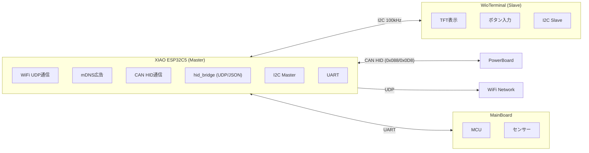
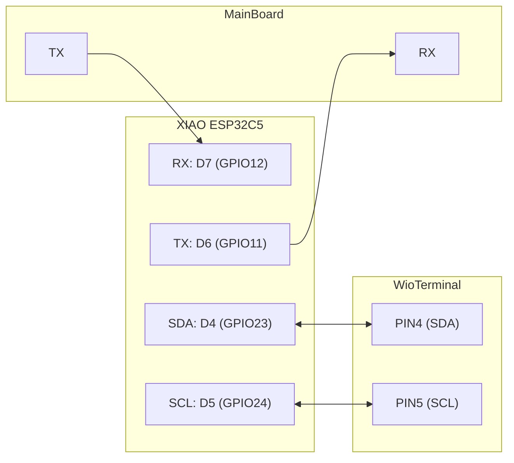

# WiFi Board - Robot Communication System

v2.5

WiFi/UDP通信ボードシステム。XIAO ESP32C5とWioTerminalによるI2C接続のロボット通信制御システム。

---

## システム概要



> **本リポジトリの対象範囲**: XIAO ESP32C5 および WioTerminal のファームウェアのみ。MainBoard、PowerBoardは対象外。

---

## ハードウェア構成

### 使用ボード

| ボード | 役割 | 特徴 |
|--------|------|------|
| **XIAO ESP32C5** | Master | WiFi 6対応、デュアルコア、小型 |
| **WioTerminal** | Slave | TFT液晶、ボタン、5WAYスイッチ搭載 |

### ピン接続


### XIAO ESP32C5 ピン配置

| 機能 | ピン | GPIO |
|------|------|------|
| I2C SDA | D4 | GPIO23 |
| I2C SCL | D5 | GPIO24 |
| Serial1 TX | D6 | GPIO11 |
| Serial1 RX | D7 | GPIO12 |
| CAN TX | D0 | GPIO1 |
| CAN RX | D1 | GPIO0 |

### WioTerminal ボタン

| ボタン | 入力 | 機能 |
|--------|------|------|
| KEY_A | 短押し | ID 減算 (-) |
| KEY_B | 短押し | ID 加算 (+) |
| KEY_C | 短押し | ID 確定 |
| KEY_C | 起動時押下 | PowerBoard の OC/OD 保護をオーバーライド (CAN 0x088 HID_CMD_PROTECTION_OVERRIDE=0x05 経由) |
| 5WAY Press | 起動時押下 | マニュアルモード投入 (CAN 0x008 Byte0=1 をメイン基板へ送信) |
| 5WAY Press | loop 中 1 秒長押し | ローカル停止トグル (Remote EMO と OR 統合してから HID_CMD_STOP/RESUME 発行) |
| KEY_A/B/C | loop 中 1 秒長押し | (未割当 / 将来拡張用) |

---

## ソフトウェア構成

### ディレクトリ構造

```
SanRei_HID/
├── src/
│   ├── ESP32C5Controller/        # Master 側ファームウェア (XIAO ESP32C5)
│   │   ├── ESP32C5Controller.ino
│   │   └── config.h              # WiFi 設定
│   │
│   └── WioDisplay/               # Slave 側ファームウェア (Wio Terminal)
│       ├── WioDisplay.ino
│       ├── config.h
│       └── Free_Fonts.h
│
├── docs/
│   ├── Build_Linux.md            # ローカルビルド手順
│   ├── I2C_Protocol_Design.md    # I2C プロトコル仕様書
│   └── I2C_Sequence_Diagrams.md  # I2C シーケンス図
│
├── libraries/                    # Wio 用同梱ライブラリ (rpcWiFi 系・ArduinoOTA fork 等)
├── robot_comm_spec/              # Git submodule (greentea-ssl/robot_comm_spec @ v1.0.0)
└── .github/workflows/            # CI/CD (build_check / auto-release)
```

> サブモジュール `robot_comm_spec` の初期化を忘れないこと: クローン直後に `git submodule update --init --recursive` を実行する。詳細は [docs/Build_Linux.md §A.1.5](docs/Build_Linux.md) を参照。

### ファームウェア

#### ESP32C5Controller (Master)

- **ファイル**: `src/ESP32C5Controller/ESP32C5Controller.ino`
- **バージョン**: 3.0.2
- **機能**:
  - WiFi接続・管理
  - UDPパケット送受信
  - Robot ID永続化 (Preferences)
  - mDNS広告 (`robot{id}.local`)
  - I2C Master通信
  - Remote EMO (EMSパケット駆動の遠隔停止) 制御
  - CAN HID通信 (PowerBoard制御 / メイン基板への HID 状態通知 0x008 / FW バージョン応答 0x040 受信 — rev4 仕様 DLC=5 で動作モードエコーバック付き)
  - hid_bridge (PC↔HID UDP/JSON, port 41000/51000): CAN 送出 / テレメトリ転送 / 状態取得 (旧 Web Server は v2.1.0 で廃止)

#### WioDisplay (Slave)

- **ファイル**: `src/WioDisplay/WioDisplay.ino`
- **バージョン**: 2.0.1
- **機能**:
  - TFT LCD表示
  - ボタン入力処理
  - ID設定UI
  - 起動時押下ボタン bitmap 通知 (5WAY → MANUAL モード / KEY_C → OC・OD ignore など、解釈は ESP32C5 が担当)
  - 通常動作中の長押し検出 (1 秒) → bitmap 通知 (5WAY 長押し → ローカル停止トグル など)
  - Remote EMO 状態表示
  - I2C Slave通信
  - 自動復旧（リセット時にESP32へ再送信要求）
  - WiFi (rpcWiFi) 経由の OTA アップデート (UDP/41000)

---

## 通信プロトコル

### I2C基本パラメータ

| パラメータ | 値 |
|------------|-----|
| アドレス | 0x08 |
| クロック | 100kHz |
| 最大転送 | 128 bytes |

### パケットフォーマット

```
┌────────┬────────┬─────────────┐
│ CMD    │ LEN    │ DATA[]      │
│ 1 byte │ 1 byte │ LEN bytes   │
└────────┴────────┴─────────────┘
```

### コマンド一覧

#### Master → Slave

| CMD | 名称 | 説明 |
|:---:|------|------|
| 0x01 | UPDATE_STATUS | WiFi状態・IP・Port更新 |
| 0x02 | SET_ROBOT_ID | 確定済みID設定 |
| 0x03 | UPDATE_EMO | EMO状態更新 |
| 0x05 | FULL_REFRESH | 全データ一括更新 |
| 0x06 | UPDATE_NETWORK | SSID・バージョン送信 |

#### Slave → Master

| CMD | 名称 | 説明 |
|:---:|------|------|
| 0x81 | ID_CONFIRM | ID 確定通知 (KEY_C 短押し) |
| 0x83 | READY | WioTerminal 準備完了通知 |
| 0x84 | ENTER_MANUAL | **legacy** (旧 Wio fw 互換用、新 fw は 0x86 を使用) |
| 0x86 | BOOT_BUTTONS | 起動時に押下されていたボタン bitmap (1 byte) |
| 0x87 | BTN_LONGPRESS | 通常動作中の長押し確定通知 bitmap (1 byte) |

bitmap (0x86 / 0x87 共通): `BTN_KEY_A=0x01`, `BTN_KEY_B=0x02`, `BTN_KEY_C=0x04`, `BTN_5WAY_PRESS=0x08` (0x10–0x80 は将来拡張用に予約)。詳細は [docs/I2C_Protocol_Design.md](docs/I2C_Protocol_Design.md) を参照。

> 0x82 (EMO_TOGGLE) は manual EMO 廃止により削除済み

---

## CAN HID通信

### CAN基本パラメータ

| パラメータ | 値 |
|------------|-----|
| TX ID | 0x088 (HID → PowerBoard) ※robot_comm_spec v2.0.0 (旧 0x210) |
| RX ID | 0x0D8 (PowerBoard → HID) ※robot_comm_spec v2.0.0 (旧 0x218) |
| 速度 | 1Mbps |
| モード | Normal |

### ピン配置

| 機能 | GPIO | ピン |
|------|------|------|
| CAN TX | 1 | D0 |
| CAN RX | 0 | D1 |

### HIDコマンド

| CMD | 名称 | パラメータ | 説明 |
|:---:|------|:---------:|------|
| 0x01 | SET_ROBOT_ID | robotId | Robot ID設定 |
| 0x02 | READ_STATUS | - | ステータス読込 |
| 0x03 | STOP | - | 停止信号送信 |
| 0x04 | RESUME | - | 再開信号送信 |
| 0x05 | PROTECTION_OVERRIDE | flags | OC/OD 保護オーバーライド (bit0=過電流, bit1=過放電; 1=保護無効) ※v2.0.0 |

### テレメトリデータ (0x0D8)

| オフセット | サイズ | 内容 |
|------------|--------|------|
| 0 | 1 byte | Result Code (0x00=success) |
| 1 | 1 byte | Robot ID |
| 2 | 1 byte | Status (0:STOP, 1:STANDBY, 2:DRIVE) |
| 3 | 1 byte | Stop Reason |

### Stop Reason ビット

| bit | 内容 | 表示テキスト |
|-----|------|-------------|
| 0 | MAIN_BOARD | MAIN |
| 1 | LOCAL_ESTOP | LOCAL |
| 2 | REMOTE_ESTOP | REMOTE |
| 3 | OVERCURRENT | OVERCUR |
| 4 | OVERDISCHARGE | LOW_BAT |

---

## ネットワーク設定

### ポート構成

| 用途 | ポート計算 | 例 (ID=1) | 備考 |
|------|------------|-----------|------|
| AI Downlink | 40000 + robotId | 40001 | CU 行き透過転送 (unicast, mDNS) |
| EMS / OTA | 40999 (固定) | 40999 | 先頭バイト 0x30 で OTA、それ以外で EMS heartbeat |
| Uplink | 50000 + robotId | 50001 | CU 発テレメトリ透過転送 (broadcast) |
| hid_bridge Downlink | 41000 + robotId | 41001 | PC→HID JSON (CAN 送出 / set_log_level) ※v2.0.0 |
| hid_bridge Uplink | 51000 + robotId | 51001 | HID→PC CAN テレメトリ転送 (broadcast) ※v2.0.0 |
| Radio Metrics | 52000 + robotId | 52001 | HID 起源 WiFi 計測メタデータ (broadcast) ※v2.0.0 |

### hid_bridge (PC ↔ HID 汎用 CAN ブリッジ) ※robot_comm_spec v2.0.0

CU を介さず PC と HID が直接 UDP/JSON を交換し、CAN バスへの送出 / CAN テレメトリの転送を行う診断用チャネル ([robot_comm_spec/hid_bridge.md](robot_comm_spec/hid_bridge.md))。本 HID は単一の Classic-CAN (低速バス) ノードのため **`bus=1` (低速バス) のみ対応**。

**Downlink (PC → HID, port 41000+id, unicast JSON):**

```json
{ "type": "can", "bus": 1, "canid": "0x088", "payload": "02" }   // CAN フレーム送出 (fire-and-forget)
{ "type": "set_log_level", "level": 3 }                           // テレメトリ転送しきい値変更
{ "type": "hid_status" }                                          // HID 自身の状態取得 (応答は uplink) ※v2.1.0
```

- `set_log_level` の `level` は severity (0=FATAL〜5=TRACE)。`severity ≤ level` の `11111` テレメトリのみ転送 (`11110` 応答は常時)。揮発 (再起動で起動時 default に戻る)、PC から実行時に上書き可能。
- **`level=15` (`F`) = promiscuous**: 受信した**全 CAN フレーム**を `kind:"raw"` で転送 (旧 Web UI `/can` raw ログの代替)。デバッグ専用 — バス負荷で UDP/WiFi 飽和の恐れ。`"F"`/`"0xF"`/`15` を受理。`6`-`14` は予約 (TRACE 相当に丸め)。
- **起動時 default は起動モードで決まる** (`BRIDGE_DEFAULT_LOG_LEVEL` / `BRIDGE_VERBOSE_LOG_LEVEL`):
  - 通常起動 = `2` (WARN) — 通常運用、転送量を抑える
  - MANUAL モード (5-way 起動押下) / 保護オーバーライド (KEY_C 起動押下) = `5` (TRACE) — 危険・デバッグ時は詳細ログ
- `hid_status` 要求で HID 自身の状態 (robot_id / fw_version / op_mode / wifi / EMO / log_level / CAN カウンタ等) を uplink に 1 回 broadcast 応答 (旧 Web UI `/api/status` の代替) ※v2.1.0
- 未知の `type` はサイレント破棄。

**Uplink (HID → PC, port 51000+id, broadcast JSON):**

受信フレームを `kind` 付き JSON で転送する。`kind` は CAN 種別から導出: `11111`=`telemetry`(severity 付, `severity ≤ level` で転送) / `11110`=`answer`(常時) / level F 時はそれ以外も `raw`。`hid_status` 要求への応答も同チャネルで返す。

**バッチ送信 (NDJSON)**: 負荷低減のため複数 JSON を 1 UDP datagram にまとめ、**MTU (約1400B) 超過 or 100ms 経過**で送出 (`BRIDGE_UP_MTU` / `BRIDGE_UP_FLUSH_MS`)。各 JSON は `\n` 終端 — **受信側は `\n` で分割して各行を parse** すること。下記の例は読みやすさのため 1 行 = 1 オブジェクトで示すが、実際は 1 パケットに複数並ぶことがある。

```json
// CAN テレメトリ (種別 11111)
{ "type": "can", "kind": "telemetry", "bus": 1, "canid": "0x7DA", "src_device_type": 3, "severity": "WARN", "severity_level": 2, "payload": "01 02 03 04", "ts_ms": 12345678 }
// raw フレーム (level F=15 時のみ。11111/11110 以外の全種別) ※v2.1.0
{ "type": "can", "kind": "raw", "bus": 1, "canid": "0x258", "src_device_type": 3, "payload": "01 00 00 00 00 00 00 01", "ts_ms": 12345720 }
// hid_status 応答 (downlink {"type":"hid_status"} に対して) ※v2.1.0
{ "type": "hid_status", "robot_id": 1, "fw_version": "dev_v2.1.0", "op_mode": 1, "wifi": true, "emo_remote": false, "estop_local": false, "log_level": 5, "can_rx": 1234, "can_tx_ok": 567, "can_tx_fail": 2, "can_fail_streak": 0, "main_fw_received": true, "main_mode_echo": 1, "ota": false, "ts_ms": 12345678 }
```

### mDNS

| デバイス | フォーマット | 例 |
|----------|--------------|-----|
| ESP32C5Controller | `robot{id}.local` | `robot1.local` |
| WioDisplay | `wio{id}.local` | `wio1.local` |

robotId は ESP32C5 が永続管理し、I2C 経由で Wio に通知される。Wio は WiFi 接続後 + robotId 確定後に自身の mDNS を開始し、robotId 変更時は再登録する。

---

## OTA アップデート

`ota_tool.py` (`OTATool.bat`) で ESP32C5Controller / WioDisplay の両方を WiFi 経由で更新できます。

### ターゲット別仕様

| ターゲット | UDPポート | プロトコル | フラッシュ書き込み | サイズ制約 |
|------------|:---------:|------------|--------------------|------------|
| ESP32C5Controller | 40999 (EMSと共有) | `[0x30][URL]` | ESP32 標準 `Update` | パーティション準拠 |
| WioDisplay | 41000 (専用) | `[0x30][URL]` | ArduinoOTA `InternalStorage` (SAMD51) | アプリ ~252KB |

### フロー

1. ツール起動 → ターゲット (ESP32C5 / Wio) を選択
2. 対応する `.ino.bin` を指定 (デフォルトは `src/<target>/<target>.ino.bin`)
3. 「Start OTA Update」: HTTP サーバ起動 + ブロードキャストで OTA コマンド送信
4. 受信側がファームをダウンロードして書き込み → 自動再起動

### WioDisplay 側 WiFi

WioDisplay は通常動作中は I2C スレーブのみで動作し、WiFi (RTL8720DN / rpcWiFi) は OTA 受信専用に常時バックグラウンドで接続を維持します。SSID/パスワードは `src/WioDisplay/config.h` で設定 (デフォルトは ESP32C5 と同一値)。

---

## 停止系 (E-Stop) / 動作モード

### Remote EMO + ローカル停止 (OR 統合)

| 種別 | トリガー | 制御場所 | 状態変数 (C5) |
|------|----------|----------|---------------|
| Remote EMO | EMS パケット受信 (UDP/40999) | ネットワーク | `isRemoteEMO` |
| Local 停止 | WioTerminal 5WAY 1 秒長押し (loop 中) | ボタン | `isLocalEstop` |

> Manual EMO (旧 5WAY 短押しトグル) は廃止しました。loop 中の 5WAY 長押しが新しい「ローカル停止」相当です。

PowerBoard の `ABORT_HID_ESTOP` (bit1) は両者で共有されるため、C5 側で OR 統合 (`active = isRemoteEMO || isLocalEstop`) してから `HID_CMD_STOP` / `HID_CMD_RESUME` を発行します。実装は `applyEstopState()` (`ESP32C5Controller.ino`)。

```
active=true へのエッジ (どちらか/両方が立った):
- 画面に EMO / LOCAL 表示 (PowerBoard テレメトリ経路)
- PowerBoard に CAN 0x088 HID_CMD_STOP

active=false へのエッジ (両方が降りた):
- PowerBoard に CAN 0x088 HID_CMD_RESUME

片方だけ降りた場合:
- もう片方の停止意図を踏み潰さないため STOP を維持
```

### 起動時 KEY_C 押下: PowerBoard OC/OD 保護のオーバーライド

WioTerminal を電源 ON 時に KEY_C 押下保持で起動すると、Wio が `CMD_BOOT_BUTTONS (0x86)` の `BTN_KEY_C` ビットを立てて C5 に通知します。C5 はこれを受けて PowerBoard に `CAN 0x088 HID_CMD_PROTECTION_OVERRIDE (0x05)` を 1 フレーム送信し、Byte1 = `0x03` (bit0=過電流, bit1=過放電) をセットします。これにより PowerBoard 側で `IGNORE_OVERCURRENT` / `IGNORE_OVERDISCHARGE` ビットが立ち、既に立っている `ABORT_OVERCURRENT` / `ABORT_OVERDISCHARGE` も `hasActiveAbortReason()` でマスクされます。

> robot_comm_spec v2.0.0 で HID 直結チャネル (CAN ID `0x088`) に保護オーバーライド設定コマンド (`0x05`) が新設されたため、正規ルートで送信します。v1.x では 0x088 に該当コマンドが無く、HID は本来「メイン基板 → 電源基板」役割の `0x201 PARAM_CMD_SET` を直接 2 フレーム打つ暫定実装で代替していました (v2.0.0 で解消)。詳細は [docs/I2C_Protocol_Design.md](docs/I2C_Protocol_Design.md) と [robot_comm_spec/CAN_LS.md §2.7](robot_comm_spec/CAN_LS.md) を参照。

### マニュアルモード (rev4 §1.3, CAN 0x008)

メイン基板に対して HID の動作モードを通知する仕組み。 `robot_comm_spec/CAN_LS.md` §1.3 準拠。

| 値 | モード | 投入トリガー |
|----|--------|-------------|
| 0 | ノーマル | 通常起動 |
| 1 | マニュアル | 起動時に WioTerminal の 5WAY を押下 |
| 2 | デバッグ | (未実装) |

`0x008` 発行タイミング:
- HID 起動完了直後 (1 回)
- ロボット ID 変更時 (KEY_C 短押しによる確定)
- マニュアルモード投入時 (Wio から `CMD_BOOT_BUTTONS` の 5WAY ビット受信、または legacy `CMD_ENTER_MANUAL` 受信)

### PowerBoard通知タイミング

- 起動時: Robot ID + EMO状態送信
- 状態変化時: STOP/RESUME送信
- 再接続時: Robot ID + EMO状態再送信

---

## 自動復旧機能

WioTerminalがリセットされた場合、自動的にESP32からデータを再取得します。

1. WioTerminal起動時: `CMD_READY` (0x83) をESP32に送信
2. ESP32受信時: 全データを再送信
   - `UPDATE_STATUS`
   - `UPDATE_NETWORK` (SSID)
   - `SET_ROBOT_ID`
   - `UPDATE_EMO`

---

## Web Server (廃止 — robot_comm_spec v2.1.0)

> **HTTP サーバ (port 80) と全エンドポイントを削除した。** 通信量・リソース削減と診断経路の一本化のため (#4)。機能は hid_bridge (UDP/JSON, port 41000/51000) に集約。

| 旧 Web UI | 代替 |
|---|---|
| `/api/status` (HID 状態取得) | hid_bridge downlink `{"type":"hid_status"}` → uplink `type:"hid_status"`(下記「hid_bridge」§) |
| `/can/send` (任意 CAN 送信) | hid_bridge downlink `{"type":"can", ...}` |
| `/can`, `/api/can` (CAN ログ閲覧) | hid_bridge uplink(種別 `11111`/`11110` のみ転送)。全フレーム raw ログは非対応 |
| `/on` `/off` `/alloff` `/reset` (制御) | 元々 no-op(CAN 送出されず表示のみ)のため削除。制御は通常制御経路 (CU) が担う |
| `/` ダッシュボード | シリアルログ + hid_bridge テレメトリ + Wio 表示 |

---

## 表示レイアウト

```
┌────────────────────────────────────────┐
│ set  +    -  sel: [setId]              │
│                                        │
│ [Xiao Disconnected / SSID: xxx]        │
│ EMO:  [Remote]                         │
│ IP: [xxx.xxx.xxx.xxx / disconnected]   │
│ Listen Port: [ppppp]                   │
│ Robot ID: [robotId]                    │
│ PWR: [STOP / STANDBY / DRIVE] [reason] │
│ ESP:[version] | WIO:[version]          │
└────────────────────────────────────────┘
```

### PowerBoard状態表示

| Status | 色 | 説明 |
|--------|-----|------|
| STOP | 黄色 | 停止中 |
| STANDBY | 緑色 | 待機中 |
| DRIVE | シアン | 駆動中 |
| No Response | オレンジ | 通信断 |

### Stop Reason表示（テキスト）

- MAIN (0x01)
- LOCAL (0x02)
- REMOTE (0x04)
- OVERCUR (0x08)
- LOW_BAT (0x10)

---

## ビルド・書き込み

> Linux ホスト上での **arduino-cli ローカルビルド (推奨)** および **Arduino IDE 2.x GUI** からのビルド手順は [`docs/Build_Linux.md`](docs/Build_Linux.md) にまとめてある (リポジトリ同梱 `arduino-cli` バイナリの利用方法、ボード定義、ライブラリ解決、UF2 化など)。

### GUI書込みツール（推奨）

PowerBoardのUploadToolを参考にした、GUIベースの書込みツールを提供しています。

```bash
# 書込みツール起動
UploadTool.bat

# または直接Pythonスクリプトを実行
python upload_tool.py
```

**機能:**
- ESP32C5 Controller / Wio Display の切り替え
- シリアルポート自動検出
- ファームウェアファイル選択
- ビルド&書き込み機能
- リアルタイムログ表示

**使用方法:**
1. ターゲットデバイスを選択（ESP32C5 Controller または Wio Display）
2. シリアルポートを選択（Refreshボタンで更新）
3. Uploadボタンで書き込み
4. Build & Uploadでビルド後に書き込み

### コマンドラインビルド

#### 必要なツール

- Arduino CLI または Arduino IDE
- ESP32ボード定義 (esp32 by Espressif)
- Seeeduino SAMDボード定義

#### ESP32C5Controller (XIAO ESP32C5)

```bash
# コンパイル
arduino-cli compile --fqbn esp32:esp32:XIAO_ESP32C5 \
  --build-property "compiler.cpp.extra_flags=-I\"$(pwd)\"" \
  src/ESP32C5Controller

# 書き込み
arduino-cli upload -p COMx --fqbn esp32:esp32:XIAO_ESP32C5 \
  src/ESP32C5Controller
```

### WioDisplay (WioTerminal)

```bash
# コンパイル
arduino-cli compile --fqbn Seeeduino:samd:seeed_wio_terminal \
  --build-property "compiler.cpp.extra_flags=-I\"$(pwd)\"" \
  src/WioDisplay

# 書き込み
arduino-cli upload -p COMx --fqbn Seeeduino:samd:seeed_wio_terminal \
  src/WioDisplay
```

---

## 設定

### WiFi設定

`src/ESP32C5Controller/config.h` を編集:

```cpp
#define WIFI_SSID       "your-ssid"
#define WIFI_PASSWORD   "your-password"
#define SUBNET_THIRD    4  // サブネット第3オクテット
```

またはビルドフラグで指定:

```bash
arduino-cli compile --fqbn esp32:esp32:XIAO_ESP32C5 \
  --build-property "compiler.cpp.extra_flags=-D__CONFIG__ -D__SSID__=\\\"ssid\\\" -D__PASSWD__=\\\"pass\\\""
```

---

## 責任分担

| 機能 | ESP32C5 | WioTerminal |
|------|:-------:|:-----------:|
| WiFi通信 | ✓ | ✓ (OTA受信専用) |
| UDP送受信 | ✓ | - |
| robotId永続化 | ✓ | - |
| mDNS広告 | ✓ | ✓ |
| CAN HID通信 (PB) | ✓ | - |
| CAN 0x008 / 0x040 (Main) | ✓ | - |
| 電源制御 | ✓ | - |
| hid_bridge (UDP/JSON: CAN送出/テレメトリ/hid_status) | ✓ | - |
| setId一時管理 | - | ✓ |
| ボタン入力 | - | ✓ |
| ID設定UI | - | ✓ |
| 起動時押下ボタン bitmap 検知 | - | ✓ |
| 起動時 bitmap → 機能解釈 (MANUAL / OC・OD ignore) | ✓ | - |
| 通常動作中の長押し検出 (1s) | - | ✓ |
| 長押し → ローカル停止トグル (Remote EMO と OR 統合) | ✓ | - |
| Remote EMO 状態管理 | ✓ | - |
| TFT表示 | - | ✓ |
| 自動復旧要求 | - | ✓ |

---

## 改訂履歴

| 版 | 日付 | 内容 |
|----|------|------|
| 1.0 | 2026-03-08 | 初版作成 |
| 2.0 | 2026-03-09 | CAN通信・Web Server機能統合 |
| 2.1 | 2026-03-14 | CAN HIDプロトコル変更、EMO初期状態有効化、自動復旧機能追加、stopReasonテキスト表示 |
| 2.2 | 2026-04-12 | ESP32S3からESP32C5に変更、ピン配置をESP32C5に更新 |
| 2.3 | 2026-05-02 | WioDisplay にも WiFi (rpcWiFi) 経由 OTA を追加 |
| 2.4 | 2026-05-02 | manual EMO 廃止、ID=12 mDNS特例廃止、Wio側 mDNS (`wio{id}.local`) 追加、画面MDNS表示削除 |
| 2.5 | 2026-05-03 | rev4 仕様準拠: CAN 0x008 (HID→Main 状態通知) / 0x040 (Main→HID FW バージョン) 追加、起動時 5WAY 押下によるマニュアルモード投入実装、ESP32S3版コントローラ削除 (C5 のみに集約)。ESP32C5Controller を 3.0.0 / WioDisplay を 2.0.0 に major bump (旧ファームと互換性なし) |
| 2.6 | 2026-05-04 | Wio (2.0.1): Robot ID 横にマニュアルモード表示。ESP (3.0.1): Web からの CAN-LS デバッグ機能追加 (`/can`, `/api/can`, `/can/send`)。ESP (3.0.2): rev4 §1.4 で 0x040 が DLC 4→5 に拡張され Byte 4 に動作モード echo-back が追加されたのを反映、HID 側の hidOpMode との不一致時に WARN ログ出力 |
| 2.7 | 2026-05-08 | Wio→C5 イベントを bitmap 形式に統一: `CMD_BOOT_BUTTONS (0x86)` / `CMD_BTN_LONGPRESS (0x87)` を追加。起動時 KEY_C 押下→ PowerBoard `CAN 0x201 PARAM_CMD_SET` で OC/OD 保護オーバーライド。loop 中の 5WAY 1 秒長押し→ ローカル停止トグル (Remote EMO と OR 統合)。`CMD_ENTER_MANUAL (0x84)` は legacy 扱いで C5 側のみハンドラ残置 (旧 Wio fw 互換)。`robot_comm_spec` (greentea-ssl, v1.0.0) を Git submodule として追加。CI/CD を PowerBoard と同じ PAT 注入方式の submodule init に統一 |
| 2.8 | 2026-06-08 | **robot_comm_spec v2.1.0 対応**: Web UI (HTTP サーバ:80) を廃止し hid_bridge に集約 (#4)。状態取得を `hid_status` (downlink 要求→uplink broadcast 応答) で代替、CAN 送信は `type:"can"` downlink へ。起動時ログレベルを起動モード別 (通常=WARN / MANUAL・保護OVR=TRACE) に設定。CAN ログ循環バッファを撤去 (hid_status 用カウンタのみ維持)。Uplink に `kind` (telemetry/answer/raw) と `11110` 応答の常時転送を実装。**ログレベル `F` (15) = 全 CAN フレームを `kind:"raw"` で UDP 転送** (旧 `/can` raw ログの代替, デバッグ専用)。**Uplink をバッチ送信化** (複数 JSON を 1 datagram に NDJSON でまとめ、MTU 超過 or 100ms で flush) し UDP パケット数を削減 |

---

## 参考資料

- [I2C Protocol Design](docs/I2C_Protocol_Design.md) - 詳細なI2C通信仕様
- [I2C Sequence Diagrams](docs/I2C_Sequence_Diagrams.md) - I2C通信シーケンス図
- [Linux ローカルビルド手順](docs/Build_Linux.md) - arduino-cli / Arduino IDE GUI からのローカルビルド手順
