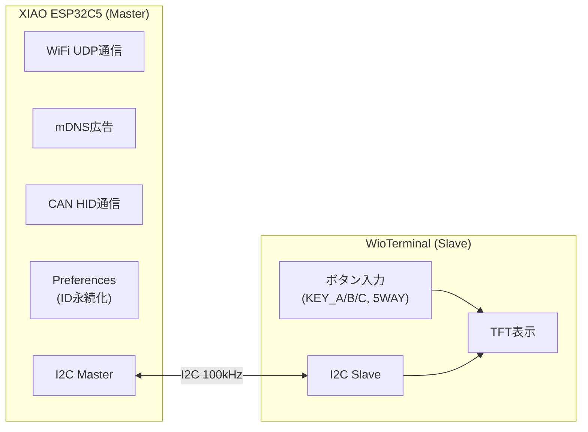
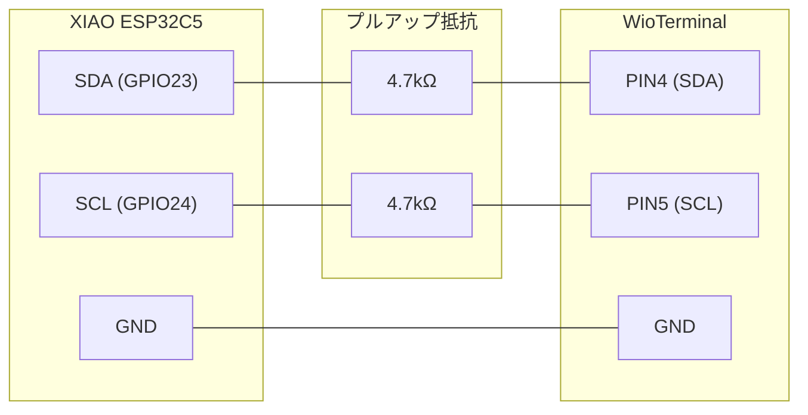
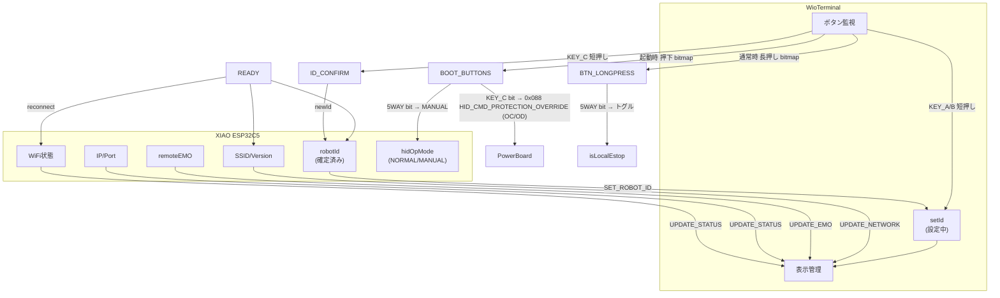
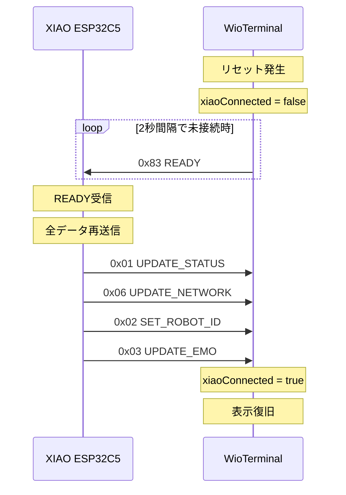
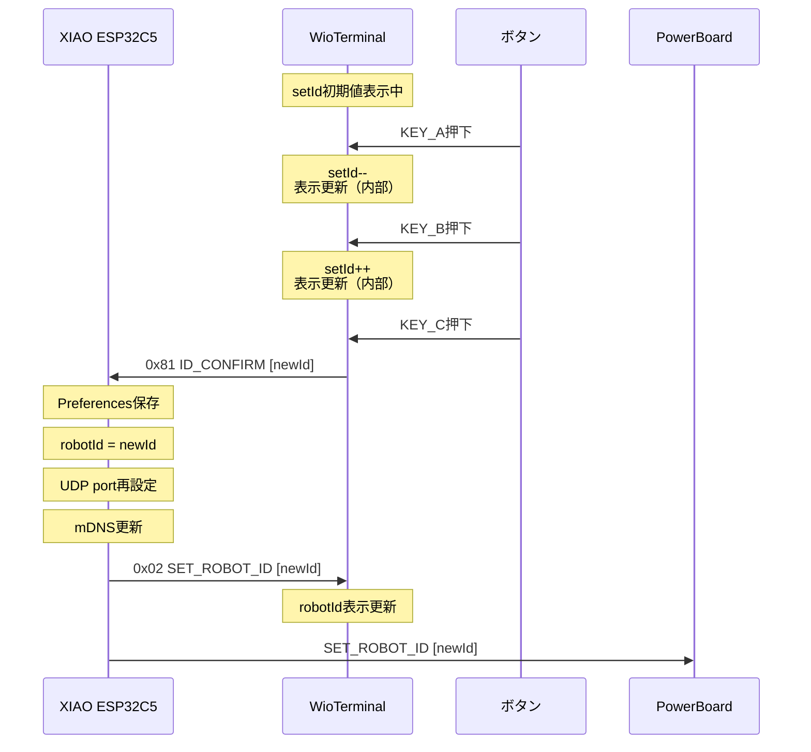
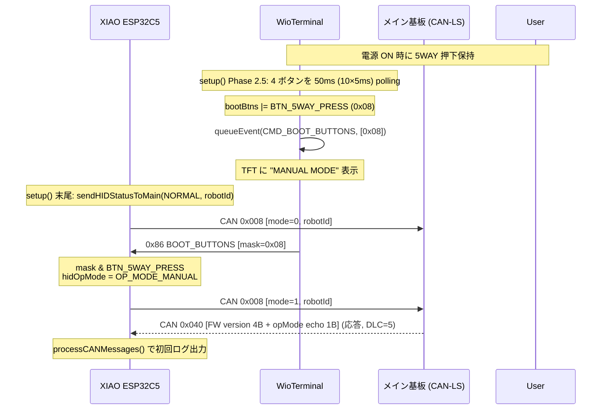
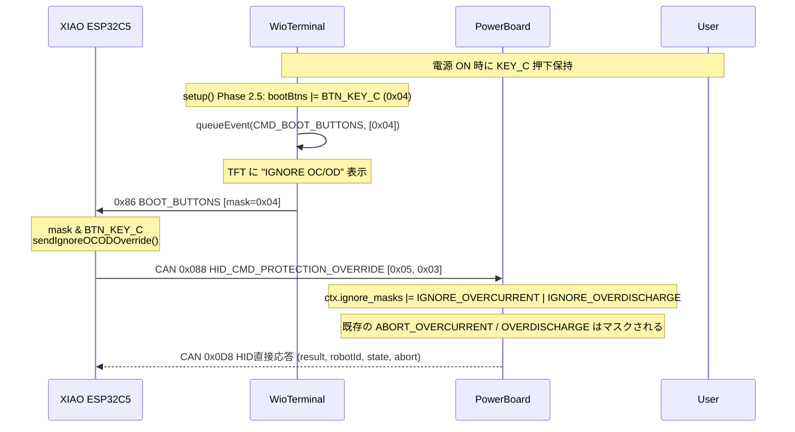
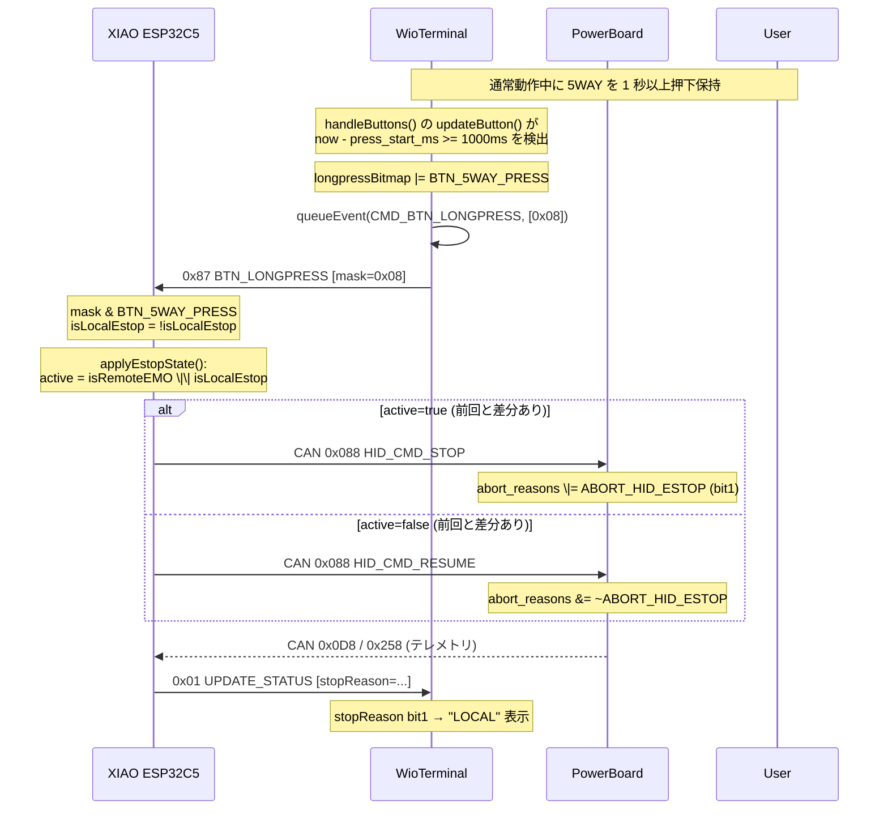
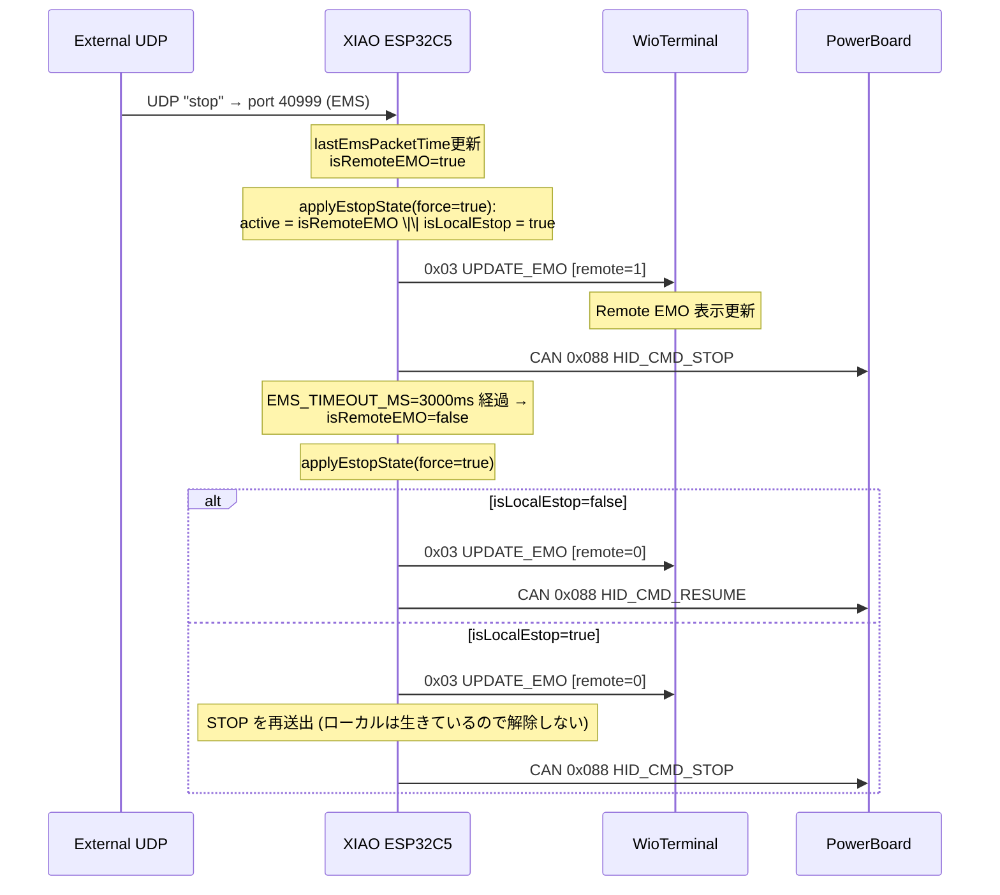
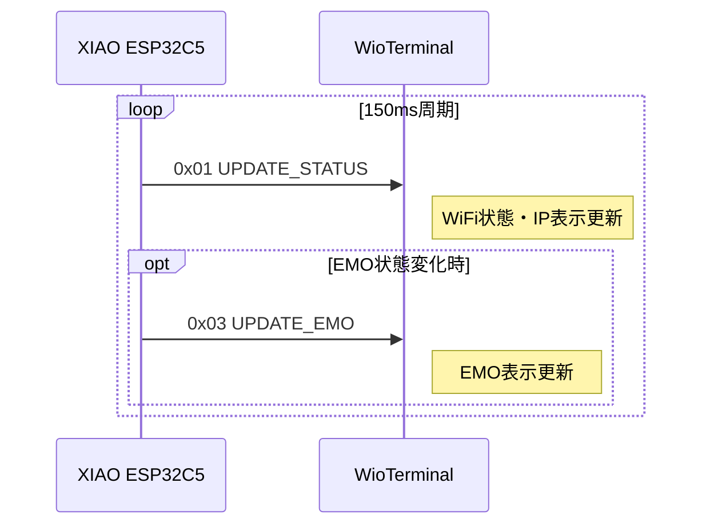

# I2C通信プロトコル設計書

## 概要

WioTransceiver後継システムにおける、XIAO ESP32C5（Master）とWioTerminal（Slave）間のI2C通信プロトコル設計。

---

## 1. システム構成

### 1.1 ハードウェア構成



### 1.2 ピン接続



### 1.3 基本パラメータ

| パラメータ | 値 |
|------------|-----|
| I2Cアドレス | 0x08 (WioTerminal) |
| クロック速度 | 100kHz |
| 最大転送サイズ | 128 bytes |

---

## 2. 責任分担

### 2.1 機能分担表

| 機能 | ESP32C5 | WioTerminal |
|------|:-------:|:-----------:|
| WiFi通信 | ✓ | ✓ (OTA受信専用) |
| UDP送受信 | ✓ | - |
| robotId永続化 (Preferences) | ✓ | - |
| mDNS広告 | ✓ | ✓ (`wio{id}.local`) |
| CAN HID通信 (PB 0x088/0x0D8) | ✓ | - |
| CAN 0x008 (HID→Main 状態通知, rev4) | ✓ | - |
| CAN 0x040 (Main→HID FW バージョン応答) | ✓ | - |
| setId一時管理 | - | ✓ |
| ボタン入力検知 | - | ✓ |
| ID加減算処理・表示 | - | ✓ |
| ID確定判定 (KEY_C) | - | ✓ |
| ID確定通知受信 | ✓ | - |
| 起動時押下ボタン bitmap 検知 | - | ✓ |
| 起動時 bitmap → 機能 (MANUAL / OC・OD ignore) 解釈 | ✓ | - |
| 通常動作中の長押し検出 (1s) | - | ✓ |
| 長押し → 機能 (ローカル停止トグル) 解釈 | ✓ | - |
| 動作モード (hidOpMode) 管理 | ✓ | - |
| Remote EMO 状態管理 + ローカル停止 OR 統合 | ✓ | - |
| TFT表示制御 | - | ✓ |
| 自動復旧要求 | - | ✓ |

### 2.2 データフロー



---

## 3. パケットフォーマット

### 3.1 基本構造

```
┌────────┬────────┬─────────────┐
│ CMD    │ LEN    │ DATA[]      │
│ 1 byte │ 1 byte │ LEN bytes   │
└────────┴────────┴─────────────┘

CMD: コマンドコード (1 byte)
LEN: データ長 (0-125 bytes)
DATA: ペイロード (可変長)
```

### 3.2 コマンド一覧

#### Master → Slave (ESP32C5 → WioTerminal)

| CMD | 名称 | LEN | 説明 |
|:---:|------|:---:|------|
| 0x01 | UPDATE_STATUS | 10 | WiFi状態・IP・Port・PowerBoard状態更新 |
| 0x02 | SET_ROBOT_ID | 1 | 確定済みID設定 |
| 0x03 | UPDATE_EMO | 1 | Remote EMO 状態更新 |
| 0x05 | FULL_REFRESH | 可変 | 全データ一括更新（起動時） |
| 0x06 | UPDATE_NETWORK | 可変 | SSID・バージョン送信 |
| 0x07 | OTA_PROGRESS | 3 | OTA 進行状況を Wio に表示 (`[source, phase, percent]`)。ESP32C5 自身 or 電源基板(CAN 0x318 を中継) |

#### Slave → Master (WioTerminal → ESP32C5)

| CMD | 名称 | LEN | 説明 |
|:---:|------|:---:|------|
| 0x81 | ID_CONFIRM | 1 | ID確定通知（KEY_C 短押し時） |
| 0x83 | READY | 0 | WioTerminal準備完了通知 |
| 0x86 | BOOT_BUTTONS | 1 | 起動時に押されていたボタンの bitmap |
| 0x87 | BTN_LONGPRESS | 1 | 通常動作中に長押し確定したボタンの bitmap |

> - 0x82 (EMO_TOGGLE) は manual EMO 廃止により削除済み
> - 0x84 (ENTER_MANUAL) は **legacy**。新 fw は BOOT_BUTTONS の 5WAY ビットで通知する。
>   ESP32C5 側は古い Wio fw 互換のため 0x84 受信ハンドラを残してある。
> - 0x85 は予約 (開発中に CMD_BOOT_IGNORE_PROT として一時的に使ったが、bitmap 形式 0x86 への統一に伴い未使用)。

#### ボタン bitmap (0x86 / 0x87 共通)

| ビット | 名称 | 値 |
|:------:|------|:---:|
| bit 0 | BTN_KEY_A | 0x01 |
| bit 1 | BTN_KEY_B | 0x02 |
| bit 2 | BTN_KEY_C | 0x04 |
| bit 3 | BTN_5WAY_PRESS | 0x08 |
| bit 4-7 | reserved | (5-way UP/DOWN/LEFT/RIGHT 等の将来拡張用) |

> 設計意図: Wio はボタン押下/長押しの **HW 状態のみ** を bitmap で報告する責務を持ち、
> 「どのボタンが何の機能か」の意味付けはすべて C5 側で行う。これにより、
> 新しい起動チョードや長押し機能の追加時に C5 のみ更新すれば済み、
> 古い Wio fw でも新しい C5 が新機能を解釈できる (forward compat)。

---

## 4. データ構造詳細

### 4.1 0x01: UPDATE_STATUS

```
DATA[0]: status bitmap
  bit 0: wifiConnected (0=切断, 1=接続)
  bit 1: mdnsEnabled   (0=無効, 1=有効)
  bit 2: powerBoardConnected (0=未接続, 1=接続)
  bit 3-7: reserved

DATA[1-4]: IP Address (big endian)
  DATA[1]: IP[0]
  DATA[2]: IP[1]
  DATA[3]: IP[2]
  DATA[4]: IP[3]

DATA[5-6]: Listen Port (big endian)
  DATA[5]: port >> 8
  DATA[6]: port & 0xFF

DATA[7]: stopReason (PowerBoardから受信)
  0x00: 正常
  0x01: MAIN_BOARD
  0x02: LOCAL_ESTOP
  0x04: REMOTE_ESTOP
  0x08: OVERCURRENT
  0x10: OVERDISCHARGE

DATA[8]: powerStatus
  0: STOP
  1: STANDBY
  2: DRIVE

DATA[9]: reserved (0x00)
```

### 4.2 0x02: SET_ROBOT_ID

```
DATA[0]: robotId (0-255)
  起動時に ESP32C5 が保持している確定済みIDを通知
  WioTerminalはこれを setId の初期値として使用
```

### 4.3 0x03: UPDATE_EMO

```
DATA[0]: remoteEMO (0=解除, 1=発動)
```

> Manual EMO は廃止されました。Remote EMO のみが残ります (1 byte)。

### 4.4 0x05: FULL_REFRESH

```
DATA[0]:   status bitmap
  bit 0: wifiConnected
  bit 1: mdnsEnabled
  bit 2: powerBoardConnected
  bit 3-7: reserved

DATA[1-4]: IP Address (big endian)
DATA[5-6]: Listen Port (big endian)
DATA[7]:   robotId
DATA[8]:   remoteEMO
DATA[9]:   stopReason
DATA[10]:  SSID length (N)
DATA[11..10+N]: SSID string (null終端なし)
DATA[11+N]: ESP32C5 version length (M)
DATA[12+N..11+N+M]: ESP32C5 version string (null終端なし)
```

> **注意**: WioTerminal側のバージョンはWio側のローカル定数として定義し、通信では送信しない。

### 4.5 0x06: UPDATE_NETWORK

```
DATA[0]: SSID length (N)
DATA[1..N]: SSID string (null終端なし)
DATA[N+1]: Version length (M)
DATA[N+2..N+M+1]: Version string (null終端なし)
```

### 4.5.1 0x07: OTA_PROGRESS

OTA 更新中の進行状況を Wio に表示させる (Wio は source 別の専用画面を描画)。**ESP32C5 自身**の OTA と、**電源基板**の OTA (ESP32C5 が CAN `0x318` を I2C に中継) の両方を扱う。

```
DATA[0]: source  (0=Xiao/ESP32C5 自身, 1=PowerBoard/電源基板)
DATA[1]: phase   (0=START/接続中, 1=DOWNLOAD/DL中, 2=APPLY/適用中, 3=DONE/完了, 4=FAIL/失敗)
DATA[2]: percent (0-100。phase=DOWNLOAD のとき有効。それ以外は 0)
```

- **ESP32C5 自身 (source=0)**: OTA 開始時 START、`Update.onProgress` から 5% 刻みで DOWNLOAD、書込前 APPLY、成功時 DONE (直後に再起動)、各失敗で FAIL。OTA 中は ESP32C5 が UPDATE_STATUS 等を止めるため、Wio は通常コマンド再開 (=再起動完了) で解除。
- **電源基板 (source=1)**: 電源基板が CAN `0x318` (種別 `01100` OTA進捗) で送る進捗を ESP32C5 が受信し本コマンドへ中継。**ESP32C5 自身は稼働中で UPDATE_STATUS を出し続ける**ため、Wio は source=1 のときは通常コマンドで解除せず、**DONE/FAIL 後 4s** か **90s タイムアウト**で解除する。
- I2C (Wire) は ESP32C5 の OTA 中も停止しない (CAN/UDP/mDNS のみ停止) ため、本通知は届く。
- Wio は OTA_PROGRESS 受信中は通常表示・切断判定を抑制する。

### 4.6 0x81: ID_CONFIRM

```
DATA[0]: newId (確定された新しいRobot ID)

用途: KEY_C押下時、WioTerminalからESP32C5へ確定IDを通知

ESP32C5側での処理:
  1. PreferencesにnewIdを保存
  2. robotId = newId に更新
  3. listen_port = 40000 + robotId に再計算
  4. UDPソケット再設定 (udp.begin)
  5. mDNSホスト名更新 ("robot{id}.local")
  6. Wioへ SET_ROBOT_ID (0x02) を送信して表示更新
  7. PowerBoardへ SET_ROBOT_ID 送信
```

### 4.7 0x83: READY

```
LEN: 0 (データなし)

用途: WioTerminal起動時・再接続時に送信
      ESP32C5側で全データを再送信:
        - UPDATE_STATUS (0x01)
        - UPDATE_NETWORK (0x06)
        - SET_ROBOT_ID (0x02)
        - UPDATE_EMO (0x03)
```

### 4.8 0x84: ENTER_MANUAL (legacy)

```
LEN: 0

用途: 旧 Wio fw が起動時 5WAY 押下を専用イベントとして送る形式 (deprecated)。
      新 Wio fw は CMD_BOOT_BUTTONS (0x86) の BTN_5WAY_PRESS ビットで通知する。
      ESP32C5 側は古い Wio fw 互換のため 0x84 受信ハンドラを残してある。
```

### 4.9 0x86: BOOT_BUTTONS

```
LEN: 1
DATA[0]: bitmap (BTN_KEY_A | BTN_KEY_B | BTN_KEY_C | BTN_5WAY_PRESS | reserved)

用途: WioTerminal の setup() Phase 2.5 で各ボタンを 50ms (10×5ms) ポーリングし、
      連続 LOW (押下) を確定したボタンの bitmap を送る。
      mask != 0 のときのみキューに積む (押下なし時は発行しない)。

ESP32C5 側のマッピング (現行):
  - BTN_5WAY_PRESS:
      hidOpMode = OP_MODE_MANUAL に遷移し、CAN 0x008 [mode=1, robotId] を
      メイン基板へ送信 (rev4 §1.3)
  - BTN_KEY_C:
      PowerBoard の CAN 0x088 HID_CMD_PROTECTION_OVERRIDE (0x05) に
        Byte1 = 0x03 (bit0=過電流, bit1=過放電) を 1 フレーム送信。
      電源基板の `ignore_masks` の OC/OD ビットを立て、
      既存の OC/OD abort_reasons をマスクする。
      ※ robot_comm_spec v2.0.0 で HID 直結チャネル (0x088) に保護オーバーライド
        設定コマンド (0x05) が新設された正規ルート。v1.x では 0x088 に該当
        コマンドが無く、HID は 0x201 PARAM_CMD_SET を 2 フレーム直送する暫定実装
        だった (v2.0.0 で解消)。
  - BTN_KEY_A, BTN_KEY_B, reserved: 現状未割当 (将来拡張用)

注意: 起動時押下中のボタンは Wio 側で「既に押下サイクル中」として記録され、
      リリースして再押下するまで通常動作 (短押し / 長押し) は発火しない。
```

### 4.10 0x87: BTN_LONGPRESS

```
LEN: 1
DATA[0]: bitmap (BTN_KEY_A | BTN_KEY_B | BTN_KEY_C | BTN_5WAY_PRESS | reserved)

用途: 通常動作中、ボタンが LONGPRESS_THRESHOLD_MS (1000ms) 以上連続押下された
      時点で 1 度だけ送られる (押下サイクルあたり 1 回)。
      短押しイベント (KEY_A/B = ID±, KEY_C = ID Confirm) と同一押下中に
      両方発火し得るが、現行用途では衝突しない。

ESP32C5 側のマッピング (現行):
  - BTN_5WAY_PRESS:
      isLocalEstop をトグル → applyEstopState() で再評価。
      Remote EMO とローカル停止は同じ ABORT_HID_ESTOP ビットを共有するため、
      C5 側で `isRemoteEMO || isLocalEstop` を OR 統合してから
      HID_CMD_STOP / HID_CMD_RESUME を発行する (Remote ON 中にローカル解除しても
      実停止状態は維持される)。
      ローカル停止が立つと PowerBoard 側 abort_reasons の bit1 が立ち、
      テレメトリ経路で Wio に伝わって "LOCAL" と表示される。
  - BTN_KEY_A, BTN_KEY_B, BTN_KEY_C, reserved: 現状未割当 (将来拡張用)
```

---

## 5. 通信シーケンス

### 5.1 起動時シーケンス

```mermaid
sequenceDiagram
    participant ESP as XIAO ESP32C5
    participant WIO as WioTerminal

    Note over ESP: 起動完了
    Note over WIO: 起動待機中

    ESP->>WIO: 0x01 UPDATE_STATUS
    Note right of WIO: status, IP, Port,<br/>stopReason, powerStatus

    delay(500ms)

    ESP->>WIO: 0x06 UPDATE_NETWORK
    Note right of WIO: SSID, Version

    delay(500ms)

    ESP->>WIO: 0x02 SET_ROBOT_ID
    Note right of WIO: robotId

    delay(500ms)

    ESP->>WIO: 0x03 UPDATE_EMO
    Note right of WIO: remoteEMO=0

    Note over WIO: 初期表示完了
```

### 5.2 自動復旧シーケンス（WioTerminalリセット時）



### 5.3 ID操作シーケンス



### 5.4 起動時 BOOT_BUTTONS シーケンス (5WAY 押下 → MANUAL モード)



### 5.5 起動時 BOOT_BUTTONS シーケンス (KEY_C 押下 → OC/OD ignore)



### 5.6 BTN_LONGPRESS シーケンス (5WAY 長押し → ローカル停止トグル)



### 5.7 Remote EMO 変化シーケンス (ローカル停止 OR 統合)



### 5.8 定期更新シーケンス



---

## 6. 表示レイアウト

### 6.1 画面構成

```
┌────────────────────────────────────────┐
│ set  +    -  sel: [setId]              │ ← 設定中ID（ローカル管理）
│                                        │
│ [Xiao Disconnected / SSID: xxx]        │ ← Xiao未接続時は赤字でDisconnected
│ EMO:  [Remote]                         │ ← Remote EMO 状態 (manual EMO 廃止)
│ IP: [xxx.xxx.xxx.xxx / disconnected]   │ ← WiFi未接続時はdisconnected
│ Listen Port: [ppppp]                   │
│ Robot ID: [robotId]                    │ ← 確定済みID
│ PWR: [STOP / STANDBY / DRIVE] [reason] │ ← PowerBoard状態（テキスト）
│ [MDNS enable/disable]                  │
│ ESP:[version] | WIO:[version]          │ ← 両方のバージョン
└────────────────────────────────────────┘
```

### 6.2 PowerBoard状態表示

| Status | 色 | 説明 |
|--------|-----|------|
| STOP | 黄色 | 停止中 |
| STANDBY | 緑色 | 待機中 |
| DRIVE | シアン | 駆動中 |
| No Response | オレンジ | 通信断 |

### 6.3 Stop Reason表示（テキスト）

| bit | テキスト | 説明 |
|-----|---------|------|
| 0x01 | MAIN | Main Board停止 |
| 0x02 | LOCAL | Local E-Stop |
| 0x04 | REMOTE | Remote E-Stop |
| 0x08 | OVERCUR | 過電流 |
| 0x10 | LOW_BAT | 過放電 |

### 6.4 表示項目とデータソース

| 表示項目 | データソース | 更新タイミング |
|----------|--------------|----------------|
| setId | WioTerminal (ローカル) | KEY_A/B押下時 |
| Xiao接続状態 | lastXiaoUpdateタイムアウト | 1秒タイムアウト |
| ssid | ESP32C5 → UPDATE_NETWORK | 起動時/再接続時 |
| Remote EMO | ESP32C5 → UPDATE_EMO | 状態変化時 |
| IP | ESP32C5 → UPDATE_STATUS | 接続/切断時 |
| Listen Port | ESP32C5 → UPDATE_STATUS | 起動時 / ID確定時 |
| robotId | ESP32C5 → SET_ROBOT_ID | 起動時 / ID確定時 |
| PowerBoard状態 | ESP32C5 → UPDATE_STATUS | テレメトリ受信時 |
| Stop Reason | ESP32C5 → UPDATE_STATUS | テレメトリ受信時 |
| MDNS状態 | ESP32C5 → UPDATE_STATUS | 変化時 |
| ESP32C5バージョン | ESP32C5 → UPDATE_NETWORK | 起動時/再接続時 |
| WIOバージョン | WioTerminal (ローカル定数) | 固定 |

---

## 7. エラー処理

| エラー条件 | 処理 |
|------------|------|
| I2C通信失敗 | エラーログ出力、前回値維持（リトライなし） |
| 不正なCMD | パケット破棄、応答なし |
| LEN不一致 | パケット破棄、応答なし |
| Slave応答なし | 最終有効データで表示維持、自動復旧待ち |
| I2Cバッファオーバーラン | 警告ログ出力、前パケット破棄 |

---

## 8. 実装ファイル

### 8.1 ファイル構成

| ファイル | ボード | 説明 |
|----------|--------|------|
| `src/ESP32C5Controller/ESP32C5Controller.ino` | XIAO ESP32C5 | Master側メインプログラム |
| `src/ESP32C5Controller/config.h` | XIAO ESP32C5 | WiFi設定 |
| `src/WioDisplay/WioDisplay.ino` | WioTerminal | Slave側メインプログラム |
| `src/WioDisplay/config.h` | WioTerminal | 設定ファイル |
| `src/WioDisplay/Free_Fonts.h` | WioTerminal | フォント定義 |

### 8.2 主要関数 (Master側)

```cpp
// I2C送信
bool sendI2CPacket(uint8_t cmd, const uint8_t* data, uint8_t len);
void sendUpdateStatus();    // CMD_UPDATE_STATUS送信
void sendSetRobotId();      // CMD_SET_ROBOT_ID送信
void sendUpdateEmo();       // CMD_UPDATE_EMO送信
void sendUpdateNetwork();   // CMD_UPDATE_NETWORK送信

// Slaveイベント受信
void checkSlaveEvents();    // loop()内で定期呼び出し
void handleIdConfirm(uint8_t newId);
void handleWioReady();      // CMD_READY受信時
// CMD_BOOT_BUTTONS / CMD_BTN_LONGPRESS / CMD_ENTER_MANUAL (legacy) は
// switch case 内で bitmap を解釈して各機能関数を呼ぶ

// CAN (rev4 §1.3 / §1.4)
void sendHIDStatusToMain(uint8_t opMode, uint8_t rid);  // CAN 0x008 送信

// CAN PowerBoard 連携
void sendCANHIDCommand(uint8_t cmd, uint8_t param = 0); // CAN 0x088
esp_err_t sendCANRaw(uint32_t id, const uint8_t* data, uint8_t dlc);
void sendIgnoreOCODOverride();  // CAN 0x088 HID_CMD_PROTECTION_OVERRIDE (0x05) を 1 frame 送信
void applyEstopState(bool force); // Remote EMO || Local 停止を OR して STOP/RESUME 発行
```

### 8.3 主要関数 (Slave側)

```cpp
// I2Cコールバック
void receiveEvent(int howMany);  // Masterからのデータ受信
void requestEvent();             // Masterへのデータ送信要求

// コマンド処理
void processI2CCommands();
void handleUpdateStatus(const uint8_t* data, uint8_t len);
void handleSetRobotId(const uint8_t* data, uint8_t len);
void handleUpdateEmo(const uint8_t* data, uint8_t len);
void handleFullRefresh(const uint8_t* data, uint8_t len);
void handleUpdateNetwork(const uint8_t* data, uint8_t len);

// イベントキュー
void queueEvent(uint8_t cmd, uint8_t dataLen, const uint8_t* data);

// 表示・入力
void updateDisplay();
void handleButtons();

// ヘルパー
const char* getPowerStatusText(const DisplayState& s);
const char* getStopReasonText(uint8_t stopReason);
```

---

## 改訂履歴

| 版 | 日付 | 内容 |
|----|------|------|
| 1.0 | 2026-02-28 | 初版作成 |
| 1.1 | 2026-02-28 | ID確定時のリブートを削除、動的ID更新に変更 |
| 1.2 | 2026-02-28 | バージョン表示をESP32C5/WIO両方の併記に変更 |
| 1.3 | 2026-02-28 | XIAO ESP32C5ピン差分を追加、ソースコード作成 |
| 1.4 | 2026-03-09 | 実装に合わせてドキュメント修正（リトライ削除、実装ファイル参照に変更） |
| 1.5 | 2026-03-14 | UPDATE_NETWORK (0x06)、READY (0x83)追加、UPDATE_STATUSにpowerStatus追加、自動復旧機能追加、stopReasonテキスト表示、EMO初期状態有効化 |
| 1.6 | 2026-04-12 | ESP32S3からESP32C5に変更、ピン配置をESP32C5に更新 |
| 1.7 | 2026-05-02 | manual EMO 廃止 (CMD_EMO_TOGGLE 0x82 削除、UPDATE_EMO を 1 byte 化、FULL_REFRESH 領域も詰める) |
| 1.8 | 2026-05-03 | CMD_ENTER_MANUAL (0x84) 追加 (起動時 5WAY 押下→ rev4 §1.3 マニュアルモード投入)、ESP32S3 版コントローラ削除 (C5 のみに集約) |
| 1.9 | 2026-05-08 | Wio→C5 イベントを bitmap 形式に統一: CMD_BOOT_BUTTONS (0x86) / CMD_BTN_LONGPRESS (0x87) を追加。CMD_ENTER_MANUAL (0x84) は legacy 扱いで C5 側のみハンドラ残置。起動時 KEY_C 押下→ PowerBoard CAN 0x201 PARAM 経路で OC/OD ignore オーバーライド要求。通常時 5WAY 長押し→ ローカル停止トグル (Remote EMO と OR 統合)。robot_comm_spec submodule (v1.0.0) 参照を追加。 |
| 1.10 | 2026-06-14 | CMD_OTA_PROGRESS (0x07) を追加: ESP32C5 自身の OTA 進行状況 (phase/percent) を Wio に表示。Wio は専用進捗画面を描画し、OTA 中は通常表示・切断判定を抑制 (通常コマンド再開/90s タイムアウトで解除)。 |
| 1.11 | 2026-06-14 | CMD_OTA_PROGRESS を `[source, phase, percent]` (3byte) に拡張し **電源基板の OTA 進捗**にも対応。電源基板が CAN `0x318` (種別 `01100`, robot_comm_spec v2.1.0) で送る進捗を ESP32C5 が中継。source=1 (PowerBoard) 時は ESP32C5 が稼働継続するため DONE/FAIL 後 4s or 90s で解除。 |
