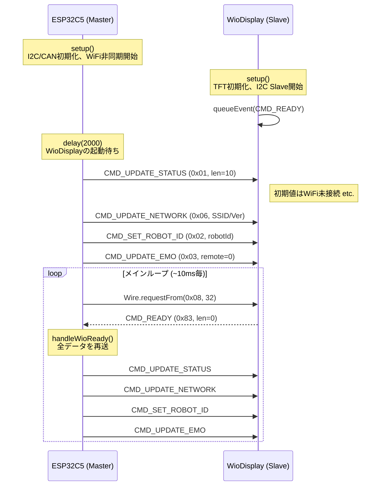
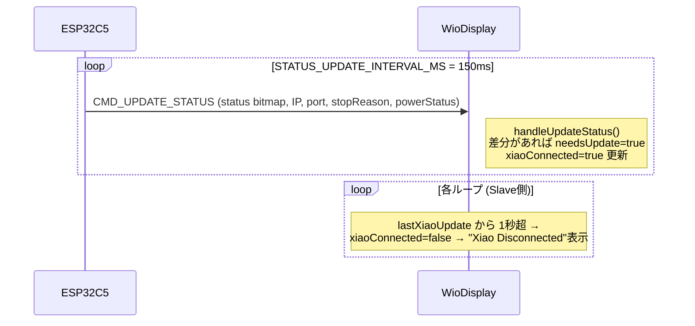
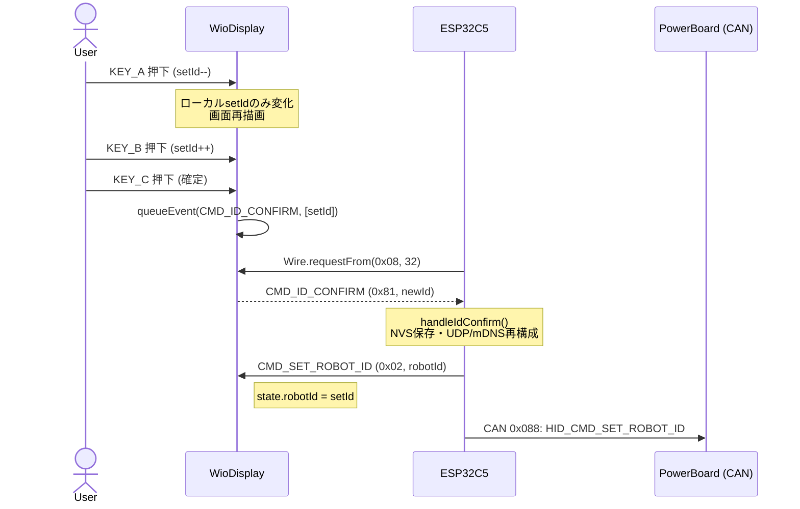
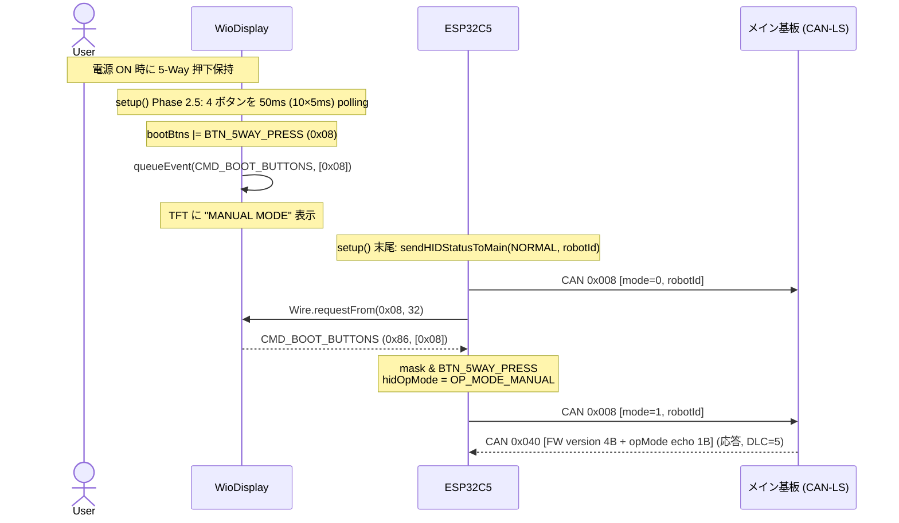
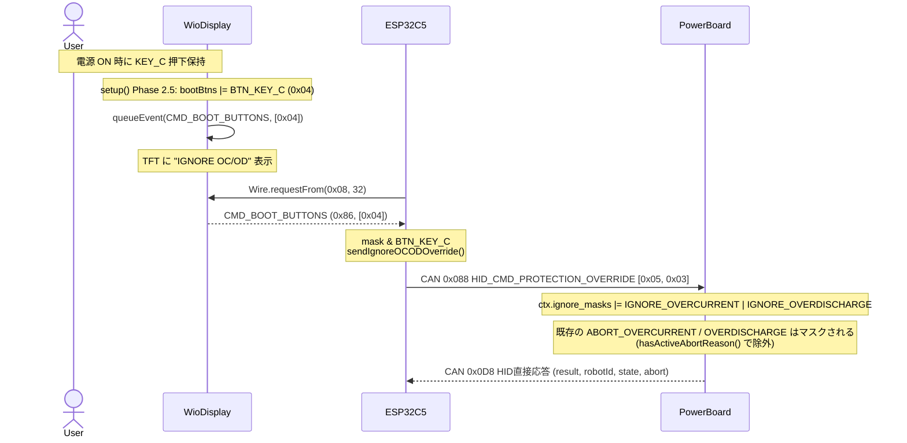
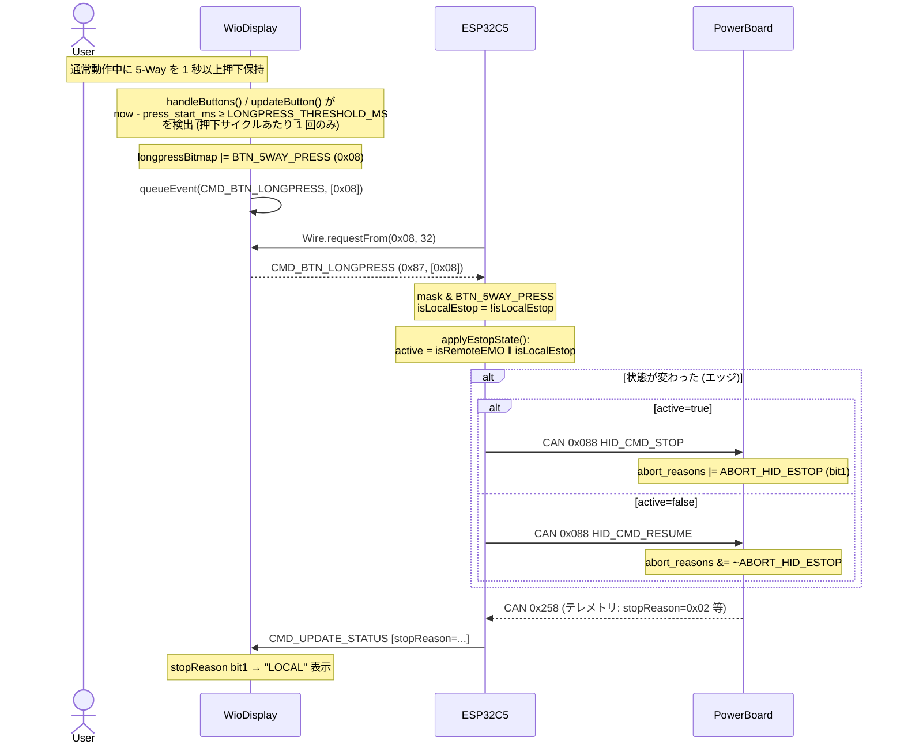
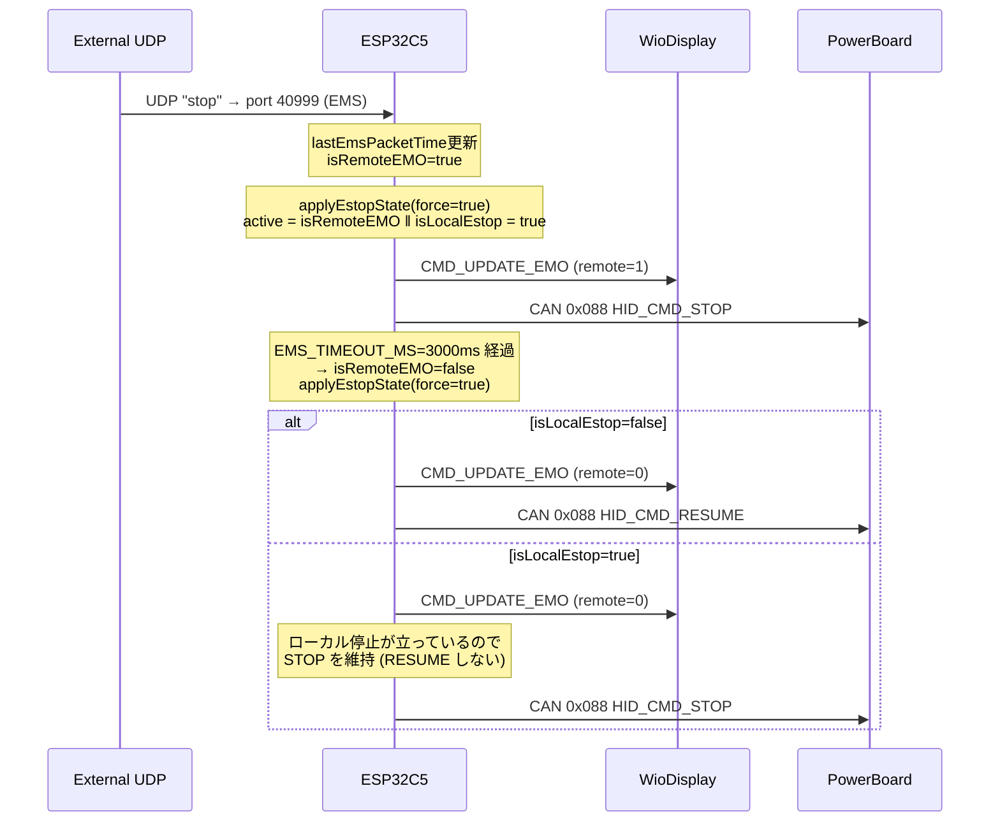
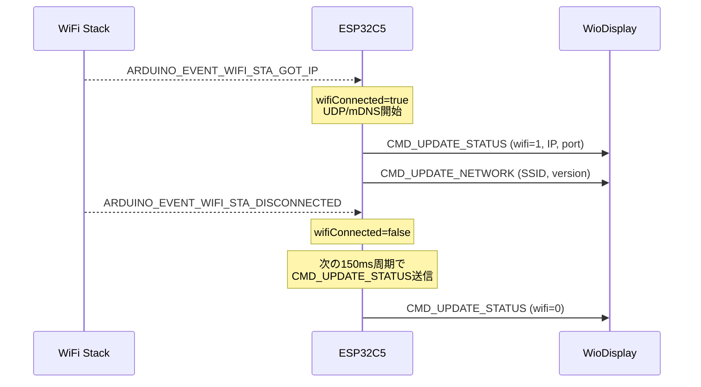
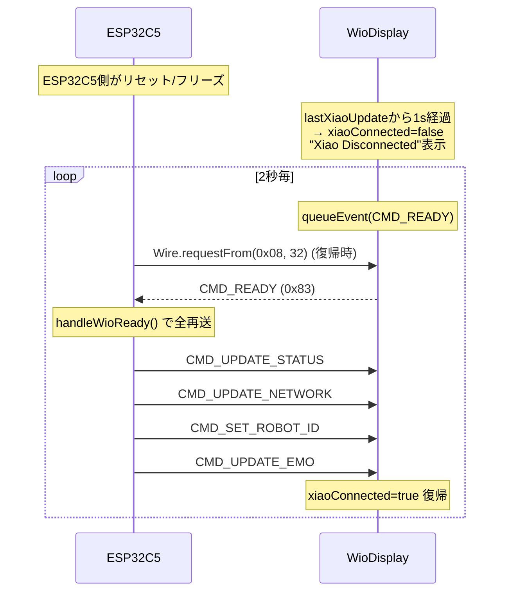

# ESP32C5Controller ↔ WioDisplay 通信シーケンス

## 通信の前提

- **物理層**: I2C(SDA=23, SCL=24, 100 kHz)
- **役割**: ESP32C5 = Master, WioDisplay = Slave (`0x08`)
- **方向**:
  - **Master → Slave**: `Wire.beginTransmission` + `cmd, len, data...` ([ESP32C5Controller.ino:147](../src/ESP32C5Controller/ESP32C5Controller.ino))
  - **Slave → Master**: Slave側の `eventQueue` に積み、Masterが `Wire.requestFrom(0x08, 32)` でポーリング ([ESP32C5Controller.ino:289](../src/ESP32C5Controller/ESP32C5Controller.ino), [WioDisplay.ino:114](../src/WioDisplay/WioDisplay.ino))

| コード | 名称 | 方向 | 意味 |
|---|---|---|---|
| `0x01` | `CMD_UPDATE_STATUS` | M→S | WiFi/IP/Port/PowerBoard状態の定期更新 |
| `0x02` | `CMD_SET_ROBOT_ID` | M→S | 確定後のRobot IDをDisplayへ反映 |
| `0x03` | `CMD_UPDATE_EMO` | M→S | Remote EMO 状態の更新 (1 byte) |
| `0x05` | `CMD_FULL_REFRESH` | M→S | 全項目の一括再送 |
| `0x06` | `CMD_UPDATE_NETWORK` | M→S | SSID+Versionの更新 |
| `0x81` | `CMD_ID_CONFIRM` | S→M | KEY_C 短押しでID確定 |
| `0x83` | `CMD_READY` | S→M | Display起動/再接続要求 |
| `0x84` | `CMD_ENTER_MANUAL` | S→M | **legacy**: 旧 Wio fw 用 (新 fw は 0x86 を使用) |
| `0x86` | `CMD_BOOT_BUTTONS` | S→M | 起動時に押されていたボタン bitmap (1 byte) |
| `0x87` | `CMD_BTN_LONGPRESS` | S→M | 通常動作中の長押し確定通知 bitmap (1 byte) |

> - `0x82` (`CMD_EMO_TOGGLE`) は manual EMO 廃止により削除済み
> - `0x85` は予約 (開発中の専用イベントから bitmap 形式へ統一)
> - bitmap: `BTN_KEY_A=0x01`, `BTN_KEY_B=0x02`, `BTN_KEY_C=0x04`, `BTN_5WAY_PRESS=0x08`, 0x10-0x80 reserved

---

## ① 起動シーケンス (READY ハンドシェイク)

参照: [ESP32C5Controller.ino:1217-1228](../src/ESP32C5Controller/ESP32C5Controller.ino), [ESP32C5Controller.ino:376-388](../src/ESP32C5Controller/ESP32C5Controller.ino), [WioDisplay.ino:597-600](../src/WioDisplay/WioDisplay.ino)

---

## ② 定期ステータス更新 (150ms周期)

参照: [ESP32C5Controller.ino:1267-1269](../src/ESP32C5Controller/ESP32C5Controller.ino), [WioDisplay.ino:201-237](../src/WioDisplay/WioDisplay.ino), [WioDisplay.ino:610-613](../src/WioDisplay/WioDisplay.ino)

---

## ③ ID変更 (KEY_A/B/C 操作)

参照: [WioDisplay.ino:529-537](../src/WioDisplay/WioDisplay.ino), [ESP32C5Controller.ino:327-367](../src/ESP32C5Controller/ESP32C5Controller.ino)

---

## ④ 起動時 BOOT_BUTTONS (5-Way 押下 → MANUAL モード, rev4 §1.3)

参照: [WioDisplay.ino setup() Phase 2.5](../src/WioDisplay/WioDisplay.ino), [ESP32C5Controller.ino case CMD_BOOT_BUTTONS](../src/ESP32C5Controller/ESP32C5Controller.ino)

> Legacy: 旧 Wio fw が `CMD_ENTER_MANUAL (0x84)` を送る場合も、C5 側ハンドラで同じく hidOpMode=MANUAL に遷移する。

---

## ⑤ 起動時 BOOT_BUTTONS (KEY_C 押下 → OC/OD ignore)

> **設計メモ**: robot_comm_spec v2.0.0 で HID 直結チャネル (CAN ID 0x088) に保護
> オーバーライド設定コマンド (0x05, Byte1 bit0=過電流/bit1=過放電) が新設された正規ルート。
> v1.x では 0x088 に該当コマンドが無く、HID は本来「メイン基板 → 電源基板」役割の
> 0x201 PARAM_CMD_SET を 2 フレーム直送する暫定実装で代替していた (v2.0.0 で解消)。

参照: [WioDisplay.ino setup() Phase 2.5](../src/WioDisplay/WioDisplay.ino), [ESP32C5Controller.ino sendIgnoreOCODOverride()](../src/ESP32C5Controller/ESP32C5Controller.ino), [robot_comm_spec/CAN_LS.md §2.7](../robot_comm_spec/CAN_LS.md)

---

## ⑥ BTN_LONGPRESS (5-Way 長押し → ローカル停止トグル)

参照: [WioDisplay.ino handleButtons() / updateButton()](../src/WioDisplay/WioDisplay.ino), [ESP32C5Controller.ino case CMD_BTN_LONGPRESS / applyEstopState()](../src/ESP32C5Controller/ESP32C5Controller.ino)

---

## ⑦ Remote EMO 変化 (UDP 由来) + ローカル停止 OR 統合

> Remote EMO とローカル停止は PowerBoard 側で同じ ABORT_HID_ESTOP ビットを共有するため、
> C5 側で OR 統合してから HID_CMD_STOP/RESUME を発行する。
> 片方の解除がもう片方の停止意図を踏み潰さないよう、`applyEstopState()` で必ず両方の状態を見る。

参照: [ESP32C5Controller.ino applyEstopState()](../src/ESP32C5Controller/ESP32C5Controller.ino)

---

## ⑧ WiFi接続イベント

参照: [ESP32C5Controller.ino:683-723](../src/ESP32C5Controller/ESP32C5Controller.ino)

---

## ⑨ Xiao切断検出 / 再接続要求

参照: [WioDisplay.ino:610-620](../src/WioDisplay/WioDisplay.ino), [ESP32C5Controller.ino:310-313](../src/ESP32C5Controller/ESP32C5Controller.ino)

---

## 注意点 (実装上の特徴)

- `CMD_FULL_REFRESH` (0x05) は両側に定義はあるが、現コードのMaster側に呼び出し元がない (READY時は `sendUpdateStatus` + `sendUpdateNetwork` + `sendSetRobotId` + `sendUpdateEmo` を個別送信)。
- Slave→MasterのイベントはMaster側のループで毎回 `Wire.requestFrom` してポーリングする方式。Slave側に未送信イベントがない場合は `Wire.available() < 2` で空読みされる。
- Slave側 `eventQueue` は16バイトのリングバッファで、容量超過時はサイレントに破棄される ([WioDisplay.ino:139-151](../src/WioDisplay/WioDisplay.ino))。
