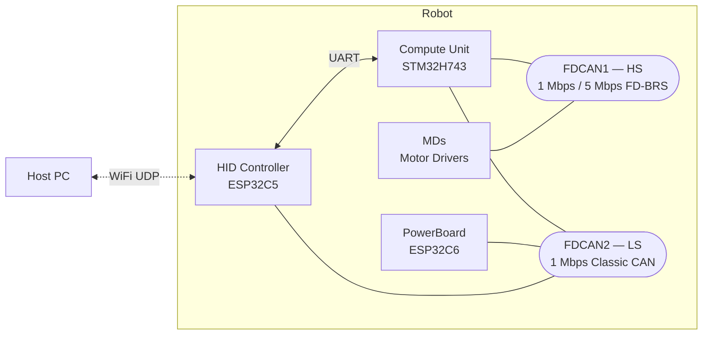

# robot_comm_spec

Greentea / SanRei プロジェクトにおける **基板間通信プロトコル** の仕様書群。
各ファームウェアリポジトリから git submodule として参照され、対応バージョンを固定して配布される。

---

## このリポジトリが定義するもの

- 各バス・リンク上で交換されるメッセージのフォーマット (CAN ID / DLC / バイトレイアウト / フィールド意味)
- メッセージの発行タイミング・応答ルール
- バス物理層の前提 (ビットレート、フレーム形式)

## 定義しないもの

- ハードウェア配線・コネクタピン配置・PCB 設計
- 各基板内部のソフトウェア実装 (状態機械の詳細、内部キュー設計など)
- **HID 内部通信** (HID Controller ↔ Wio Display) — HID 内で閉じるため対象外
- アプリケーション層のセマンティクス (具体的なモード遷移ロジック等は各ファームウェアリポジトリ側のドキュメントを参照)

---

## システム構成



### 物理リンク

| リンク | 物理層 | 参加ノード |
|---|---|---|
| FDCAN1 (HS) | CAN-FD 1/5 Mbps, BRS | CU, MDs |
| FDCAN2 (LS) | Classic CAN 1 Mbps | CU, PowerBoard, HID |
| WiFi UDP | IEEE 802.11 / UDP | Host PC, HID |
| UART | 115200 bps, 8N1, フロー制御なし | HID, CU |

### 論理チャネル

Host PC ↔ CU 間の通信は HID が **WiFi UDP と UART の透過中継** を担う。すなわち UDP ペイロードは UART へそのまま流され、その逆方向も同様。本仕様書群はこの論理ペイロード (HID が変換しない部分) を記述しており、UDP / UART のいずれの物理経路上でも同一の意味を持つ。

| 論理チャネル | 方向 | UDP ポート (HID 側) | 送信方式 | 物理経路 | 仕様 |
|---|---|---|---|---|---|
| Downlink (通常コマンド) | Host PC → CU | `40000 + robot_id` | **unicast** (mDNS) | Host →`UDP`→ HID →`UART`→ CU | [downlink_command.md](./downlink_command.md) |
| Downlink (全体連絡 / EMS) | Host PC → CU | `40999` | broadcast | Host →`UDP`→ HID →`UART`→ CU | [downlink_command.md](./downlink_command.md) |
| Downlink (汎用 CAN ブリッジ / JSON) | Host PC → HID | `41000 + robot_id` | **unicast** (mDNS) | Host →`UDP`→ HID | [hid_bridge.md](./hid_bridge.md) |
| Uplink (テレメトリ) | CU → Host PC | `50000 + robot_id` | broadcast (`192.168.x.255`) | CU →`UART`→ HID →`UDP`→ Host | [uplink_telemetry.md](./uplink_telemetry.md) |
| Uplink (CAN テレメトリ/応答 / JSON) | HID → Host PC | `51000 + robot_id` | broadcast | (CAN 上の `11111` テレメトリ / `11110` 応答 種別) → HID →`UDP`→ Host | [hid_bridge.md](./hid_bridge.md) |
| Uplink (Radio Metrics / JSON) | HID → 計測機 | `52000 + robot_id` | broadcast | (HID 内部 WiFi 計測) → HID →`UDP`→ 計測機 | [radio_metrics.md](./radio_metrics.md) |

- `robot_id` はロボット個体に割り当てられた識別番号 (詳細は各 spec 文書を参照)。
- 通常コマンドの宛先 IP は **mDNS** で解決される。HID は自身を `robot<robot_id>.local` として mDNS 登録するため、Host PC は当該名前を引いて得た IP に unicast 送信する。
- 全体連絡 (EMS) は全ロボット同時受信が必要なため broadcast を維持する。
- 汎用 CAN ブリッジ (41000/51000) は CU を経由せず HID で UDP↔CAN 変換するため、物理経路から `UART` / `CU` が外れる (v2.0.0 で導入)。
- Radio Metrics (52000) は CU を経由せず HID が自身の WiFi RX/TX イベントの計測メタデータを broadcast する診断チャネル (v2.0.0 で導入)。

CAN バス (HS/LS) 上のメッセージはこの論理チャネルとは独立で、それぞれ [CAN_HS.md](./CAN_HS.md) / [CAN_LS.md](./CAN_LS.md) を参照。

---

## ドキュメント一覧

| ドキュメント | 内容 |
|---|---|
| [CAN_HS.md](./CAN_HS.md) | 高速 CAN バス (CU ↔ MDs) の ID 割当・メッセージ定義 |
| [CAN_LS.md](./CAN_LS.md) | 低速 CAN バス (CU ↔ PowerBoard / HID) の ID 割当・メッセージ定義 |
| [downlink_command.md](./downlink_command.md) | Host PC → CU の Downlink コマンド (UDP / UART 共通) |
| [uplink_telemetry.md](./uplink_telemetry.md) | CU → Host PC の Uplink テレメトリ (UDP / UART 共通) |
| [hid_bridge.md](./hid_bridge.md) | PC ↔ HID 汎用 CAN ブリッジ (UDP/JSON, Port 41000/51000) |
| [radio_metrics.md](./radio_metrics.md) | HID → 計測機 Radio Metrics チャネル (UDP/JSON, Port 52000+id) |
| [VERSIONING.md](./VERSIONING.md) | バージョン採番規則 (本仕様 + ファームウェア) |

---

## バージョニング

詳細は [VERSIONING.md](./VERSIONING.md) を参照。

要点:
- 本リポジトリは Semantic Versioning に従う (`vMAJOR.MINOR.PATCH`)
- 各ファームウェアのバージョンは `<branch>_v<spec_major>.<spec_minor>.<firmware_patch>` 形式
- spec の PATCH 更新 (説明追記等) はファームのバンプ理由にはならない

---

## 主な変更履歴

リリースごとの詳細は GitHub Releases (https://github.com/greentea-ssl/robot_comm_spec/releases) を参照。

### v2.1.0 (予定)

**後方互換な追加 (既存フレーム構造は不変):**

- CAN メッセージ種別 **`11110`** を「**bridge 透過 (応答/診断)**」クラスとして新設 (reserved 領域の意味付け、CAN_HS / CAN_LS 共通)。
    - HID bridge は **メッセージ種別上位 2 ビット = `11` (CAN ID `0x780`–`0x7FF`、種別 `11110`/`11111`) のフレームのみを転送する固定ルール**で動作。`11111` (テレメトリ) は `severity ≤ ログレベル`、**`11110` (応答/診断) は常時転送** (= `level 0` の床)。
    - bridge は中身を解釈しない (土管) ため、PC が観測したい応答は応答口の仕様で「要求 ID → 応答 ID (`11110`)」を定義する。**パラメータ口の追加で bridge ソフトの変更は不要**。
    - [hid_bridge.md](./hid_bridge.md): Uplink JSON に `kind` (`"telemetry"`/`"answer"`) を追加。`level 0 = FATAL + ANSWER` を明記。
- 既存の応答 (`0x0D8` / `0x2D8` / `0x040`) は `11110` ではないため自動転送対象外 (互換維持)。新規に PC 観測したい応答口を `11110` 系で設計する。
- **起動時ログレベルを仕様から除外**: v2.0.0 で `1` (ERROR) と規定していた `set_log_level` の起動時初期値を「ファーム実装依存 (本仕様では規定しない)」に変更。起動モード等に応じた初期値設定は各ファームのポリシーとする (転送ルール = `severity ≤ level` / `11110` 常時、は仕様として維持)。
- **hid_status を新設** ([hid_bridge.md](./hid_bridge.md)): HID 自身の稼働状態取得を downlink `type:"hid_status"` (pull 要求) → uplink `type:"hid_status"` (broadcast 応答) として定義。HID Web UI の旧 `/api/status` を hid_bridge に集約する代替経路 (#4)。robot_id / fw_version / op_mode / wifi / EMO / log_level / CAN カウンタ等を含む。
- **ログレベル `F` (15) = promiscuous (raw 全転送)** ([hid_bridge.md](./hid_bridge.md)): `set_log_level` を拡張し、`F` で bridge が受信した**全 CAN フレーム**を `kind:"raw"` で UDP 転送 (上位2bit=`11` 制限の解除)。旧 Web UI `/can` raw ログの代替。デバッグ専用 (バス負荷で UDP 飽和の恐れ)。`6`-`14` は予約。Uplink `kind` に `"raw"` を追加。
- **Uplink のバッチ送信 (NDJSON)** ([hid_bridge.md](./hid_bridge.md)): 負荷低減のため uplink は複数 JSON を 1 datagram にまとめ、**MTU 超過 or 100 ms 経過**で送出。各オブジェクトは `\n` 終端で、受信側は `\n` で分割して parse する。オブジェクトのスキーマ自体は不変。
- **OTA進捗フレームを新設** (メッセージ種別 `01100`, [CAN_LS.md](./CAN_LS.md)): OTA 中の基板が進捗 (`[phase, percent]`) を送り、HID が Wio 表示器へ I2C 中継するための診断フレーム。電源基板 = `0x318`。予約領域 `01100` の意味付け (PowerBoard #4)。
- **`set_ssid` を新設** ([hid_bridge.md](./hid_bridge.md)): downlink `type:"set_ssid"` (`ssid` / 任意 `password`、省略=オープン) で HID の接続先 WiFi AP を切替える診断用 type。SSID 明示の directed connection のため **hidden AP にも接続可能**(自動接続の scan は hidden を名前一致できないため、hidden AP は本 type で繋ぐ)。揮発、フォールバック等の接続方針はファーム実装依存 (SanRei_HID #5)。
- **`rx_dl` に送信アンカーを追加** ([radio_metrics.md](./radio_metrics.md)): `t_tx_tsf_us` / `t_tx_esp_timer_us` (rx_dl フレーム自身を broadcast する直前の TSF/esp_timer) を新設。これにより `rx_dl` 1 種で**下り OWD と上り OWD の両方向**を同一フレームから per-frame 分解できる (上り `HID→air` leg の送信アンカー、§4.3)。下り 100Hz に追従した高密度な上り計測が得られる。
- **`tx_ul` を任意 (optional) に変更** ([radio_metrics.md](./radio_metrics.md)): 上り OWD は `rx_dl`/`hb` の自己アンカーで計測可能になったため、`tx_ul` は **production 上り (`50000`/`51000`) そのものの OWD を測る専用プロキシ**としてのみ必要。Challenge 報告には不要で、HID ファームは CU 上り送出パスへのフックを省略できる。仕様定義は互換維持のため残置。

### v2.0.0 (予定)

**互換性のない変更 (CAN_LS):**

両ファーム (HID / PowerBoard / メイン基板) の **同時更新** が必要なため、デプロイ運用に注意。

- 既存 ID 例外を排除し、ビット割当規則に従う新 ID に再割当 (詳細は [CAN_LS.md §1](./CAN_LS.md) の v1→v2 移行表):
    - `0x210` → **`0x088`** (HID直接コマンド)
    - `0x218` → **`0x0D8`** (HID直接応答)
    - `0x201` → **`0x280`** (電源パラメータ操作要求)
    - `0x259` → **`0x2D8`** (電源パラメータ応答)
- `0x258` 電源フィードバックを DLC 7 → **DLC 8** に拡張し、`Byte 7` = 電源動作ステート (`0` = STOP, `1` = STANDBY, `2` = DRIVE) を再定義 (#2)

**新機能:**

- PC ↔ HID UDP/JSON CAN ブリッジを導入 (#3) — 新規 doc [hid_bridge.md](./hid_bridge.md) に集約
    - Downlink: `41000 + robot_id` (PC → HID) で任意 CAN フレーム送出やテレメトリ転送しきい値の動的変更
    - Uplink: `51000 + robot_id` (HID → PC) で CAN メッセージ種別 `11111` のフレームを JSON 化して転送
    - CAN ID Bit 10-6 (メッセージ種別) = `11111` を「テレメトリ」として予約、サブID (Bit 2-0) = severity (`0` = FATAL ～ `5` = TRACE, syslog 風) を導入
    - 運用既定値を確定: `type=can` は fire-and-forget (HID は同期 ack を返さない) / `set_log_level` は揮発で起動時 default `1` (ERROR) / テレメトリペイロード形式はデバイス側仕様に委ねる
- HID 直接コマンド (`0x088`) に subcommand `0x05` 保護オーバーライド設定 (OC/OD ビットフラグ) を追加 (#1)
    - v1.x で HID が `0x201 PARAM_CMD_SET` を直接送っていた暫定実装を、正規ルートに統一
- HID 起源の **Radio Metrics チャネル** (port `52000 + robot_id`, broadcast JSON) を導入 — 新規 doc [radio_metrics.md](./radio_metrics.md)
    - HID が自身の WiFi RX/TX イベントの計測メタデータ (TSF / esp_timer / 連番) を broadcast し、外部計測機が WiFi 区間の片方向遅延 (OWD) 計測等に使う
    - 受信タイプ (`rx_dl`) / 送信タイプ (`tx_ul`) / ハートビート (`hb`) の 3 種類のメッセージ
    - 全種別の**先頭に固定オフセット HEX の `meta` フィールド** ([radio_metrics.md §3.0](./radio_metrics.md)) を持たせ、JSON を解さない off-board 観測機 (air sniffer / 有線 SPAN) が空中・有線上でフレームを `hid_seq` で同定・突合できるようにした → 無線区間を air/wire 多点で分解可能 (§4.3)。送信時刻は payload に埋めず観測する設計原則を明記
    - 既存の 40000/40999/41000/50000/51000 ポートには一切手を加えず、互換性維持

**仕様 doc / ツール改善:**

- Growi 自動同期ワークフローが md リンクを Growi 絶対パス / GitHub blob URL に書き換えるようになり、wiki 上で他 md ファイルへのリンクが正しく解決されるようになった (#4)
- 物理リンク表の HID↔CU UART を確定: **115200 bps, 8N1, フロー制御なし** (v1.x までは TBD)

### v1.0.x

- **v1.0.1**: タグ push 時に Growi へ docs を自動同期する GitHub Actions ワークフローを追加 (ドキュメント配信機構のみ; 仕様変更なし)
- **v1.0.0**: 初版リリース

---

## サブモジュールとしての利用

### 追加

```sh
git submodule add https://github.com/greentea-ssl/robot_comm_spec.git
cd robot_comm_spec && git checkout v1.0.0   # 任意のリリースタグへピン留め
cd .. && git add robot_comm_spec
git commit -m "Add robot_comm_spec as submodule pinned to v1.0.0"
```

### クローン側

```sh
# 新規クローン時
git clone --recurse-submodules <consumer-repo-url>

# 既存クローンの追従
git submodule update --init --recursive
```

### バージョンの更新

```sh
cd robot_comm_spec
git fetch --tags
git checkout v1.1.0
cd ..
git add robot_comm_spec
git commit -m "Bump robot_comm_spec to v1.1.0"
```

---

## コントリビュート

仕様変更・ドキュメント追記の手順:

1. `master` から派生するトピックブランチを切る (`docs/...`, `feat/...`, `fix/...`)
2. 1 トピック = 1 commit を目安に変更を積む
3. PR を作成し、レビューを経て `master` に merge
4. merge 後、適切なバージョン (semver に従う) を annotated タグで打つ
5. GitHub Release を作成し、変更概要 (CHANGELOG 相当) を記載

---

## Growi への自動同期

`v*` 形式のタグが push されると、GitHub Actions ([.github/workflows/growi-sync.yml](./.github/workflows/growi-sync.yml)) がリポジトリ直下の `*.md` を Growi へ転記する。

- 配置: `/robot_comm_spec/<ファイル名>` を上書き (`README.md` のみ親ページ `/robot_comm_spec` 自体に配置)
- 各ページ先頭にはタグ名と commit SHA を含む同期ヘッダが付与される (Growi 側で直接編集しないこと)

### 初回セットアップ

1. Growi で **Access Token** を発行する (旧 API Token ではなく、Growi v7 系から導入された新しい方)
   - Growi にログイン → User Settings → **API Settings** → **Access Token Settings** → `New`
   - 設定項目:
     - **Description**: 任意 (例: `robot_comm_spec sync from GitHub Actions`)
     - **Expiration**: 任意の期限 (運用上、年に一度ローテーションする想定で 1 年程度を推奨)
     - **Scopes** (必須):
       - `read:features:page` — 既存ページのリビジョン情報取得に必要
       - `write:features:page` — ページの作成・更新に必要
   - `Create token` を押すとトークン文字列が表示されるので **その場でコピー** する (再表示不可)
   - トークンを発行するユーザは、対象パス (`/robot_comm_spec` 配下) への書き込み権限が必要
2. GitHub リポジトリの **Settings → Secrets and variables → Actions** に登録
   - Secrets:
     - `GROWI_URL` — Growi インスタンスの URL (例: `https://growi.example.com`)
     - `GROWI_ACCESS_TOKEN` — 1. で発行した Access Token
   - Variables (任意):
     - `GROWI_PARENT_PATH` — 親パスを変えたい場合のみ (デフォルト `/robot_comm_spec`)
3. 動作確認は Actions タブから `Sync docs to Growi` ワークフローを `workflow_dispatch` で手動実行 (ブランチ名やタグを指定して試せる)

タグを打って push する例:

```sh
git tag -a v1.0.0 -m "Release v1.0.0"
git push origin v1.0.0
```
